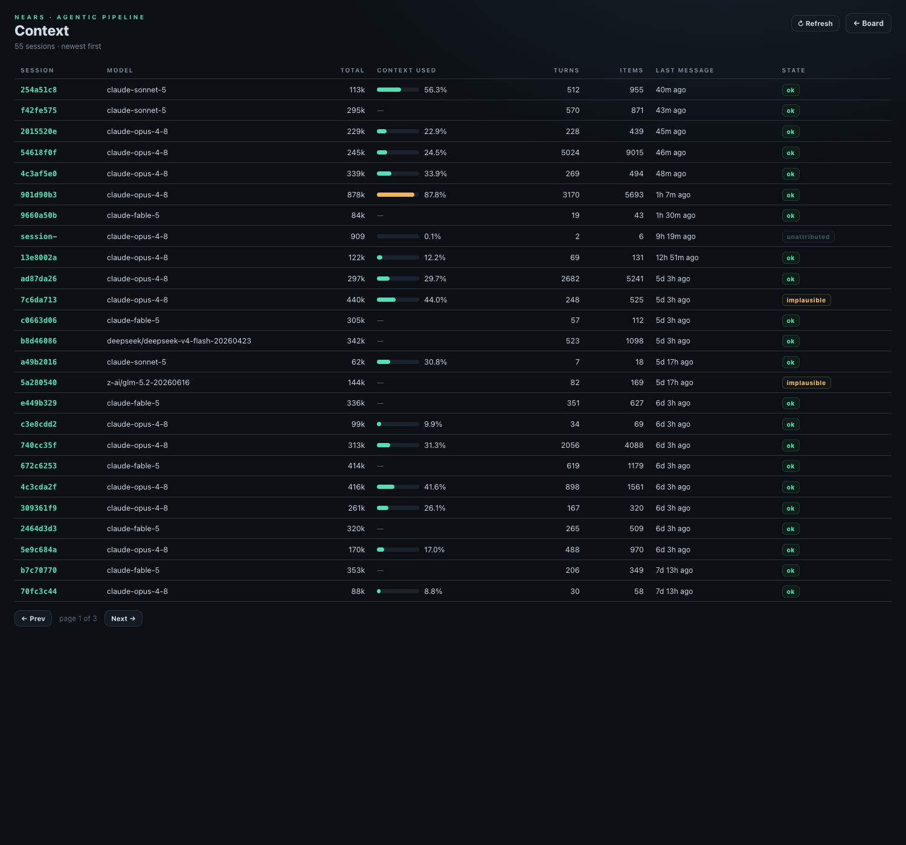
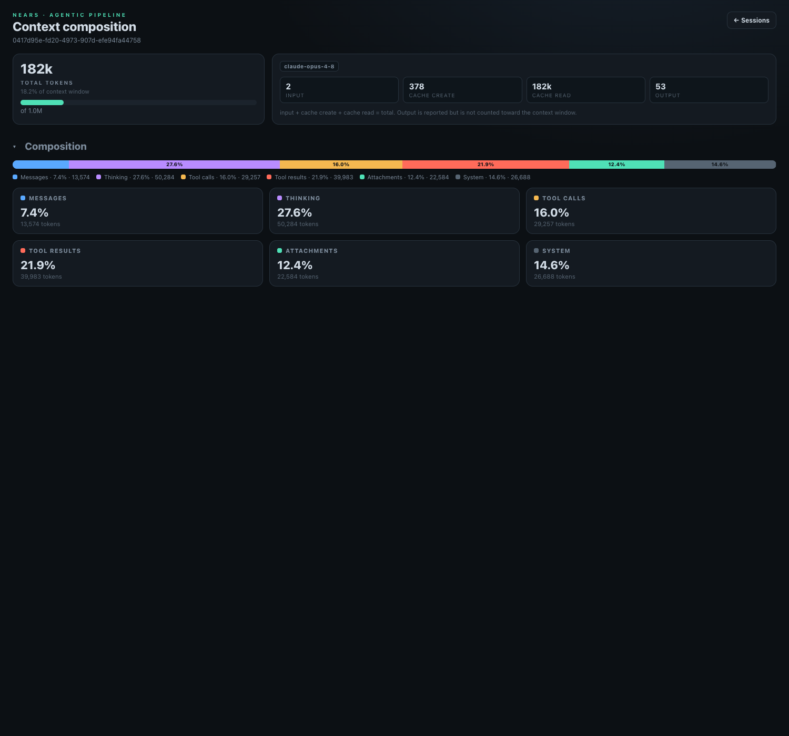
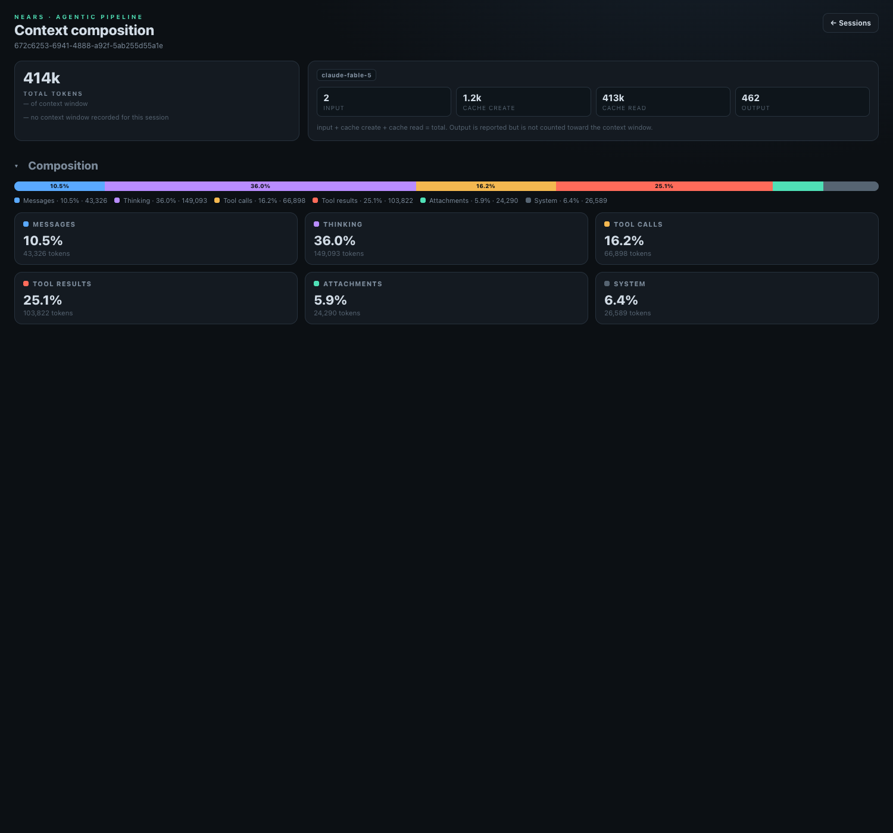
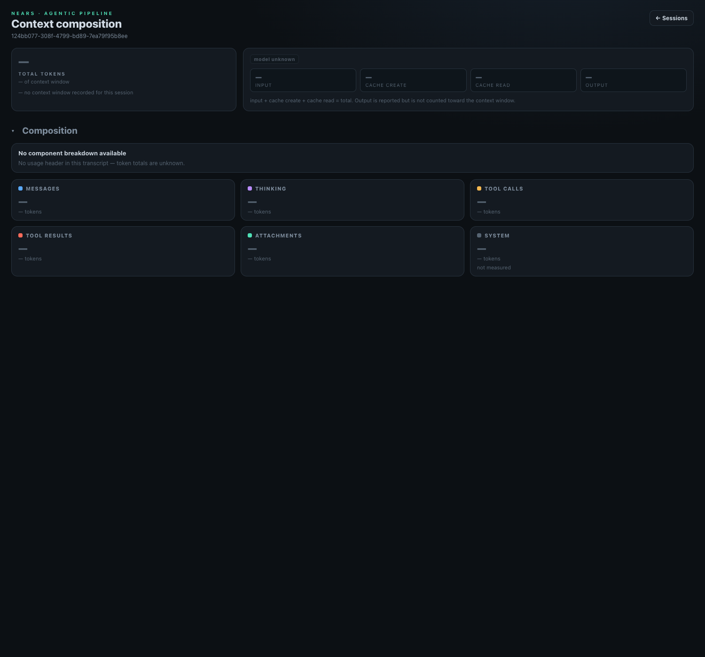
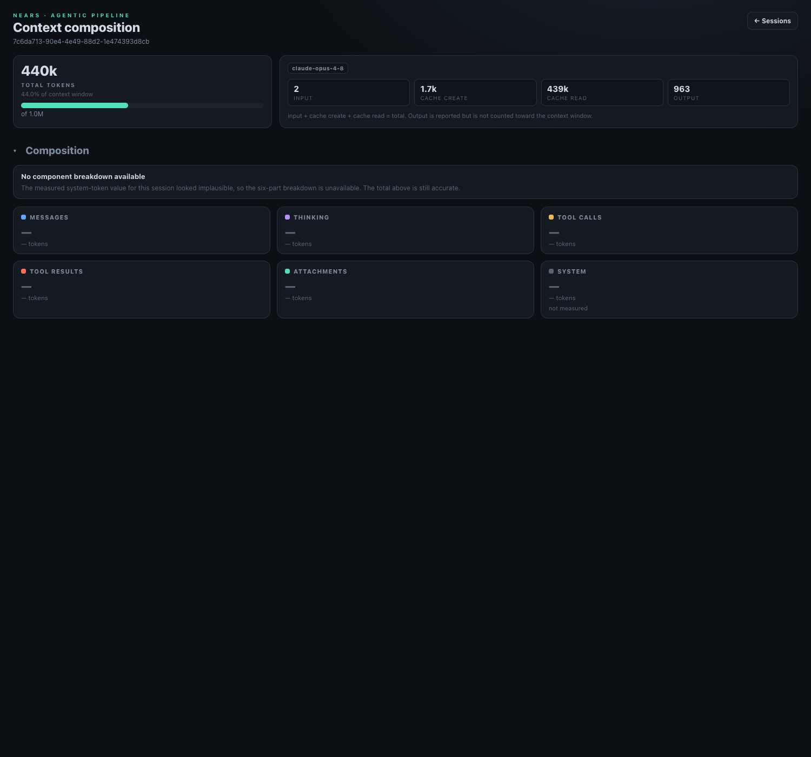
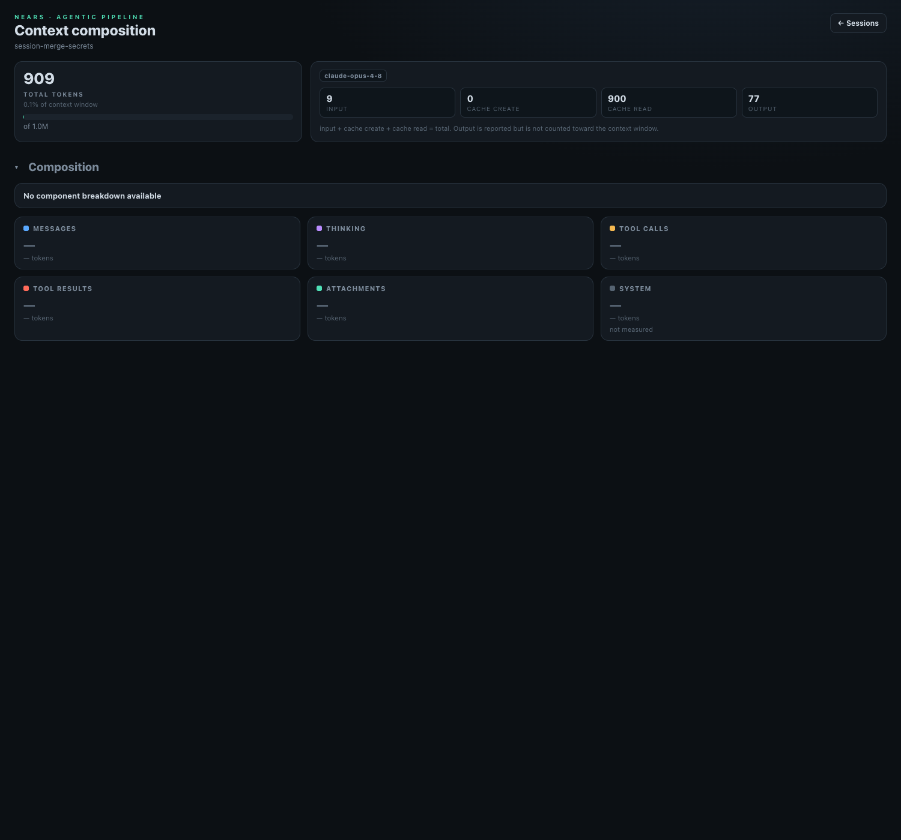
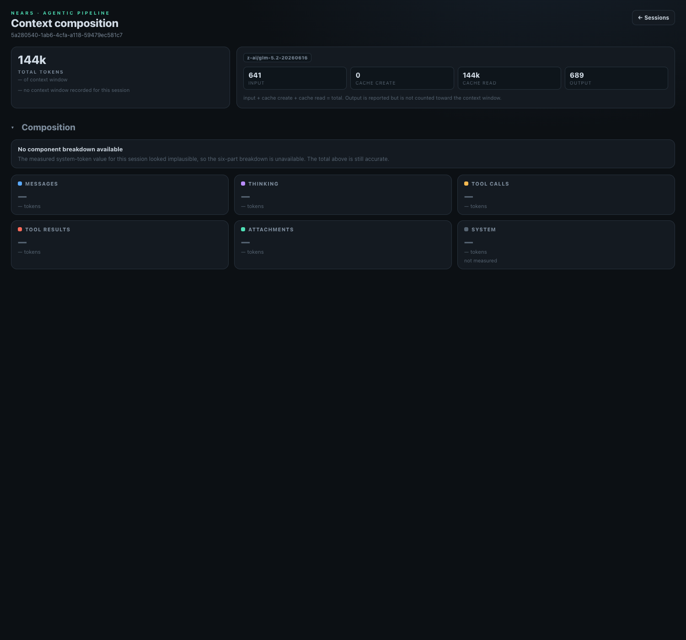
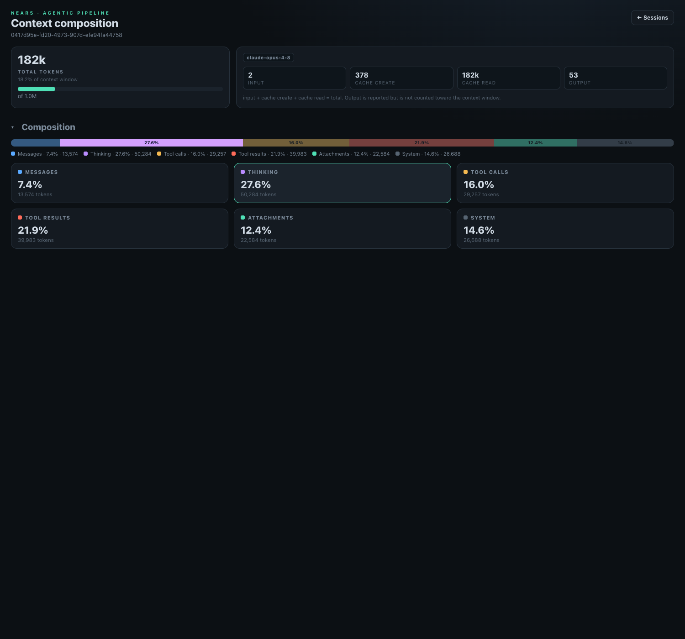

# QA Evidence — AP-36

**AP-36 Context Explorer UI — PASS (6 render states + list, live nears_monitor)**

**8 screenshot(s).** Click any thumbnail for full resolution.

<table>
<tr>
<td align="center" width="33%"> sessions list</td>
<td align="center" width="33%"> attributed happy</td>
<td align="center" width="33%"> NULL ctxwindow TRAP</td>
</tr>
<tr>
<td align="center" width="33%"> no header total NULL</td>
<td align="center" width="33%"> implausible INDEPENDENCE</td>
<td align="center" width="33%"> attribstate NULL noreason</td>
</tr>
<tr>
<td align="center" width="33%"> implausible null window</td>
<td align="center" width="33%"> card selected</td>
</tr>
</table>

---
*From `nears/docs/qa-evidence/AP-36/` · public-repo scrub policy (no live secrets; verified clean).*
