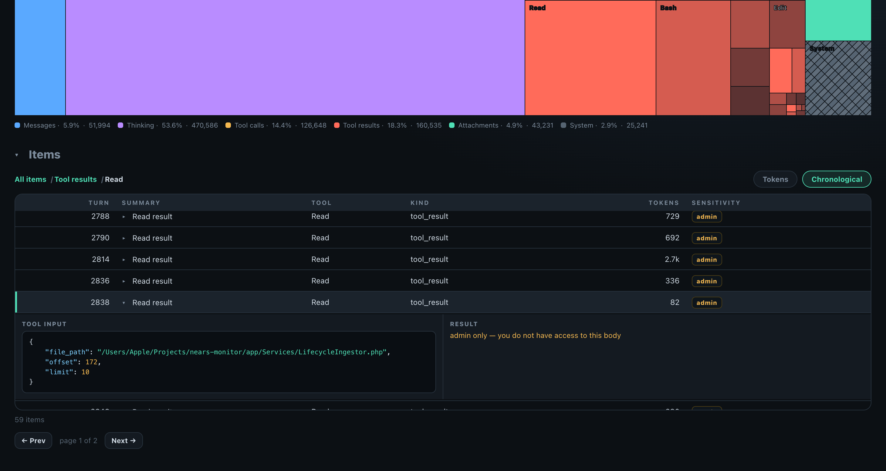
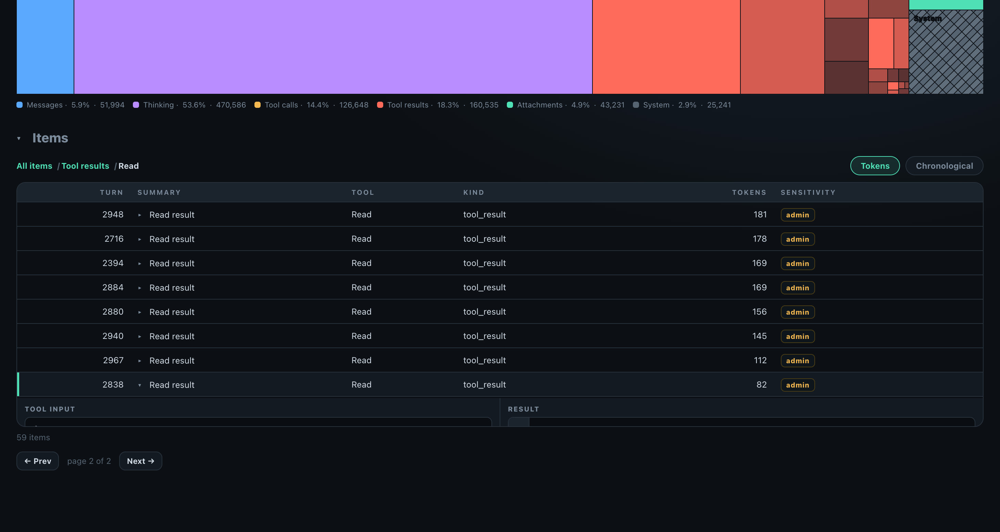
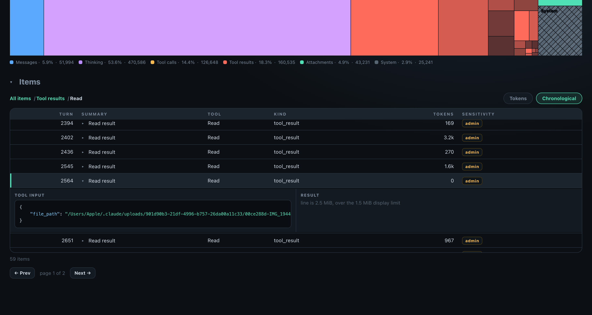
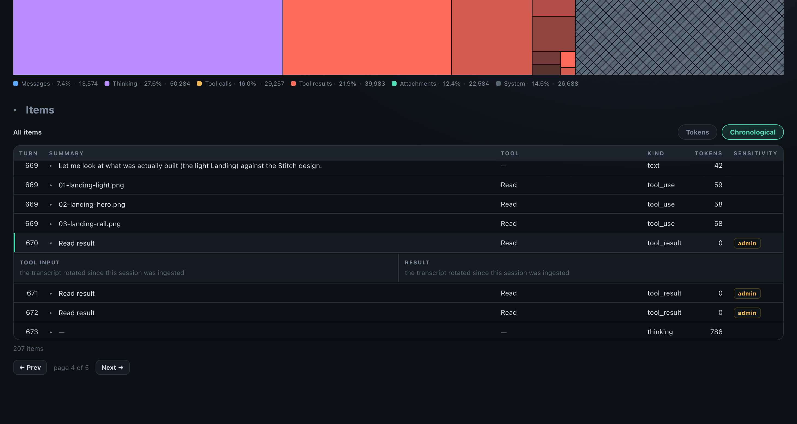
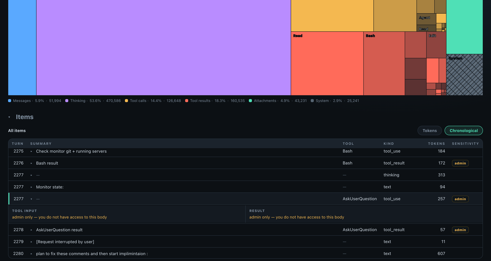
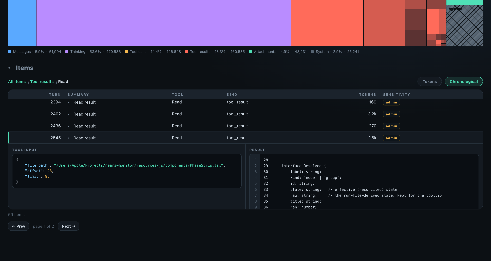

# QA Evidence — AP-79

**AP-79 delta cycle2: AC5+AC8 3rd shot RESOLVED, PASS**

**6 screenshot(s).** Click any thumbnail for full resolution.

<table>
<tr>
<td align="center" width="33%"> ac5 ac8 admin only viewer</td>
<td align="center" width="33%"> ac5 admin contrast 200</td>
<td align="center" width="33%"> ac6 ac8 body too large</td>
</tr>
<tr>
<td align="center" width="33%"> ac7 transcript rotated</td>
<td align="center" width="33%"> ac8 admin only</td>
<td align="center" width="33%"> ac8 normal pair</td>
</tr>
</table>

### Other artifacts
- [`progress.md`](progress.md)

---
*From `nears/docs/qa-evidence/AP-79/` · public-repo scrub policy (no live secrets; verified clean).*
