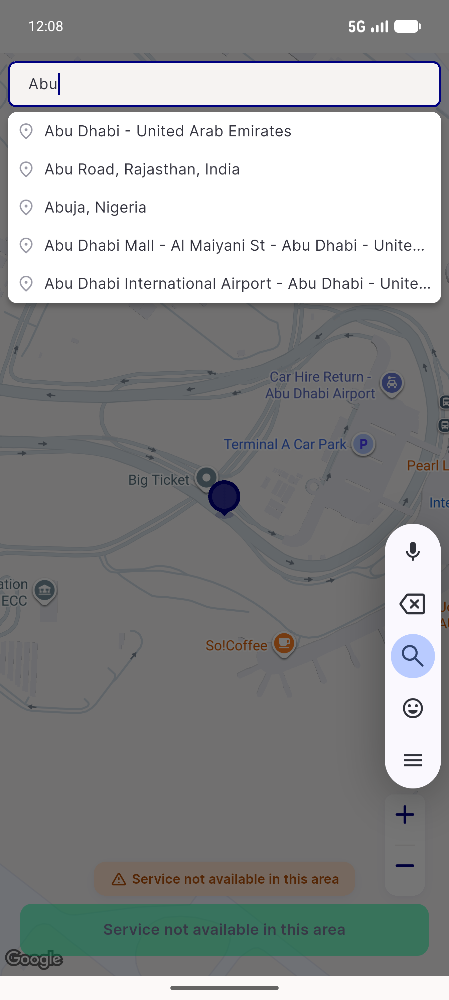
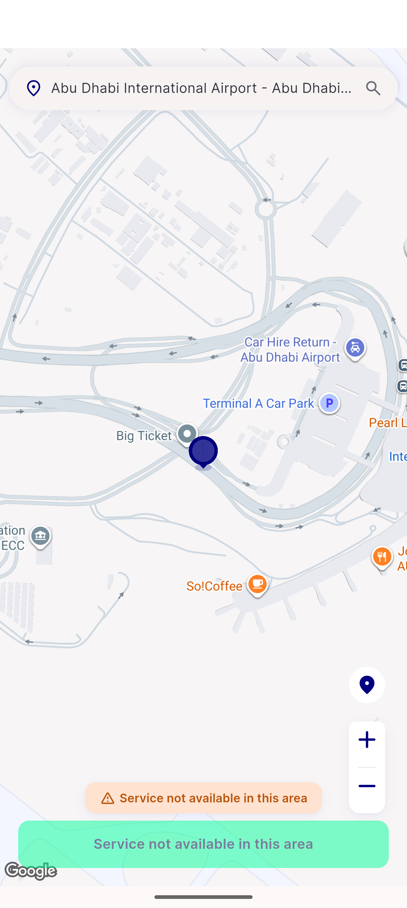
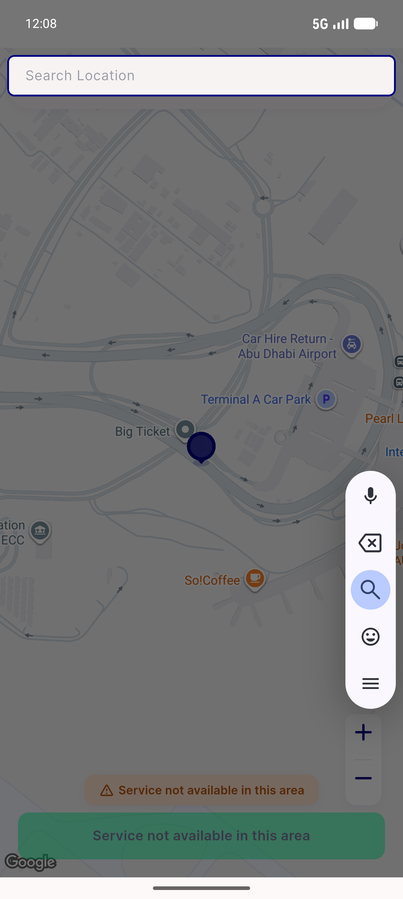

# QA Evidence — NEARS-1015

**PASS — all 7 ACs met, 1977/1977 tests pass**

**3 screenshot(s).** Click any thumbnail for full resolution.

<table>
<tr>
<td align="center" width="33%"> s01 dialog with suggestions</td>
<td align="center" width="33%"> s02 pickmap after selection</td>
<td align="center" width="33%"> s03 dialog empty</td>
</tr>
</table>

---
*From `nears/docs/qa-evidence/NEARS-1015/` · public-repo scrub policy (no live secrets; verified clean).*
