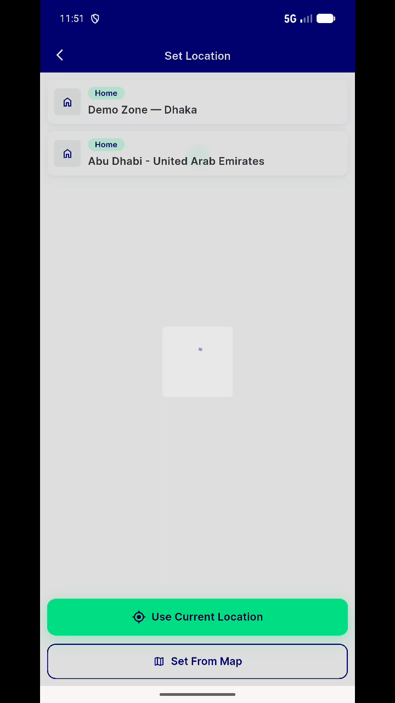
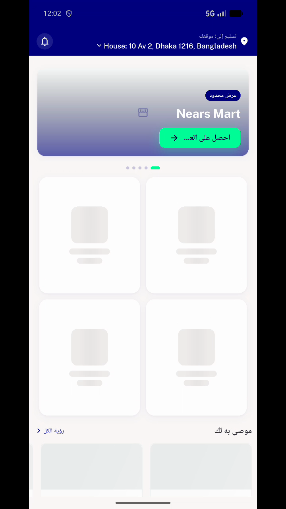

# QA Evidence — NEARS-1016

**QA PASS — home module-choose tri-state: 0 'Service not available' flash frames across 27 recordings (~19.6k frames); empty state persists only genuinely out-of-zone; 1942/1942 tests green**

**8 screenshot(s).** Click any thumbnail for full resolution.

<table>
<tr>
<td align="center" width="33%"> ac2 sector cards after resolution</td>
<td align="center" width="33%"> ac2 shimmer during zone resolution</td>
<td align="center" width="33%"> ac2 shimmer rtl cold</td>
</tr>
<tr>
<td align="center" width="33%"> ac3 empty state home</td>
<td align="center" width="33%"> ac3 empty state video domain ref</td>
<td align="center" width="33%"> before flash human review 2026 07 06</td>
</tr>
<tr>
<td align="center" width="33%"> ref populated zone1</td>
<td align="center" width="33%"> rtl home grid</td>
</tr>
</table>

### Other artifacts
- [`ac3-empty-cold1.mp4`](ac3-empty-cold1.mp4)
- [`ac3-empty-persist.mp4`](ac3-empty-persist.mp4)
- [`ac3-recovery.mp4`](ac3-recovery.mp4)
- [`airplane.mp4`](airplane.mp4)
- [`cold1.mp4`](cold1.mp4)
- [`cold2.mp4`](cold2.mp4)
- [`cold3.mp4`](cold3.mp4)
- [`detector-results.txt`](detector-results.txt)
- [`progress.md`](progress.md)
- [`ptr3.mp4`](ptr3.mp4)
- [`rtl-zone1-cold.mp4`](rtl-zone1-cold.mp4)
- [`warm1.mp4`](warm1.mp4)
- [`warm2.mp4`](warm2.mp4)
- [`warm3.mp4`](warm3.mp4)
- [`zoneswitch12.mp4`](zoneswitch12.mp4)

---
*From `nears/docs/qa-evidence/NEARS-1016/` · public-repo scrub policy (no live secrets; verified clean).*
