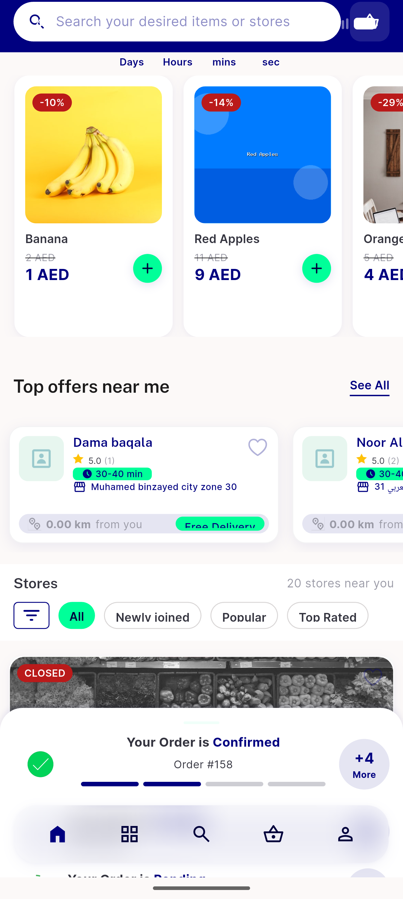
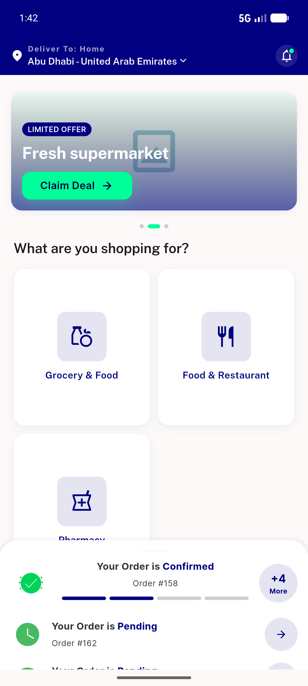
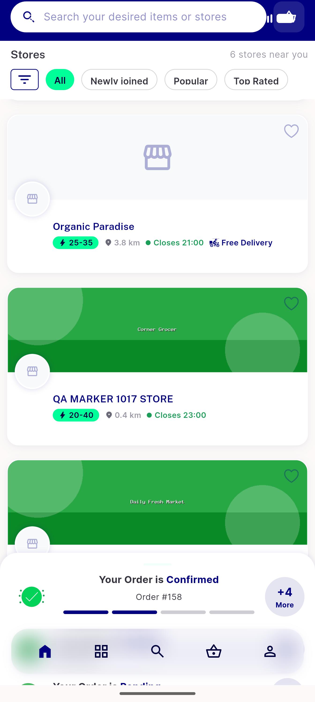

# QA Evidence — NEARS-1017

**PASS — all 7 store-list disk-cache keys carry -z<zoneId>; cross-zone forged-row never read (key layer); same-zone cache-hit proven via marker render with backend down; featured/recommended collision fixed (distinct rows); 1951/1951 tests**

**3 screenshot(s).** Click any thumbnail for full resolution.

<table>
<tr>
<td align="center" width="33%"> ac2 grocery z2 stores no marker</td>
<td align="center" width="33%"> ac2 landing zone2</td>
<td align="center" width="33%"> ac3 marker cache render</td>
</tr>
</table>

### Other artifacts
- [`ac1-z1-keys.log`](ac1-z1-keys.log)
- [`ac1-z2-keys.log`](ac1-z2-keys.log)
- [`ac2-two-rows-proof.log`](ac2-two-rows-proof.log)
- [`ac3-log-window.log`](ac3-log-window.log)
- [`progress.md`](progress.md)

---
*From `nears/docs/qa-evidence/NEARS-1017/` · public-repo scrub policy (no live secrets; verified clean).*
