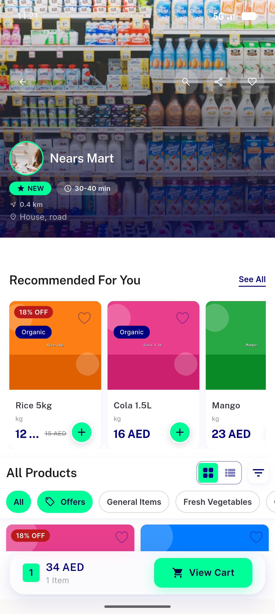

# QA Evidence — NEARS-1018

**FAIL — AC3: NULL-image banner renders via backend placeholder (4/5 ACs pass; task_bug filed)**

**14 screenshot(s).** Click any thumbnail for full resolution.

<table>
<tr>
<td align="center" width="33%"> ac1 slide banner 18 source</td>
<td align="center" width="33%"> ac1 slide banner 19</td>
<td align="center" width="33%"> ac1 slide banner 20</td>
</tr>
<tr>
<td align="center" width="33%"> ac1 slide banner 27 dup image</td>
<td align="center" width="33%"> ac2 tap banner18 opens nears mart</td>
<td align="center" width="33%"> ac2 tap banner19 opens fresh mart</td>
</tr>
<tr>
<td align="center" width="33%"> ac2 tap banner27 opens nears mart</td>
<td align="center" width="33%"> ac3 slide banner 28 should not exist</td>
<td align="center" width="33%"> ac4 store1 closed 2 slides</td>
</tr>
<tr>
<td align="center" width="33%"> ac4 store1 reopened restored</td>
<td align="center" width="33%"> bug main carousel suffix slide27</td>
<td align="center" width="33%"> bug null image banner renders</td>
</tr>
<tr>
<td align="center" width="33%"> regression module home main carousel</td>
<td align="center" width="33%"> regression rtl arabic carousel</td>
</tr>
</table>

### Other artifacts
- [`ac5-image-urls.log`](ac5-image-urls.log)
- [`bug-main-carousel-suffix-slide27.log`](bug-main-carousel-suffix-slide27.log)
- [`bug-null-image-banner-renders.log`](bug-null-image-banner-renders.log)
- [`bug-vendor-storesetup-500-store2.log`](bug-vendor-storesetup-500-store2.log)
- [`progress.md`](progress.md)
- [`qa-comment.md`](qa-comment.md)

---
*From `nears/docs/qa-evidence/NEARS-1018/` · public-repo scrub policy (no live secrets; verified clean).*
