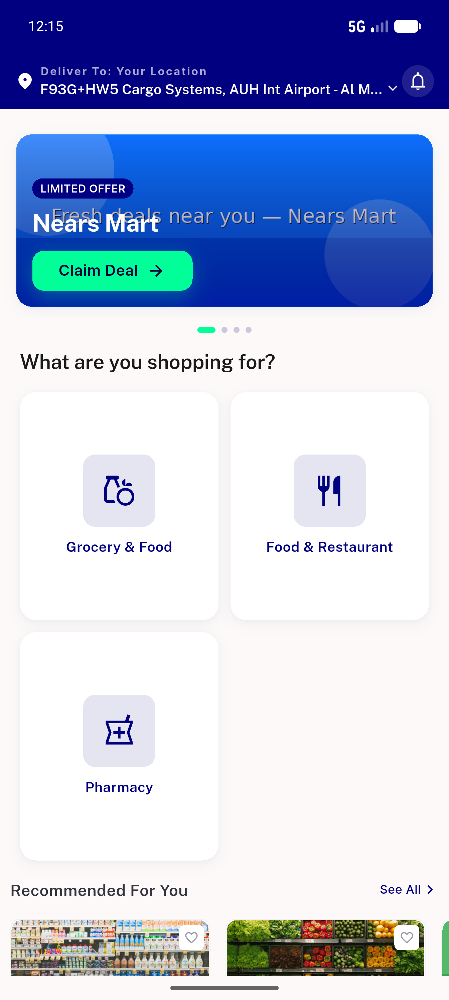
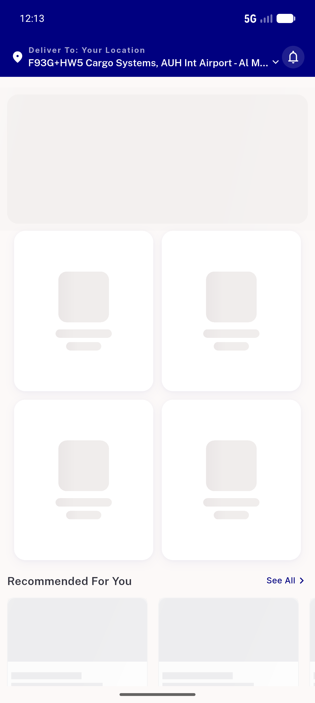
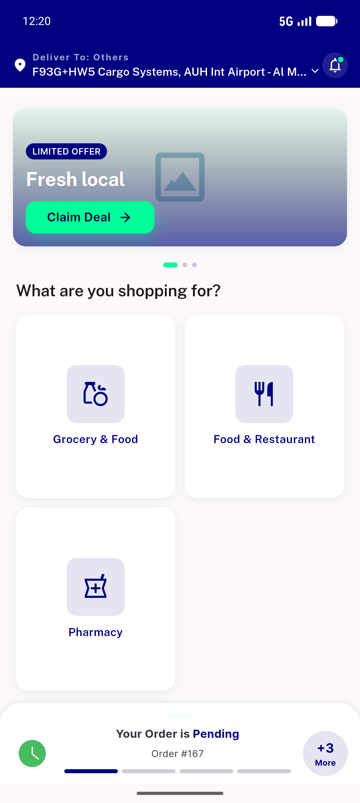
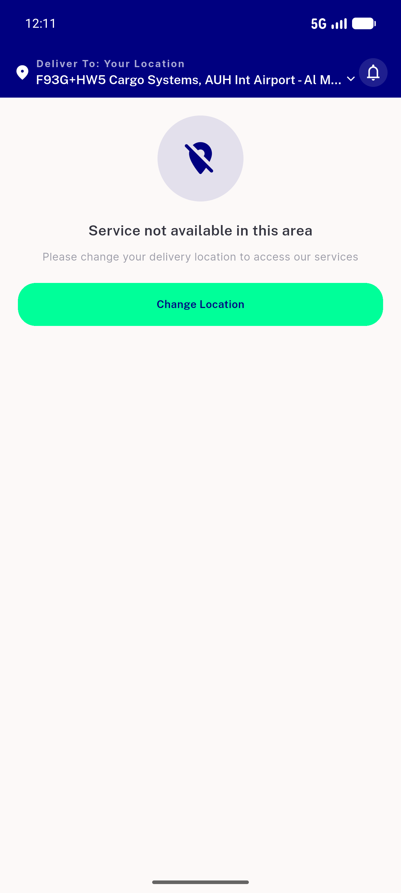
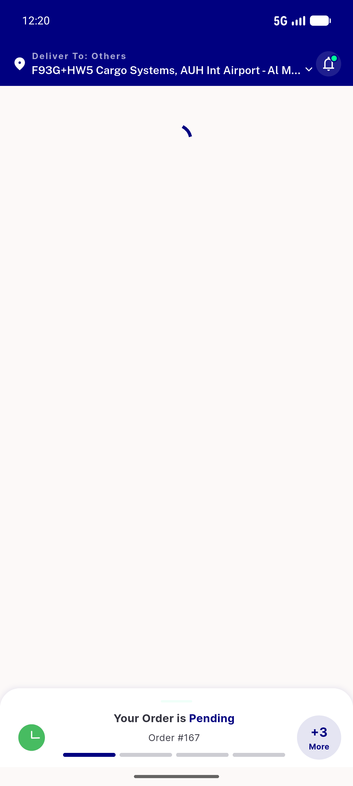
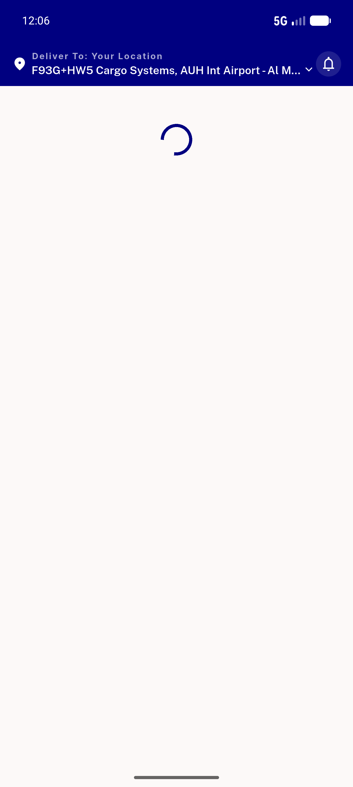
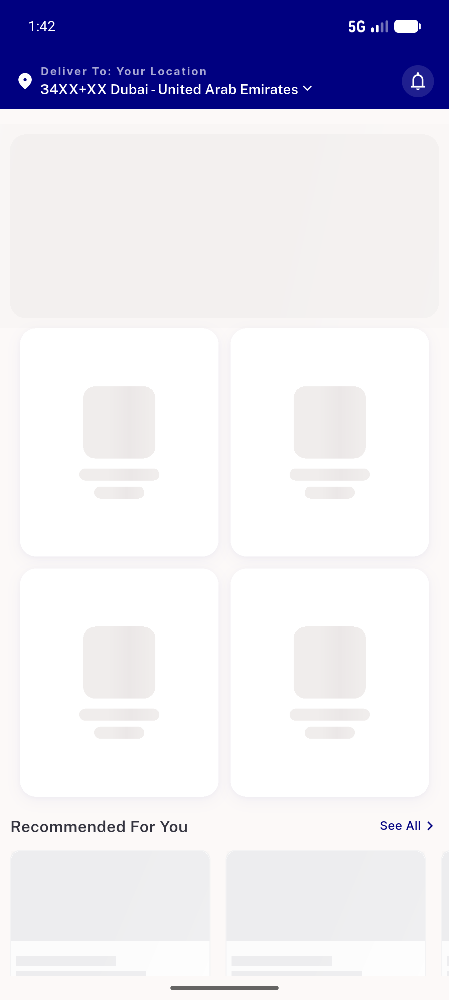
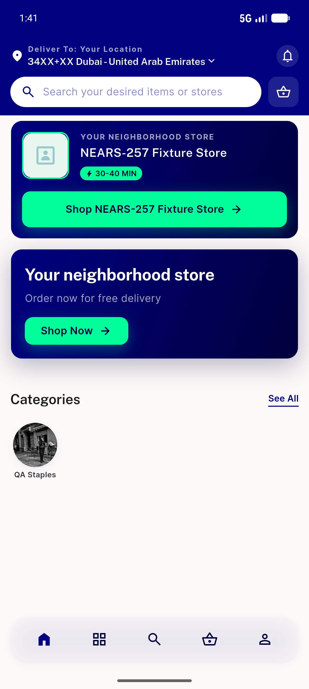
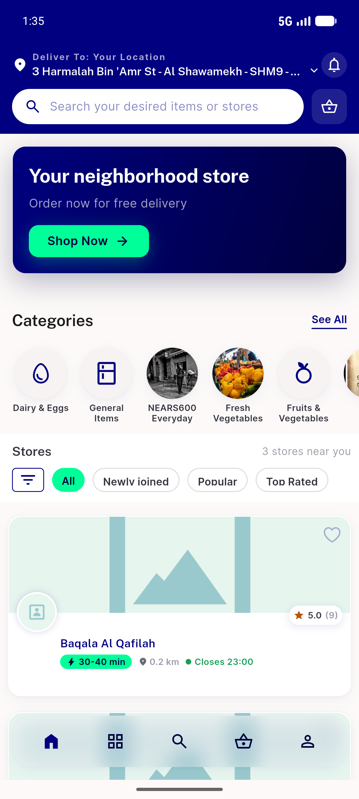
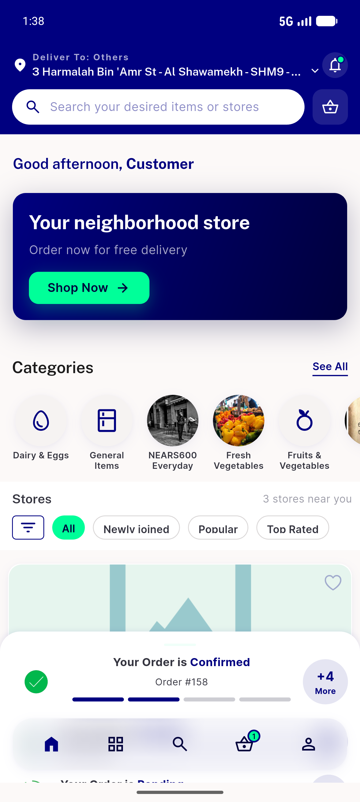

# QA Evidence — NEARS-1020

**cycle 1 delta re-QA PASS @ 5f9f5883 — B1 scoped module headers + B2 boot latch verified live (zones 1/3/364, guest+logged-in, fallback sweep); 2012/2012 tests**

**11 screenshot(s).** Click any thumbnail for full resolution.

<table>
<tr>
<td align="center" width="33%"> ac1 zone1 module chooser resolved</td>
<td align="center" width="33%"> ac2 airplane after config home shimmer</td>
<td align="center" width="33%"> ac6 loggedin multimodule resolved</td>
</tr>
<tr>
<td align="center" width="33%"> ac6 outofzone settled</td>
<td align="center" width="33%"> bug loggedin zone364 stuck spinner</td>
<td align="center" width="33%"> bug resolver module header unscoped</td>
</tr>
<tr>
<td align="center" width="33%"> cycle1 fallback home shimmer</td>
<td align="center" width="33%"> cycle1 zone1 multimodule chooser</td>
<td align="center" width="33%"> cycle1 zone3 directstore home</td>
</tr>
<tr>
<td align="center" width="33%"> cycle1 zone364 guest module home</td>
<td align="center" width="33%"> cycle1 zone364 loggedin module home</td>
</tr>
</table>

### Other artifacts
- [`bug-dual-resolver-pass-per-boot.log`](bug-dual-resolver-pass-per-boot.log)
- [`bug-resolver-module-header-unscoped.log`](bug-resolver-module-header-unscoped.log)
- [`bug-web-boot-uncaught-promise-preexisting.log`](bug-web-boot-uncaught-promise-preexisting.log)
- [`cycle1-b1-module-request-headers.jsonl`](cycle1-b1-module-request-headers.jsonl)
- [`cycle1-b2-warmboot-trace.log`](cycle1-b2-warmboot-trace.log)
- [`cycle1-fallback-boot.log`](cycle1-fallback-boot.log)
- [`cycle1-zone3-directstore-boot.log`](cycle1-zone3-directstore-boot.log)
- [`cycle1-zone364-guest-boot.log`](cycle1-zone364-guest-boot.log)
- [`cycle1-zone364-loggedin-boot.log`](cycle1-zone364-loggedin-boot.log)
- [`progress.md`](progress.md)

---
*From `nears/docs/qa-evidence/NEARS-1020/` · public-repo scrub policy (no live secrets; verified clean).*
