# QA Evidence — NEARS-1021

**QA cycle-1 DELTA — PASS: AC1 direct-store boot fix verified (guest+logged-in), AC2 autoOpened error state, AC3/AC4 slug routing; 1 pre-existing regression (deep-link relocation NPE)**

**15 screenshot(s).** Click any thumbnail for full resolution.

<table>
<tr>
<td align="center" width="33%"> firstrun home hero guest</td>
<td align="center" width="33%"><a href="01-directstore-boot-guest.png">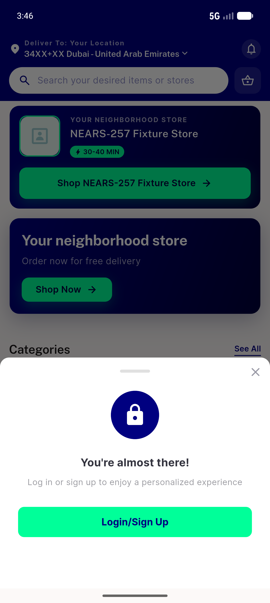</a> directstore boot guest</td>
<td align="center" width="33%"><a href="02-AC1-FAIL-lands-on-home-not-store.png">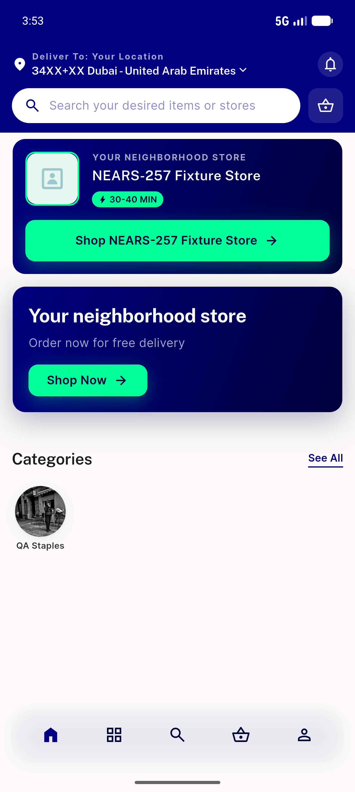</a> AC1 FAIL lands on home not store</td>
</tr>
<tr>
<td align="center" width="33%"><a href="03-after-shopnow.png">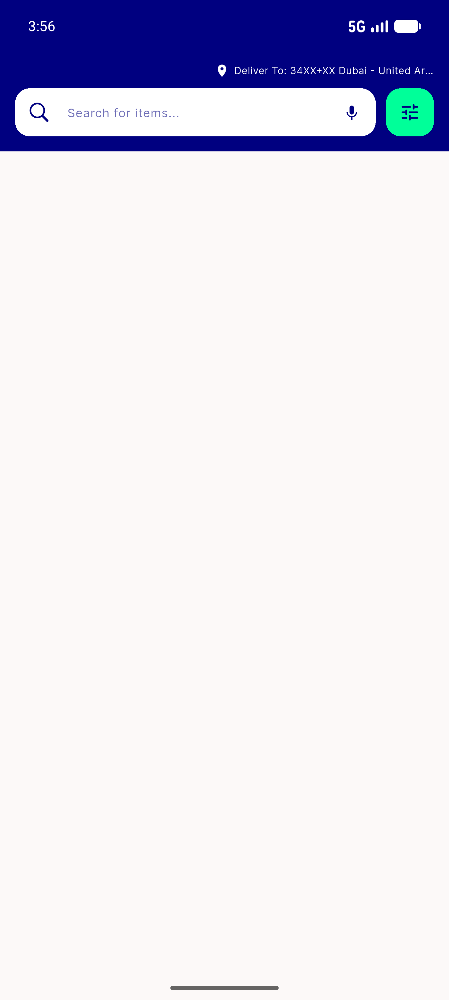</a> after shopnow</td>
<td align="center" width="33%"><a href="04-store-loaded-hero-autoopened.png">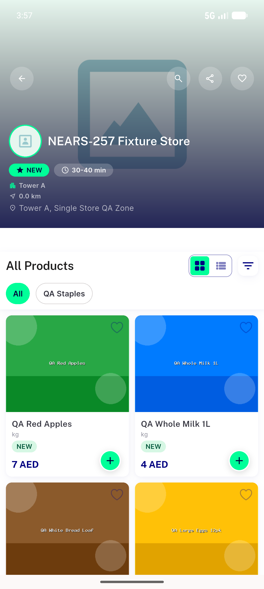</a> store loaded hero autoopened</td>
<td align="center" width="33%"><a href="05-AC2-failure-state-nonboot.png">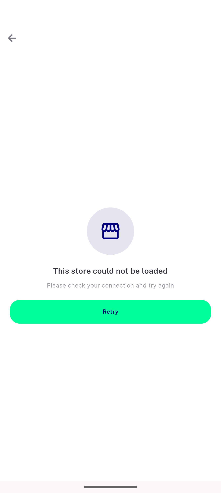</a> AC2 failure state nonboot</td>
</tr>
<tr>
<td align="center" width="33%"><a href="06-AC4-failure-state-arabic-rtl.png">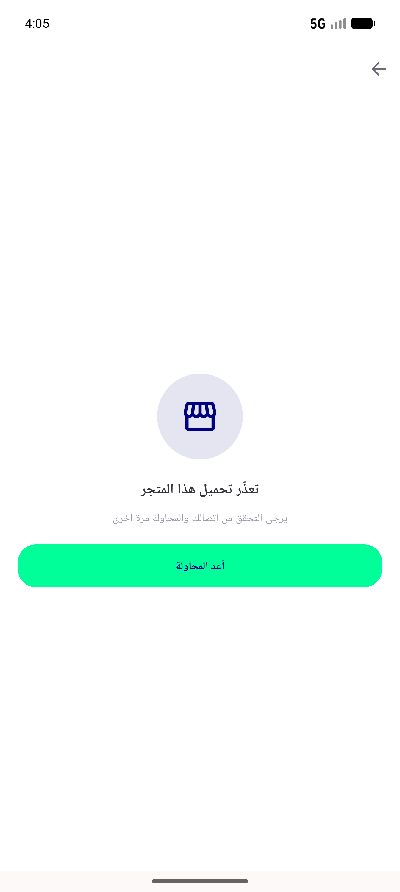</a> AC4 failure state arabic rtl</td>
<td align="center" width="33%"><a href="07-AC1-FAIL-loggedin-home-not-store.png">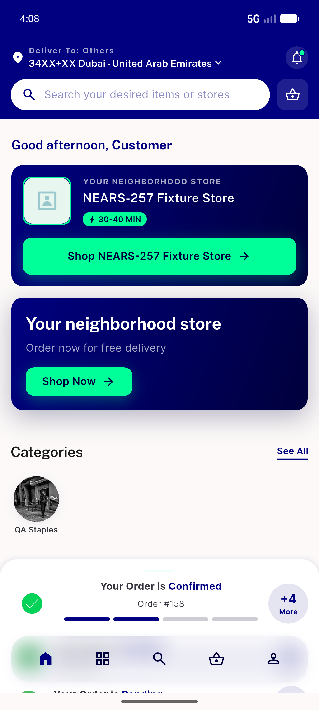</a> AC1 FAIL loggedin home not store</td>
<td align="center" width="33%"><a href="08-AB-withslug-reaches-store.png">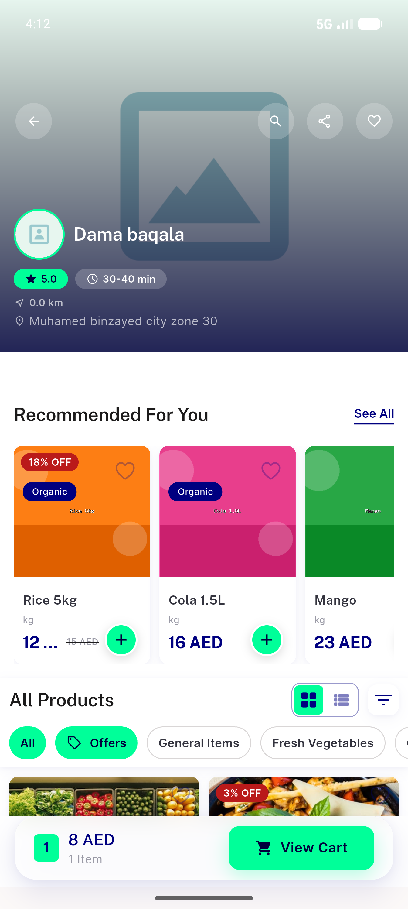</a> AB withslug reaches store</td>
</tr>
<tr>
<td align="center" width="33%"> c1 01 AC1 guest lands on store</td>
<td align="center" width="33%"><a href="c1-02-AC1-loggedin-lands-on-store.png">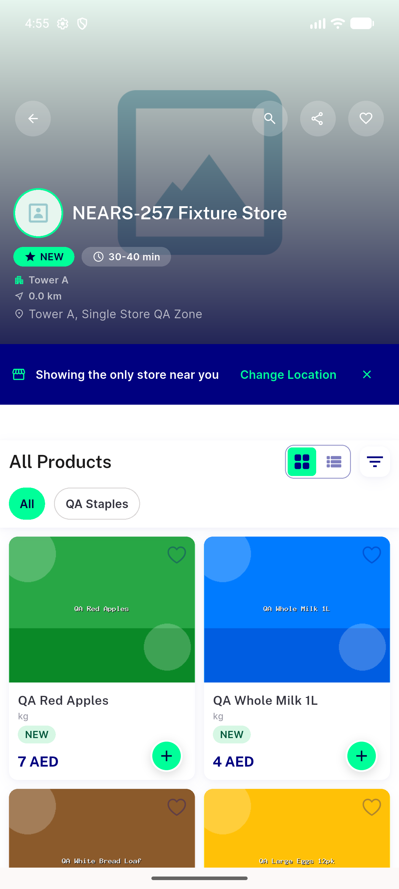</a> c1 02 AC1 loggedin lands on store</td>
<td align="center" width="33%"><a href="c1-03-AC2-autoopened-error-state.png">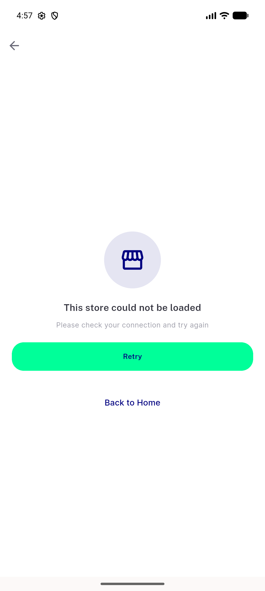</a> c1 03 AC2 autoopened error state</td>
</tr>
<tr>
<td align="center" width="33%"> c1 04 AC2 back to home landing</td>
<td align="center" width="33%"><a href="c1-05-AC4-deeplink-outofzone-slug-store.png">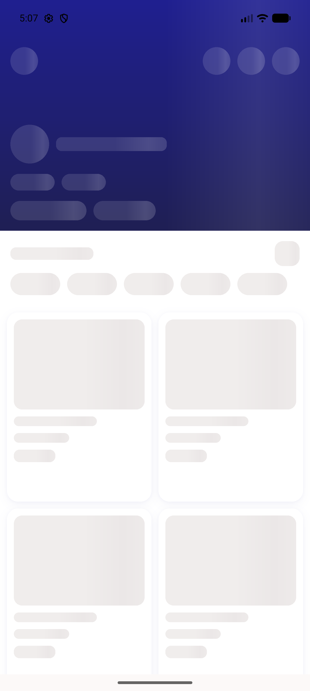</a> c1 05 AC4 deeplink outofzone slug store</td>
<td align="center" width="33%"><a href="c1-06-AC4-inzone-slug-deeplink-store.png">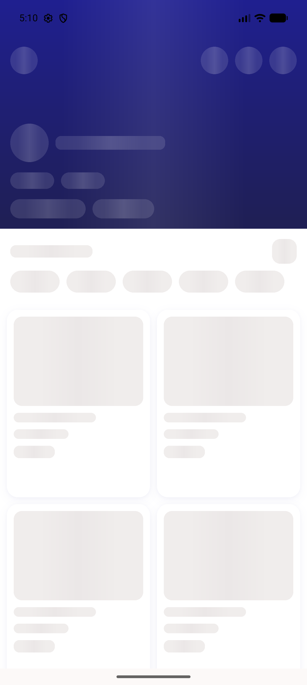</a> c1 06 AC4 inzone slug deeplink store</td>
</tr>
</table>

### Other artifacts
- [`bug-directstore-misroutes-home.log`](bug-directstore-misroutes-home.log)
- [`bug-outofzone-relocation-npe.log`](bug-outofzone-relocation-npe.log)

---
*From `nears/docs/qa-evidence/NEARS-1021/` · public-repo scrub policy (no live secrets; verified clean).*
