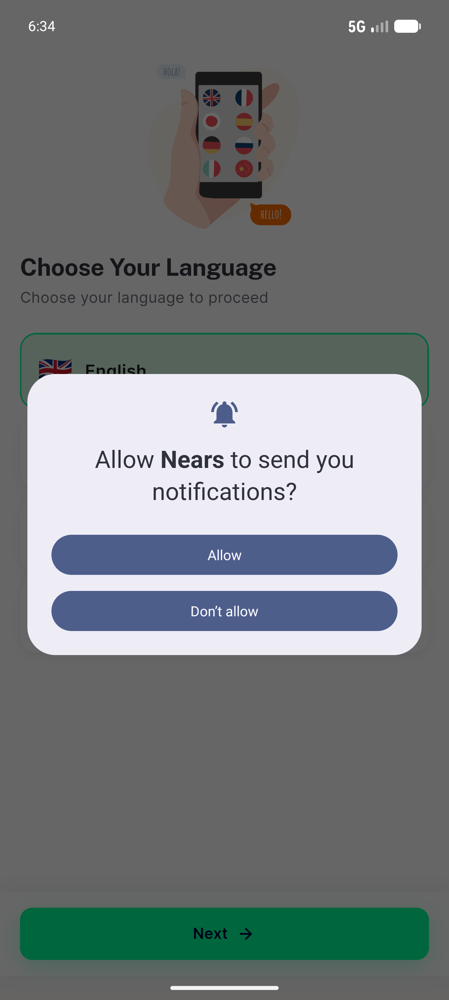
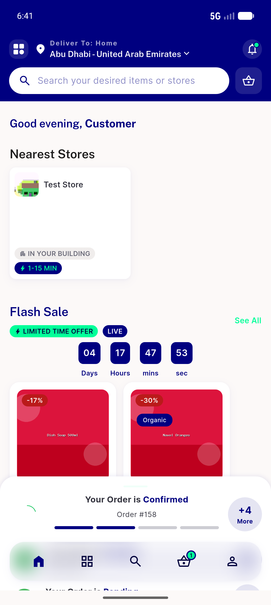
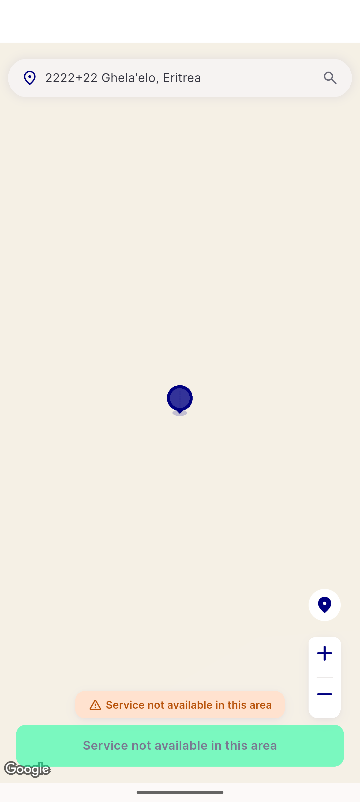
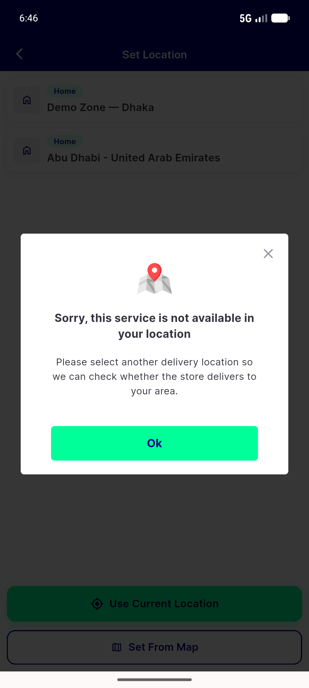
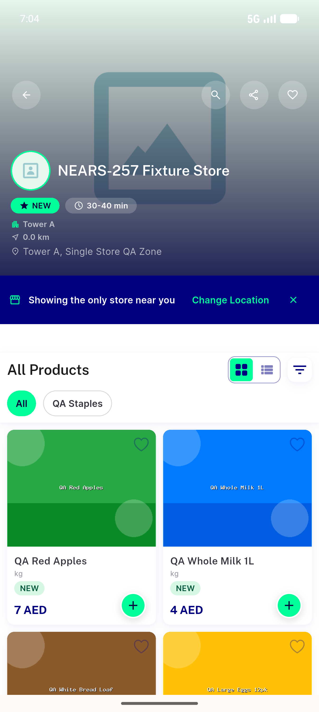
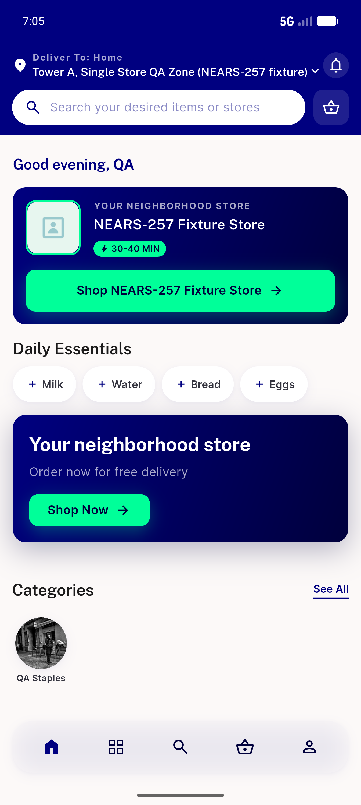
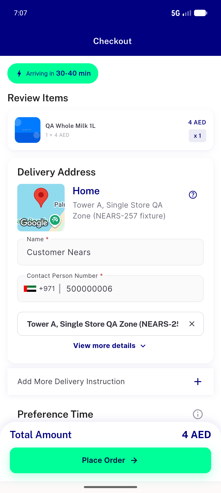

# QA Evidence — NEARS-1022

**PASS — in-app address-change reuse of shared destination resolver (directStore AC1, canRoute AC5, module-not-available AC4, out-of-zone AC2)**

**8 screenshot(s).** Click any thumbnail for full resolution.

<table>
<tr>
<td align="center" width="33%"> boot</td>
<td align="center" width="33%"> normal switch zone2 home</td>
<td align="center" width="33%"> ac2 outofzone pickmap</td>
</tr>
<tr>
<td align="center" width="33%"> ac4 module not available</td>
<td align="center" width="33%"> boot directstore store59</td>
<td align="center" width="33%"> ac1 inapp directstore store59</td>
</tr>
<tr>
<td align="center" width="33%"> ac1 backpress fresh home</td>
<td align="center" width="33%"> ac5 canroute checkout preserved</td>
</tr>
</table>

---
*From `nears/docs/qa-evidence/NEARS-1022/` · public-repo scrub policy (no live secrets; verified clean).*
