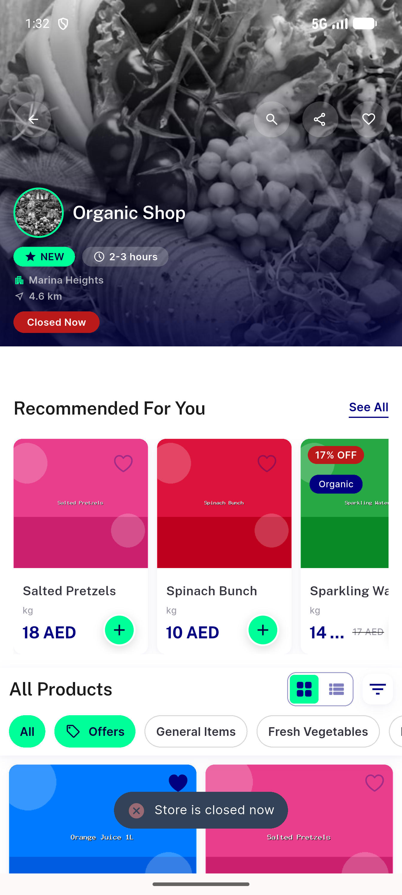
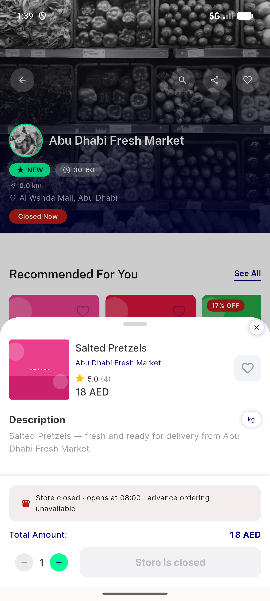
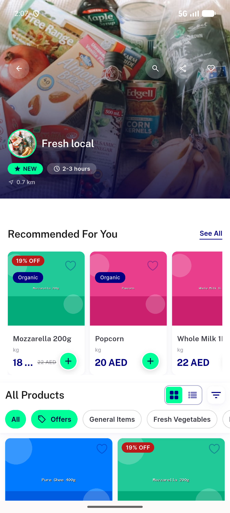
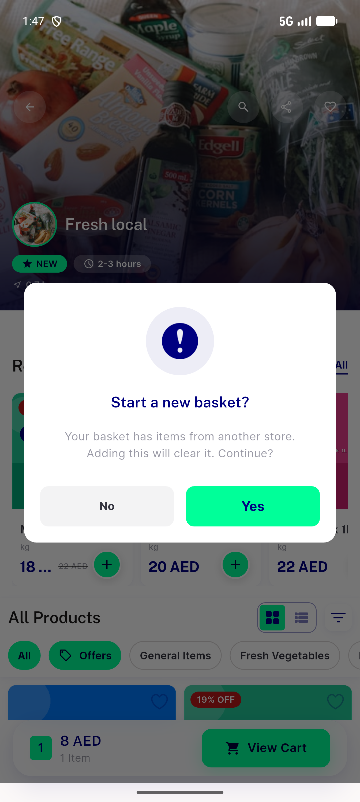
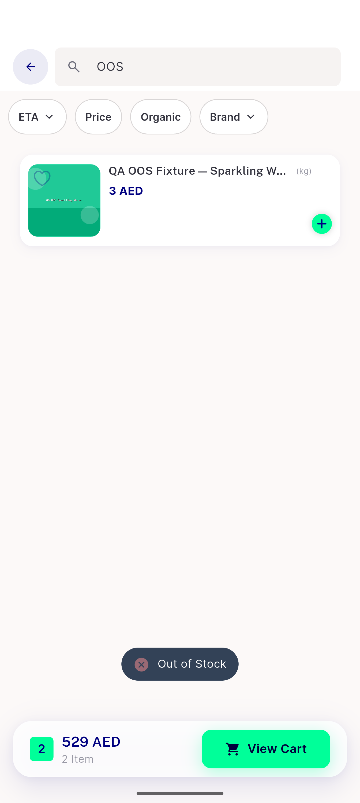
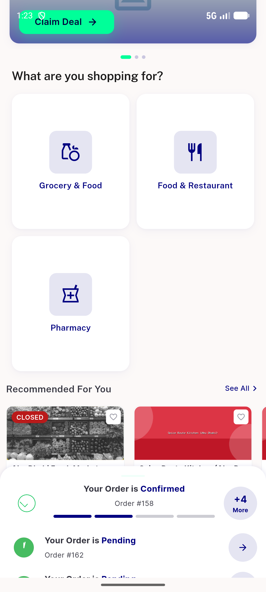
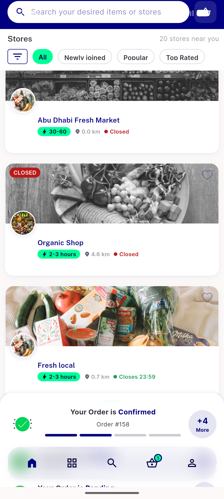
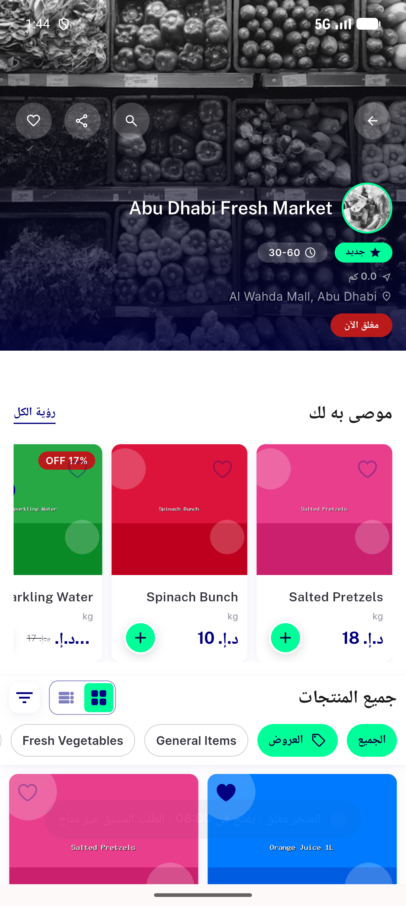
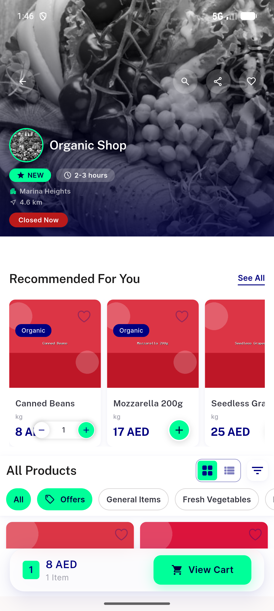

# QA Evidence — NEARS-1023

**PASS — closed-store pre-gate + typed 403 extractor: 7/7 ACs live-demonstrated on emulator-5556 (light), 1974 unit tests green, regression sweep clean**

**10 screenshot(s).** Click any thumbnail for full resolution.

<table>
<tr>
<td align="center" width="33%"> ac1 quickadd blocked opens at</td>
<td align="center" width="33%"> ac1 quickadd blocked snackbar</td>
<td align="center" width="33%"> ac2 bottomsheet blocked cta</td>
</tr>
<tr>
<td align="center" width="33%"> ac3 stale 403 mapped message</td>
<td align="center" width="33%"> ac4 crossstore reset dialog</td>
<td align="center" width="33%"> ac4 oos toast</td>
</tr>
<tr>
<td align="center" width="33%"> ac5 closed badge recommended rail</td>
<td align="center" width="33%"> ac5 closed badge store8 rail</td>
<td align="center" width="33%"> edge ar quickadd blocked rtl</td>
</tr>
<tr>
<td align="center" width="33%"> edge schedule store9 add succeeds</td>
</tr>
</table>

### Other artifacts
- [`followup-stale-storecontroller-failopen.log`](followup-stale-storecontroller-failopen.log)
- [`progress.md`](progress.md)

---
*From `nears/docs/qa-evidence/NEARS-1023/` · public-repo scrub policy (no live secrets; verified clean).*
