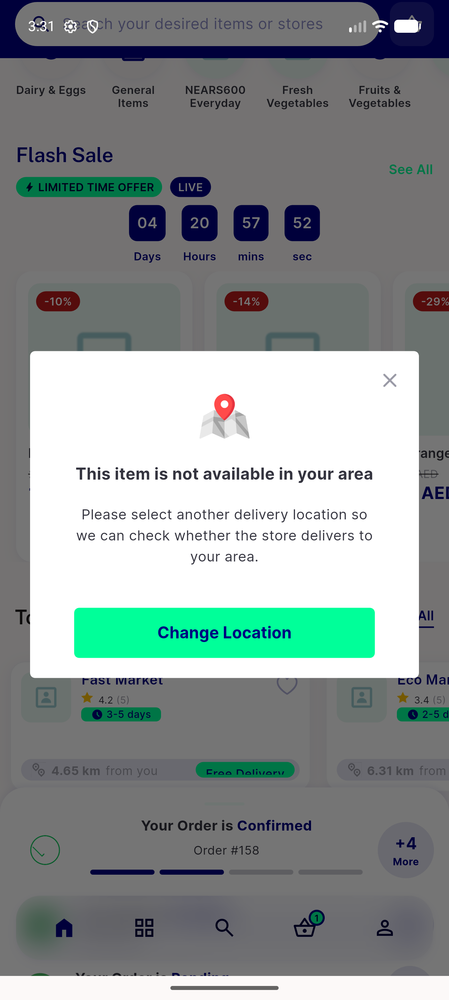
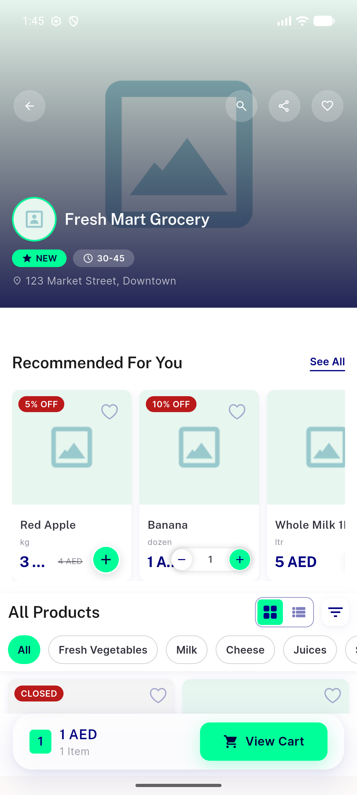
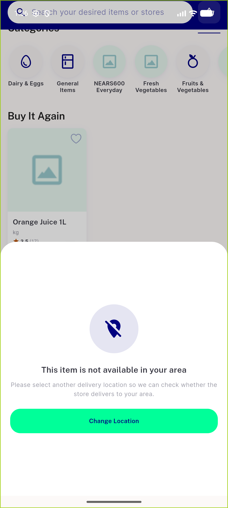
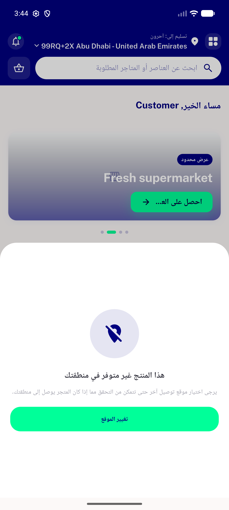
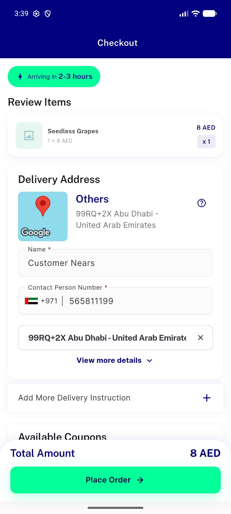
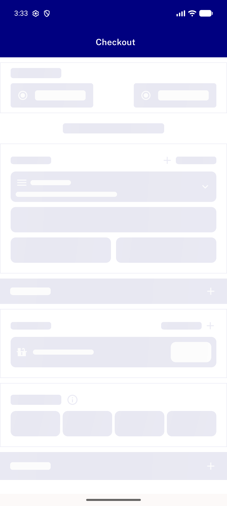

# QA Evidence — NEARS-1024

**PASS — zone-guard details endpoints: item sheet (LTR+RTL) + quick-add + checkout no-dialog-leak all verified on emulator-5556 @ c3ddcb7d**

**6 screenshot(s).** Click any thumbnail for full resolution.

<table>
<tr>
<td align="center" width="33%"> ac quickadd out of zone</td>
<td align="center" width="33%"> ac10 share link store shown</td>
<td align="center" width="33%"> ac8 item sheet out of zone ltr</td>
</tr>
<tr>
<td align="center" width="33%"> ac8 item sheet out of zone rtl</td>
<td align="center" width="33%"> ac9 checkout inzone loaded</td>
<td align="center" width="33%"> ac9 checkout no zone dialog</td>
</tr>
</table>

### Other artifacts
- [`bug-coldopen-store-sharelink-module-match.log`](bug-coldopen-store-sharelink-module-match.log)
- [`progress.md`](progress.md)
- [`qa-quickadd-fail.txt`](qa-quickadd-fail.txt)

---
*From `nears/docs/qa-evidence/NEARS-1024/` · public-repo scrub policy (no live secrets; verified clean).*
