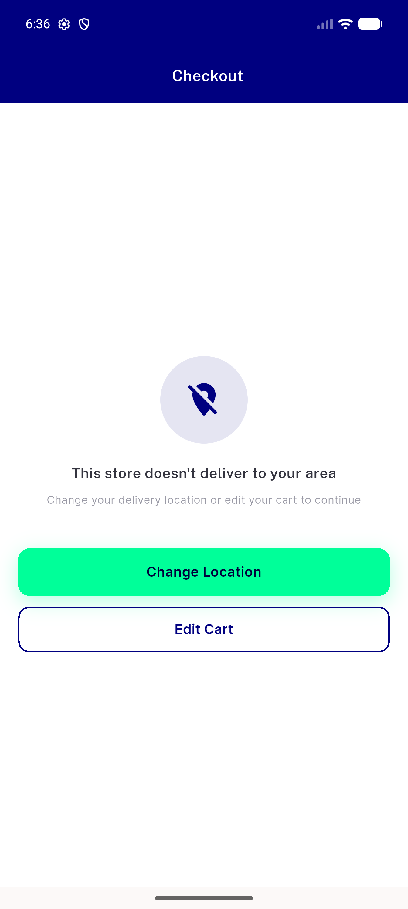
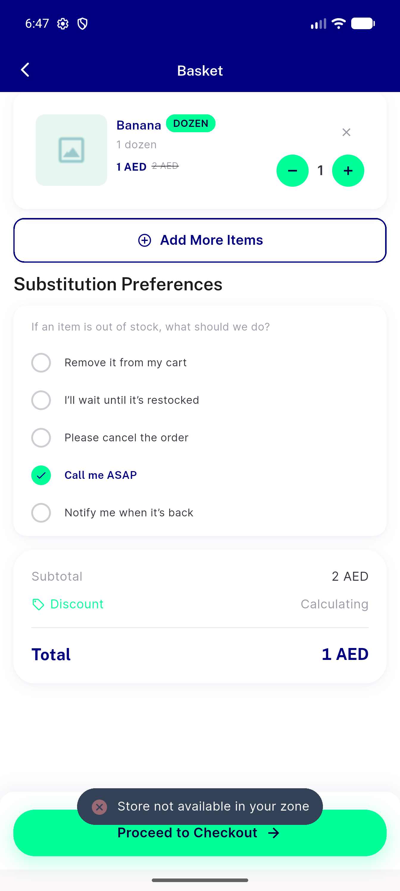
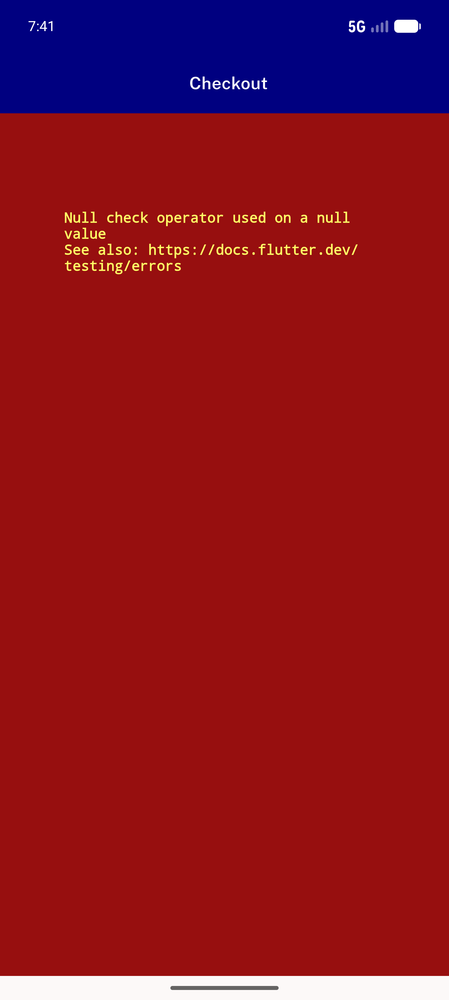
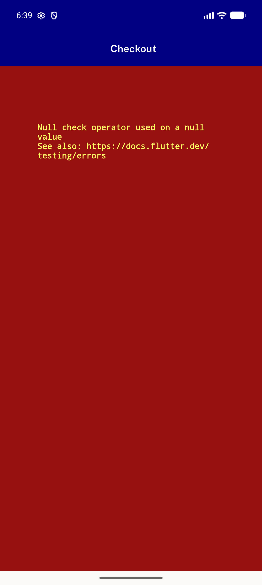
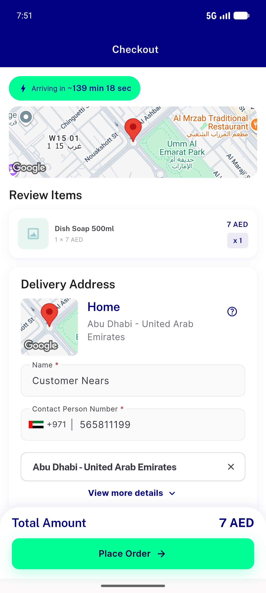
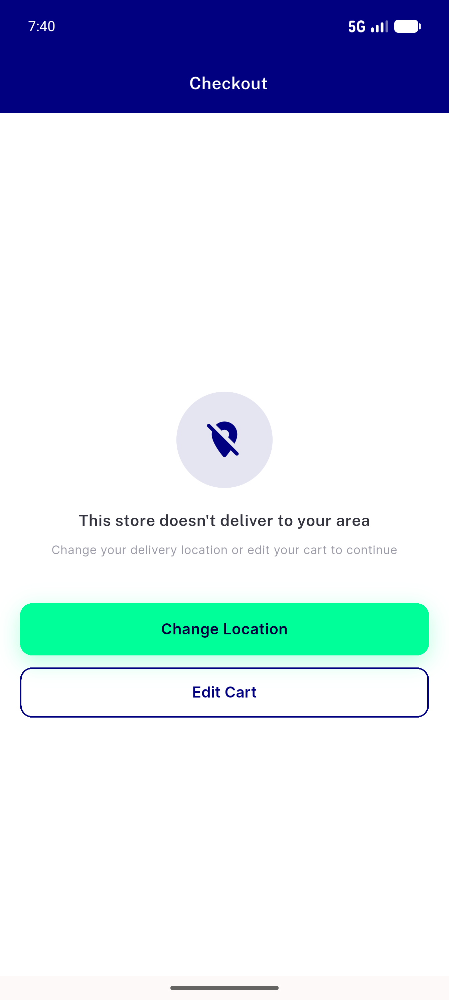
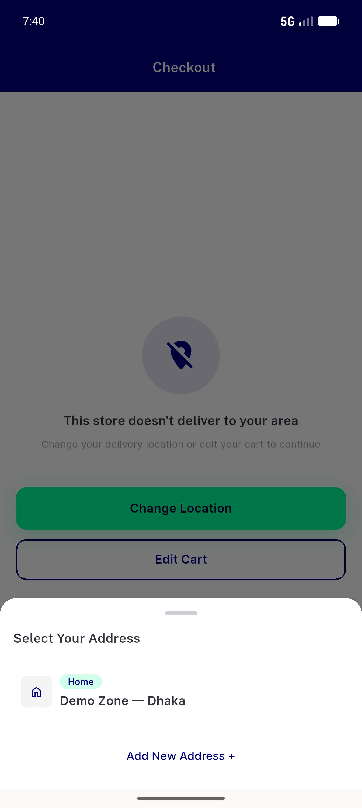

# QA Evidence — NEARS-1025

**cycle-1 re-QA: FAIL — Change Location pick still red-screens**

**8 screenshot(s).** Click any thumbnail for full resolution.

<table>
<tr>
<td align="center" width="33%"> checkout out of zone panel</td>
<td align="center" width="33%"> edit cart lands on cart</td>
<td align="center" width="33%"> bug c1 changeloc pick redscreen</td>
</tr>
<tr>
<td align="center" width="33%"> bug changeloc inzone checkout redscreen</td>
<td align="center" width="33%"> c1 05 inzone checkout renders</td>
<td align="center" width="33%"> c1 10 panel renders</td>
</tr>
<tr>
<td align="center" width="33%"> c1 11 changeloc sheet</td>
<td align="center" width="33%"> c1 11b after pick dhaka</td>
</tr>
</table>

### Other artifacts
- [`bug-c1-changeloc-pick-redscreen.log`](bug-c1-changeloc-pick-redscreen.log)
- [`bug-changeloc-inzone-checkout-redscreen.log`](bug-changeloc-inzone-checkout-redscreen.log)
- [`curl-matrix.txt`](curl-matrix.txt)

---
*From `nears/docs/qa-evidence/NEARS-1025/` · public-repo scrub policy (no live secrets; verified clean).*
