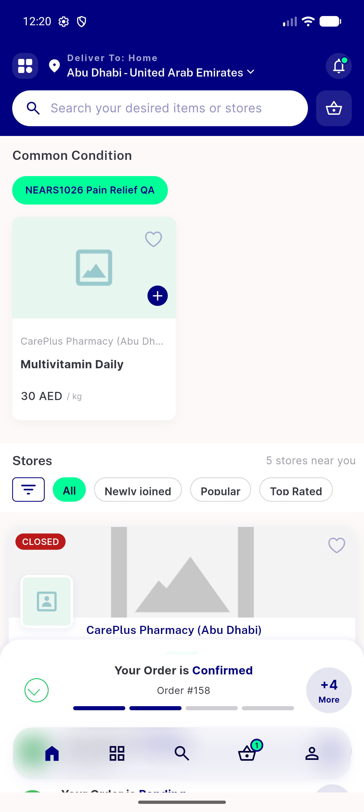

# QA Evidence — NEARS-1026

**PASS — chip counts zone-scoped (z1=2/z2=1, ==list total_size), fail-closed 0, default-zone parity, /list regression clean, 774/774 tests, both zones demoed on emulator-5556**

**2 screenshot(s).** Click any thumbnail for full resolution.

<table>
<tr>
<td align="center" width="33%"> pharmacy home zone1 chip and items</td>
<td align="center" width="33%"> pharmacy home zone2 chip and item</td>
</tr>
</table>

### Other artifacts
- [`curl-matrix.txt`](curl-matrix.txt)
- [`progress.md`](progress.md)
- [`seeder-apply.log`](seeder-apply.log)

---
*From `nears/docs/qa-evidence/NEARS-1026/` · public-repo scrub policy (no live secrets; verified clean).*
