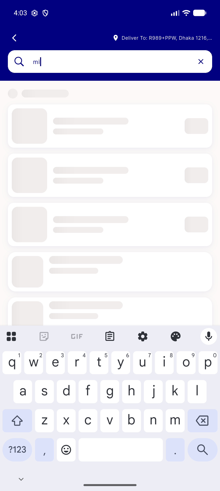
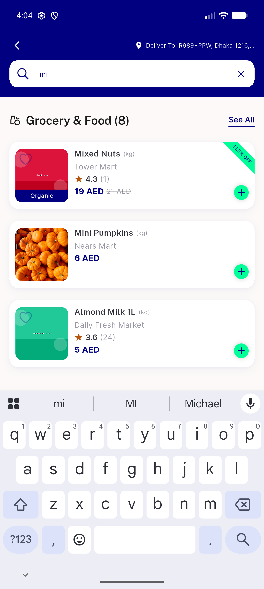
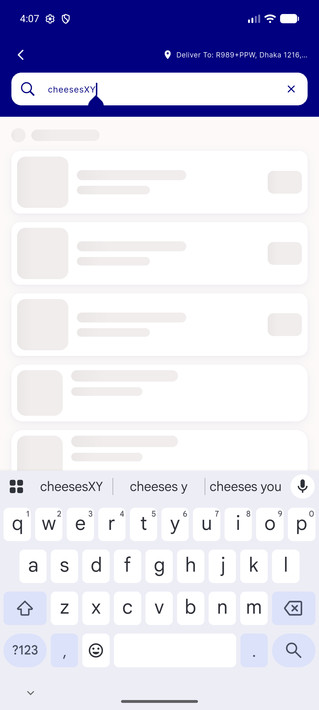
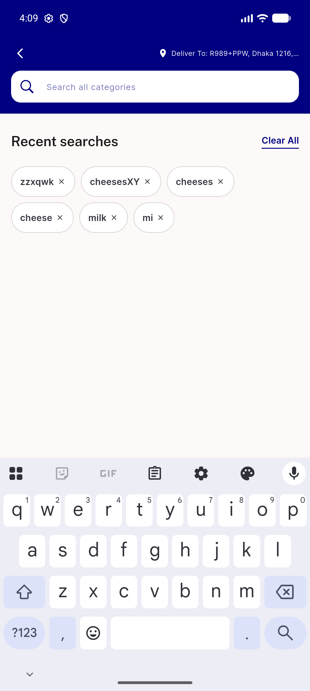
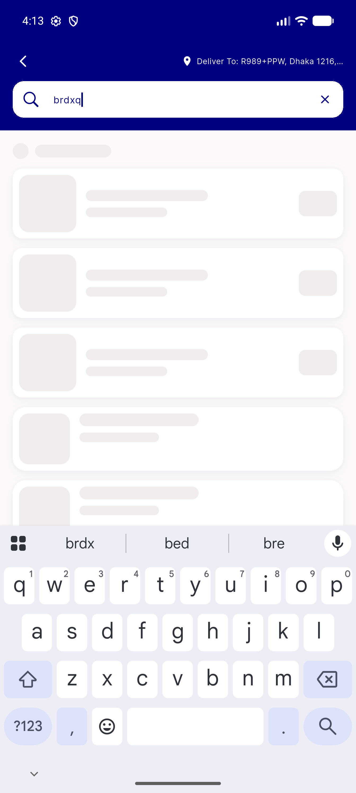
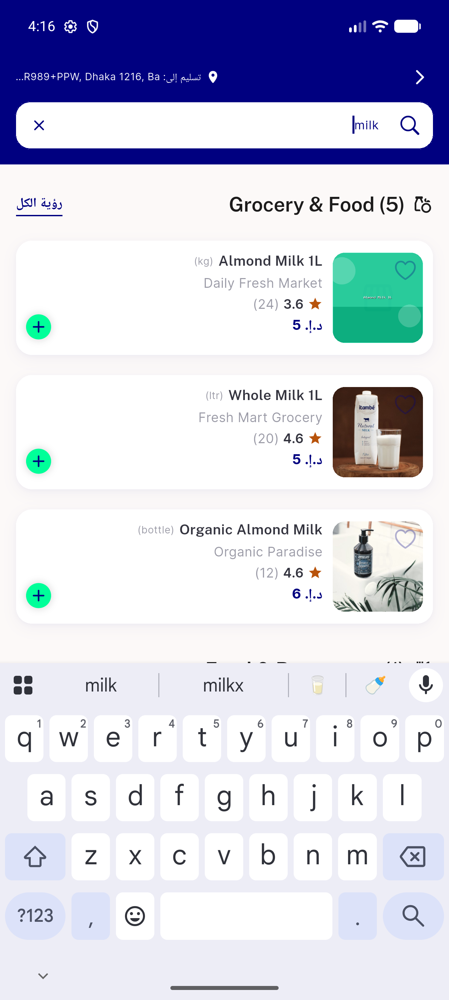
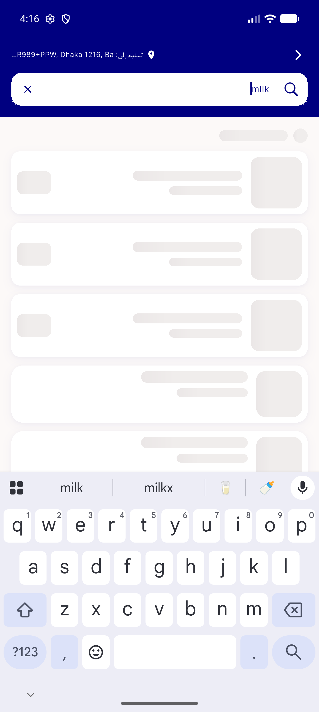

# QA Evidence — NEARS-1031

**PASS — global-search sectioned skeleton + entry pill (emulator-5556, debug 1031 build)**

**12 screenshot(s).** Click any thumbnail for full resolution.

<table>
<tr>
<td align="center" width="33%"> ac1 entry pill home</td>
<td align="center" width="33%"> ac2 skeleton</td>
<td align="center" width="33%"> ac2b loaded sections</td>
</tr>
<tr>
<td align="center" width="33%"> ac3 no stale flash</td>
<td align="center" width="33%"> ac3b error state</td>
<td align="center" width="33%"> ac3c error edit skeleton</td>
</tr>
<tr>
<td align="center" width="33%"> ac4 empty result</td>
<td align="center" width="33%"> ac4b idle recent chips</td>
<td align="center" width="33%"> ac5 reduced motion skeleton</td>
</tr>
<tr>
<td align="center" width="33%"> ac5 rtl loaded</td>
<td align="center" width="33%"> ac5 rtl skeleton</td>
<td align="center" width="33%"> ac6 error retry</td>
</tr>
</table>

---
*From `nears/docs/qa-evidence/NEARS-1031/` · public-repo scrub policy (no live secrets; verified clean).*
