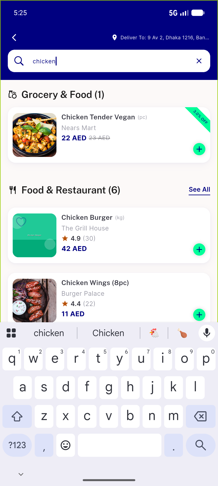
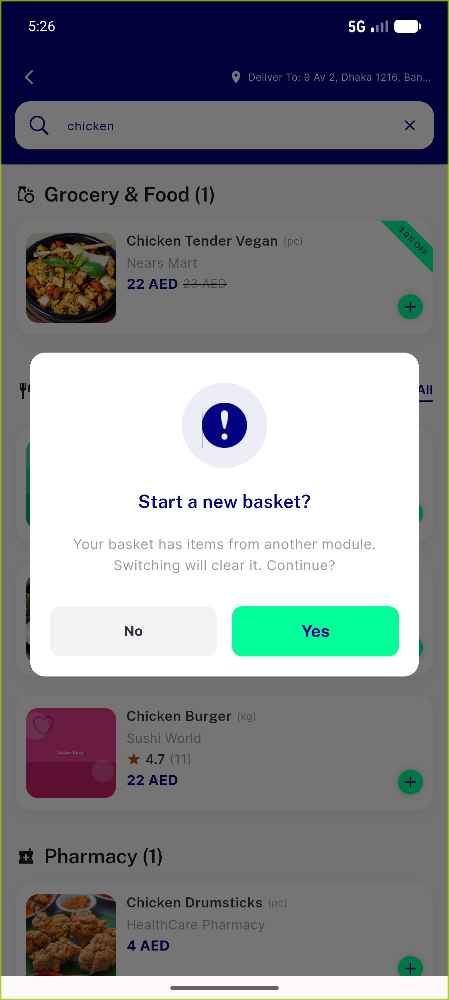
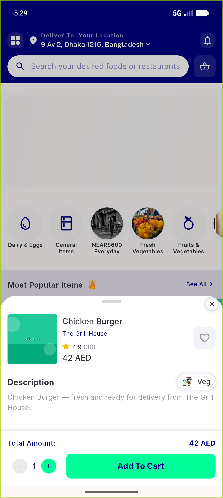
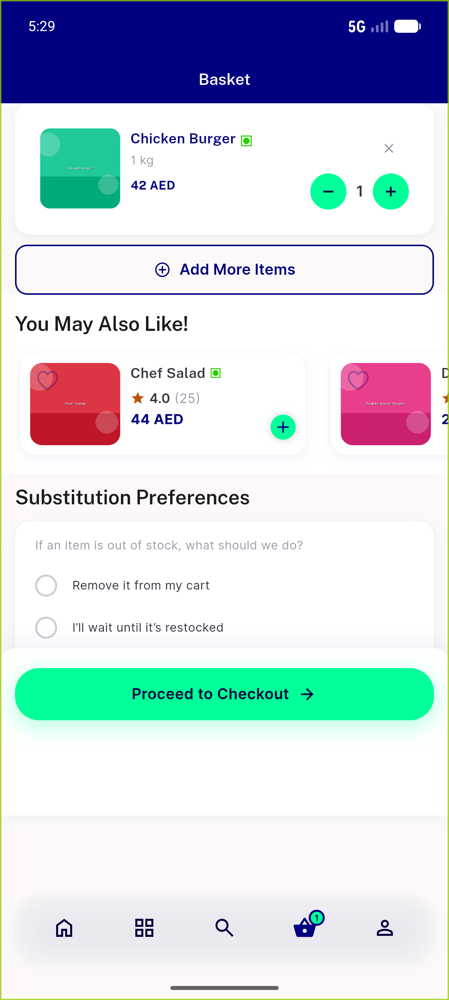
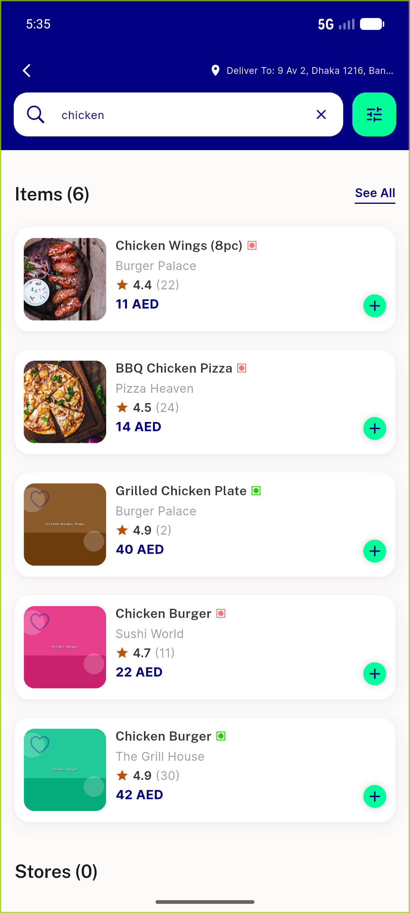
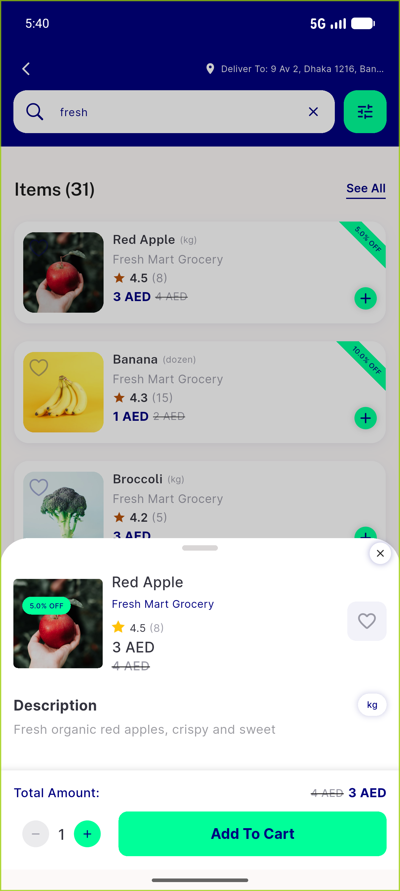
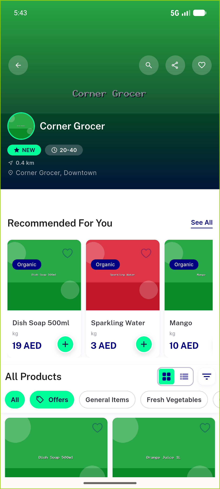
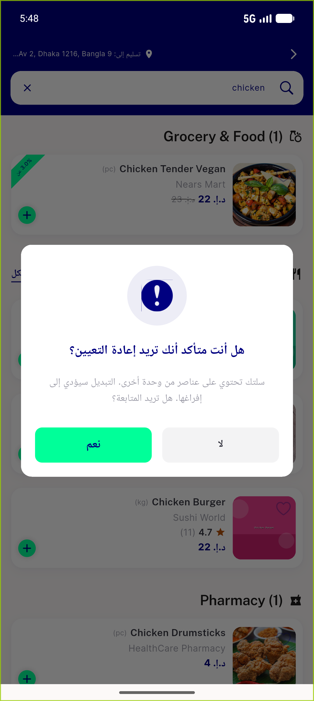

# QA Evidence — NEARS-1032

**PASS - cross-module tap-through guard verified on emulator-5554, zone 1; 1 task_bug (mis-seeded-item 404, non-blocking)**

**8 screenshot(s).** Click any thumbnail for full resolution.

<table>
<tr>
<td align="center" width="33%"> global results crossmodule</td>
<td align="center" width="33%"> reset dialog reworded en</td>
<td align="center" width="33%"> food item detail after confirm no404</td>
</tr>
<tr>
<td align="center" width="33%"> cart buckets under food</td>
<td align="center" width="33%"> seeall searchscreen prefilled</td>
<td align="center" width="33%"> regression store profile</td>
</tr>
<tr>
<td align="center" width="33%"> crossmodule store offNamed</td>
<td align="center" width="33%"> reset dialog arabic rtl</td>
</tr>
</table>

### Other artifacts
- [`bug-tapthrough-section-module-404.log`](bug-tapthrough-section-module-404.log)
- [`progress.md`](progress.md)

---
*From `nears/docs/qa-evidence/NEARS-1032/` · public-repo scrub policy (no live secrets; verified clean).*
