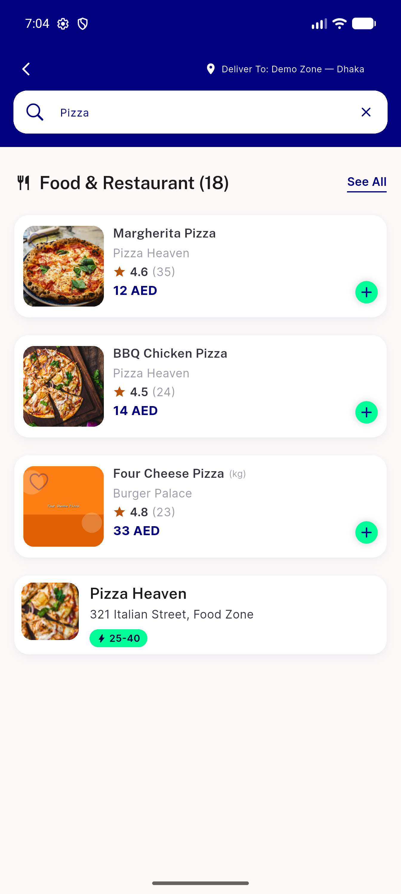
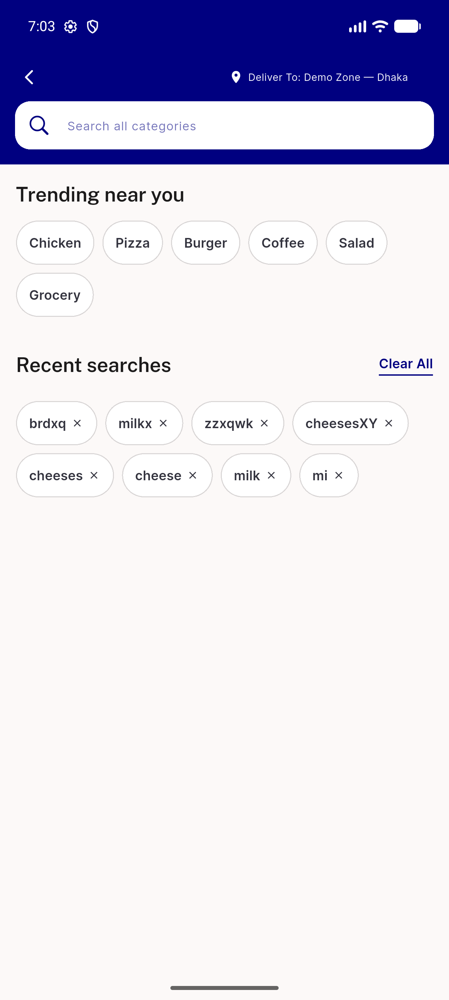
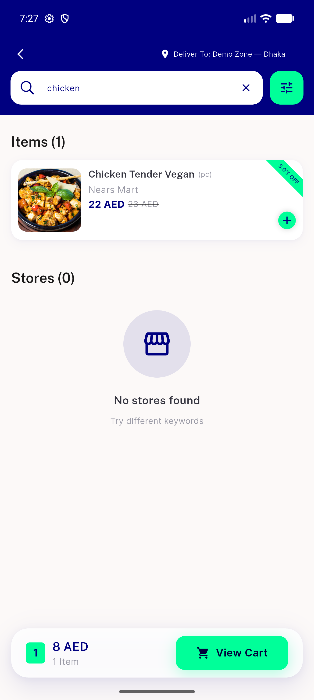
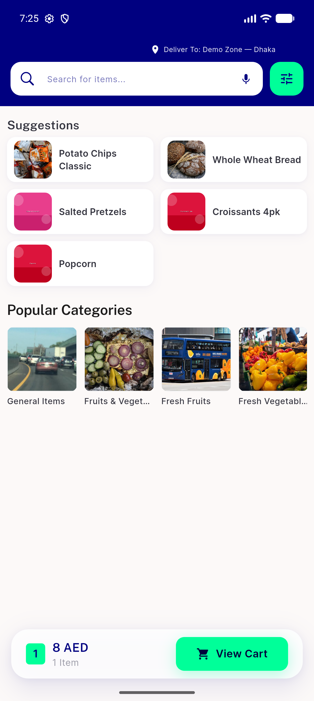
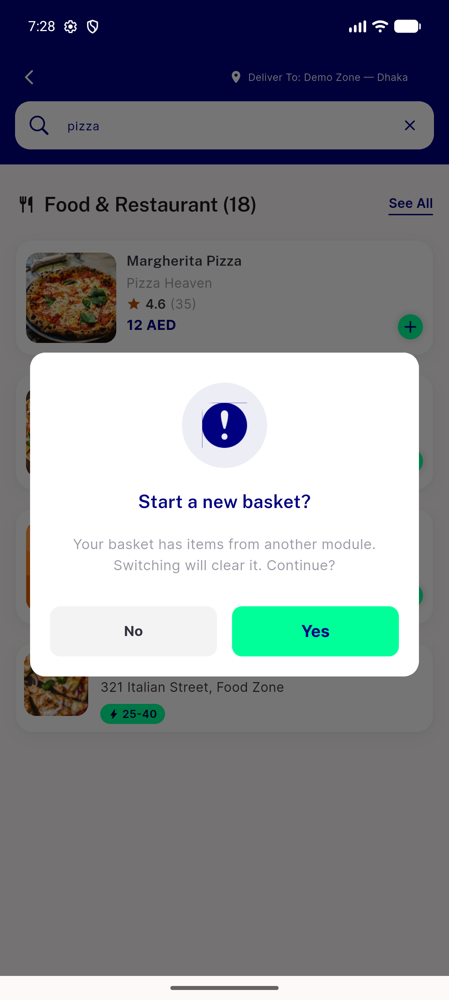
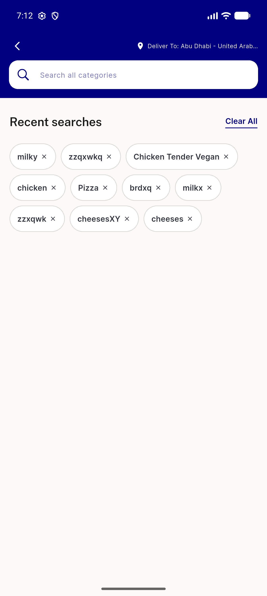
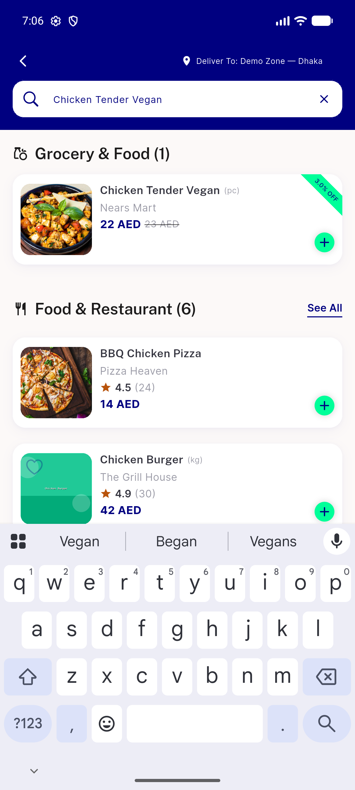
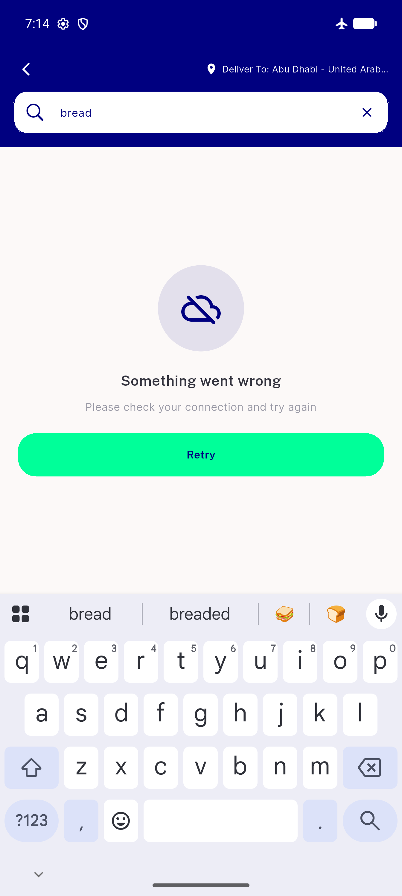
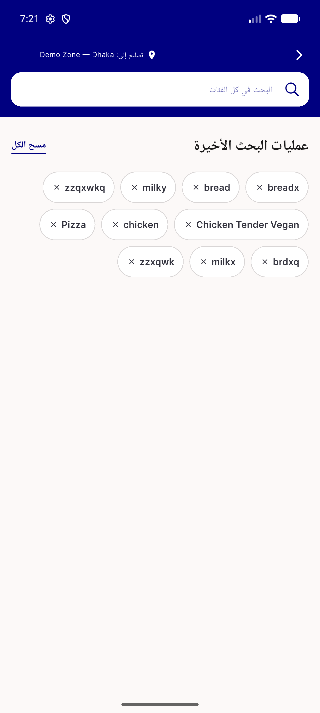
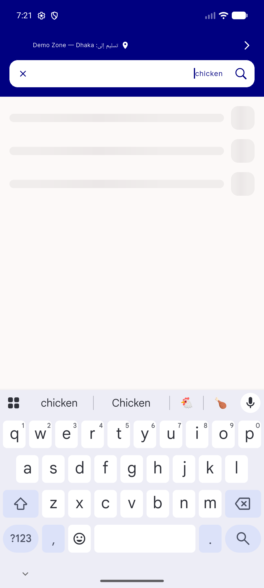

# QA Evidence — NEARS-1033

**PASS (1 non-blocking task_bug: trending stale on mid-session zone change) — UserApp global-search suggestions + trending, emulator-5556, zone 1**

**15 screenshot(s).** Click any thumbnail for full resolution.

<table>
<tr>
<td align="center" width="33%"> ac1 trending chip result</td>
<td align="center" width="33%"> ac1 trending idle</td>
<td align="center" width="33%"> ac10 module pinned result</td>
</tr>
<tr>
<td align="center" width="33%"> ac10 module scoped pinned</td>
<td align="center" width="33%"> ac10 tapthrough guard</td>
<td align="center" width="33%"> ac2 trending hidden</td>
</tr>
<tr>
<td align="center" width="33%"> ac3 ac4 suggestions dropdown</td>
<td align="center" width="33%"> ac3 crossmodule result</td>
<td align="center" width="33%"> ac5 stale flash clear</td>
</tr>
<tr>
<td align="center" width="33%"> ac6 pending skeleton</td>
<td align="center" width="33%"> ac7 ac4 nomatch</td>
<td align="center" width="33%"> ac8 typeahead failure</td>
</tr>
<tr>
<td align="center" width="33%"> ac9 rtl idle trending</td>
<td align="center" width="33%"> ac9 rtl skeleton</td>
<td align="center" width="33%"> ac9 rtl suggestions</td>
</tr>
</table>

### Other artifacts
- [`ac2-trending-5xx-fail.log`](ac2-trending-5xx-fail.log)
- [`bug-trending-zone-change-stale.log`](bug-trending-zone-change-stale.log)

---
*From `nears/docs/qa-evidence/NEARS-1033/` · public-repo scrub policy (no live secrets; verified clean).*
