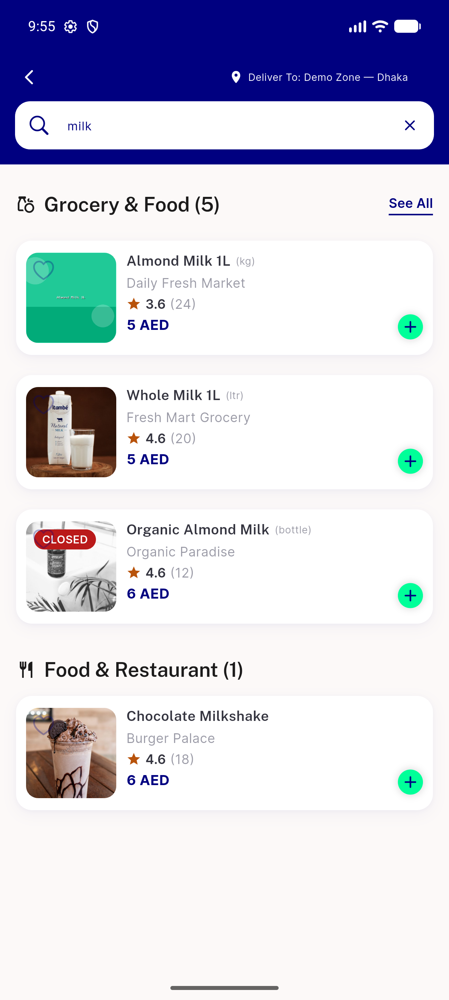
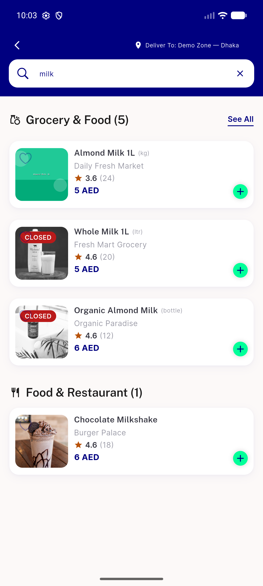
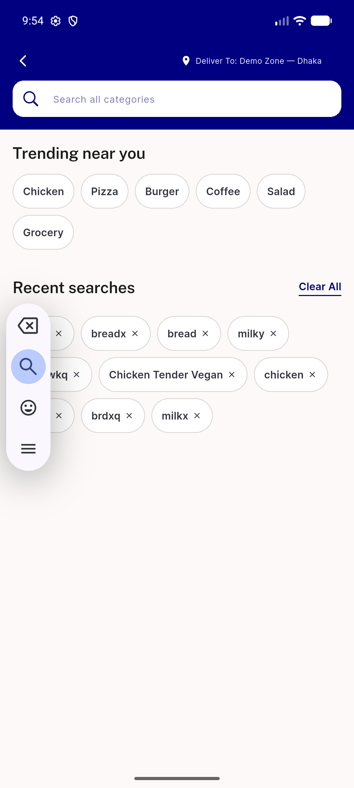
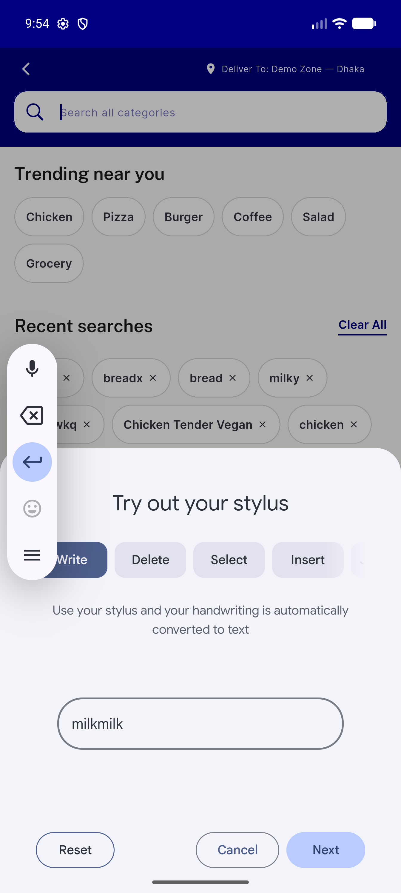

# QA Evidence — NEARS-1034

**PASS — 4 global-search analytics events fire once, PII-safe (query_hash 8825e765, no raw text); from_search attribution gated**

**4 screenshot(s).** Click any thumbnail for full resolution.

<table>
<tr>
<td align="center" width="33%"> results milk</td>
<td align="center" width="33%"> results seeall</td>
<td align="center" width="33%"> setup search screen</td>
</tr>
<tr>
<td align="center" width="33%"> setup stylus dialog intercept</td>
</tr>
</table>

### Other artifacts
- [`analytics-events-summary.log`](analytics-events-summary.log)
- [`flutter-run.log`](flutter-run.log)
- [`logcat-analytics-trimmed.txt`](logcat-analytics-trimmed.txt)

---
*From `nears/docs/qa-evidence/NEARS-1034/` · public-repo scrub policy (no live secrets; verified clean).*
