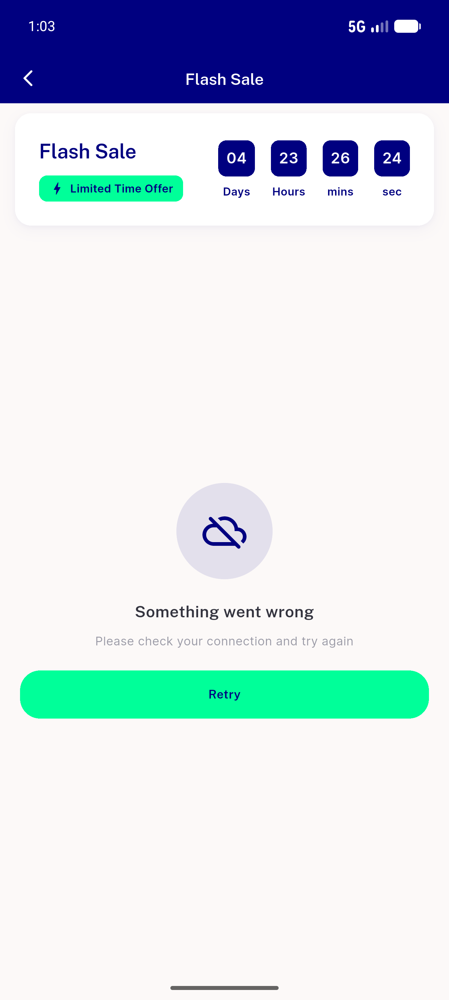
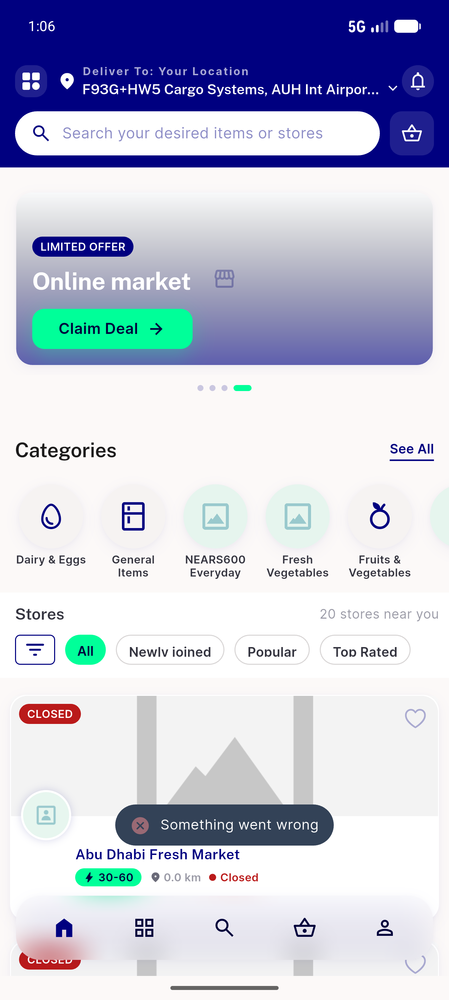
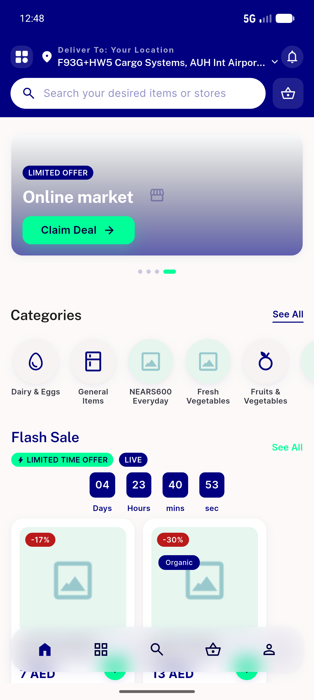

# QA Evidence — NEARS-1035

**PASS — all 5 ACs + rail degrade + cache bump demonstrated live (021d2028, emulator-5554, worktree BE :8035); phpunit 776/776, flutter 2015/2015; 1 pre-existing regression bug filed-ready (details initState setState-during-build)**

**7 screenshot(s).** Click any thumbnail for full resolution.

<table>
<tr>
<td align="center" width="33%"> bug details stuck shimmer</td>
<td align="center" width="33%"> details error retry 403</td>
<td align="center" width="33%"> details happy zone2</td>
</tr>
<tr>
<td align="center" width="33%"> details loaded empty</td>
<td align="center" width="33%"> rail degrade hidden</td>
<td align="center" width="33%"> rail zone1 normal</td>
</tr>
<tr>
<td align="center" width="33%"> rail zone2 grocery</td>
</tr>
</table>

### Other artifacts
- [`ac1a-raw.json`](ac1a-raw.json)
- [`ac1b-unknown-id.json`](ac1b-unknown-id.json)
- [`ac2-crafted-zoneid.txt`](ac2-crafted-zoneid.txt)
- [`ac2-zone1.json`](ac2-zone1.json)
- [`ac2-zone2.json`](ac2-zone2.json)
- [`ac3-fail-log-excerpt.log`](ac3-fail-log-excerpt.log)
- [`ac3-fault-items.json`](ac3-fault-items.json)
- [`ac3-fault-rail.json`](ac3-fault-rail.json)
- [`bug-details-initstate-update-during-build.log`](bug-details-initstate-update-during-build.log)
- [`progress.md`](progress.md)

---
*From `nears/docs/qa-evidence/NEARS-1035/` · public-repo scrub policy (no live secrets; verified clean).*
