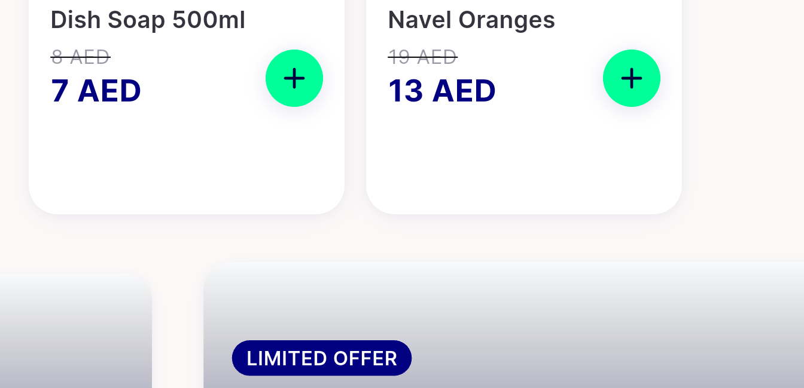
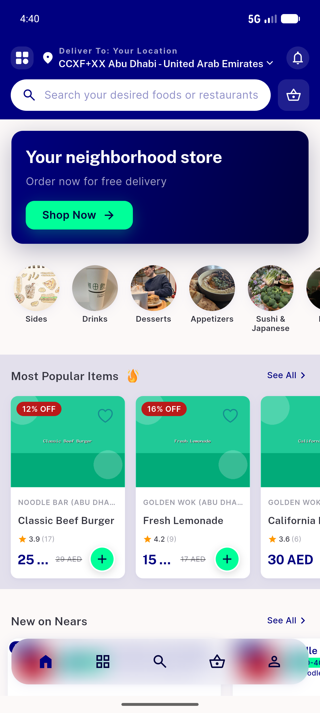

# QA Evidence — NEARS-1036

**PASS — flash-sale hoists above banner on live-sale grocery home; single collapsed seam gutter; single-mount; no flicker; logs clean**

**5 screenshot(s).** Click any thumbnail for full resolution.

<table>
<tr>
<td align="center" width="33%"> ac1 flash header chrome</td>
<td align="center" width="33%"> ac1 grocery flash above banner</td>
<td align="center" width="33%"> ac1 grocery flash top</td>
</tr>
<tr>
<td align="center" width="33%"> ac1 seam single gutter</td>
<td align="center" width="33%"> ac2 food normal banner top</td>
</tr>
</table>

---
*From `nears/docs/qa-evidence/NEARS-1036/` · public-repo scrub policy (no live secrets; verified clean).*
