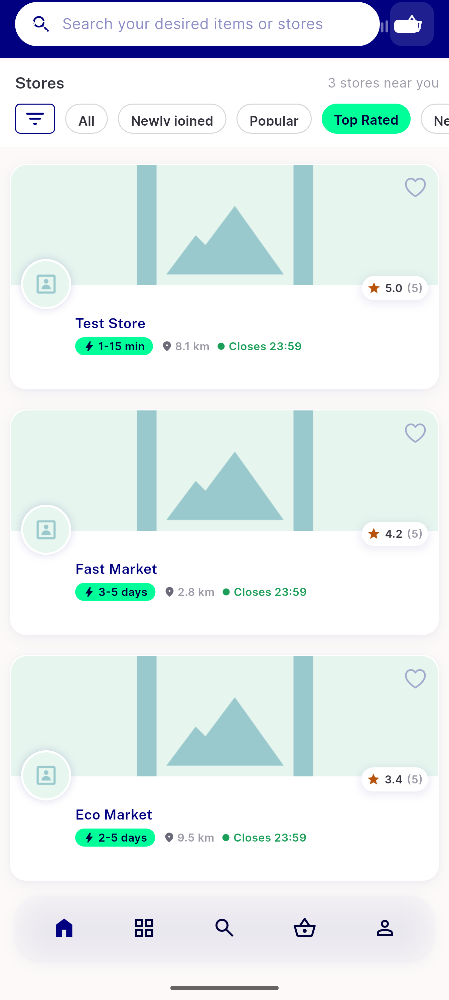

# QA Evidence — NEARS-1038

**PASS — nearest distance-ASC + top_rated 35>21>19 on-device, backend matrix reused, logs clean**

**2 screenshot(s).** Click any thumbnail for full resolution.

<table>
<tr>
<td align="center" width="33%"> ondevice nearest</td>
<td align="center" width="33%"> ondevice top rated</td>
</tr>
</table>

### Other artifacts
- [`progress.md`](progress.md)

---
*From `nears/docs/qa-evidence/NEARS-1038/` · public-repo scrub policy (no live secrets; verified clean).*
