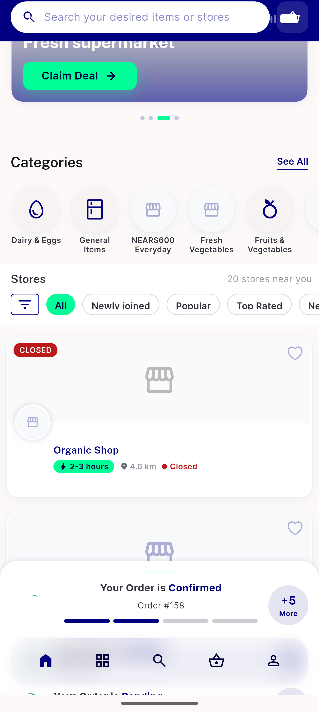
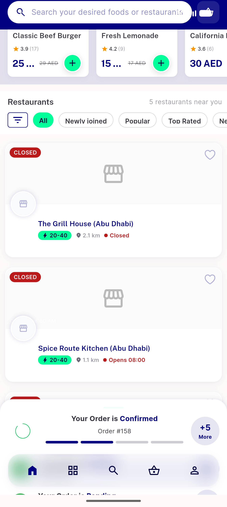
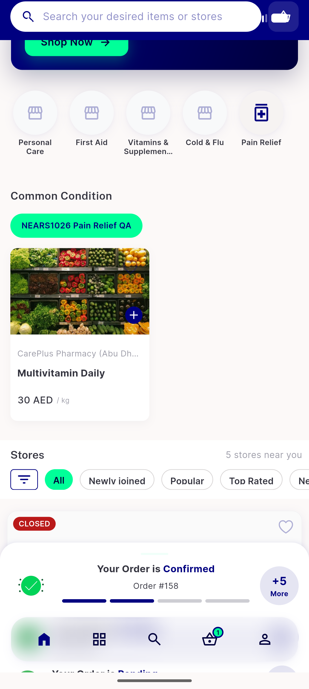
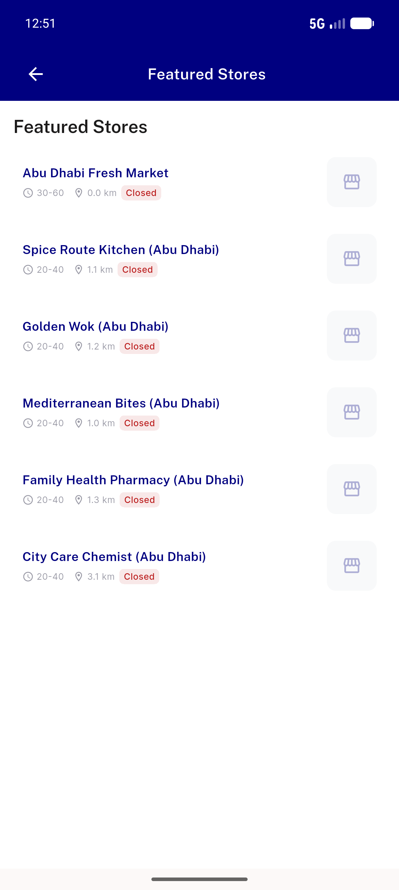
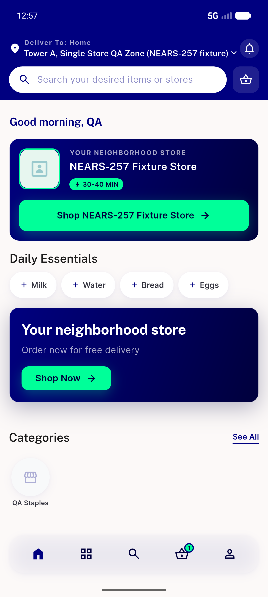
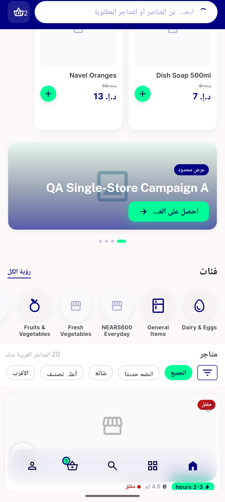
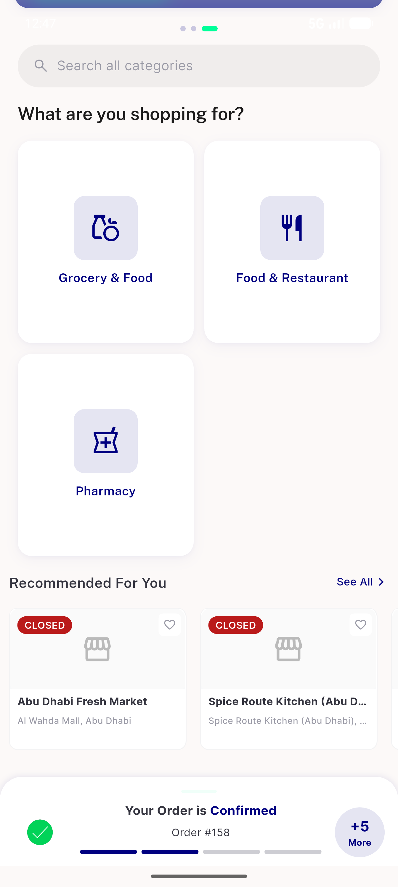

# QA Evidence — NEARS-1039

**PASS — Top Offers rail removed; homes reflow gap-free, no dead fetch, see-all + single-store hero intact (zone2 + zone3, EN + AR)**

**7 screenshot(s).** Click any thumbnail for full resolution.

<table>
<tr>
<td align="center" width="33%"> grocery module home reflow</td>
<td align="center" width="33%"> food module home reflow</td>
<td align="center" width="33%"> pharmacy module home reflow</td>
</tr>
<tr>
<td align="center" width="33%"> see all featured intact</td>
<td align="center" width="33%"> single store hero resolved</td>
<td align="center" width="33%"> arabic rtl module home</td>
</tr>
<tr>
<td align="center" width="33%"> zone2 dashboard</td>
</tr>
</table>

### Other artifacts
- [`progress.md`](progress.md)

---
*From `nears/docs/qa-evidence/NEARS-1039/` · public-repo scrub policy (no live secrets; verified clean).*
