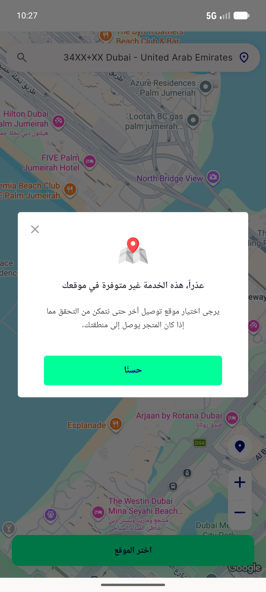
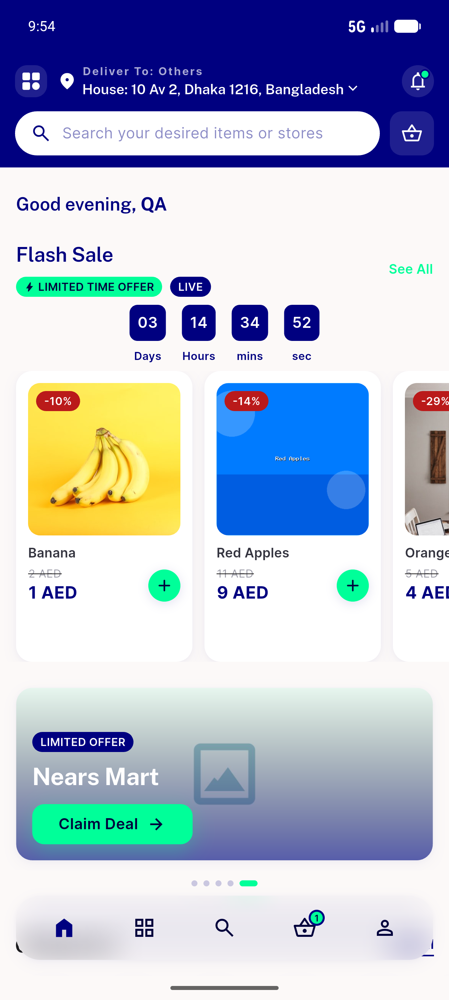
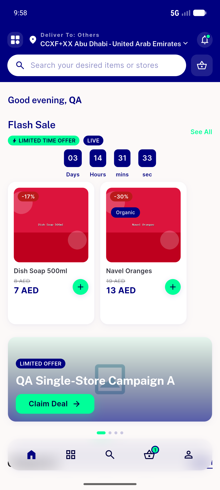
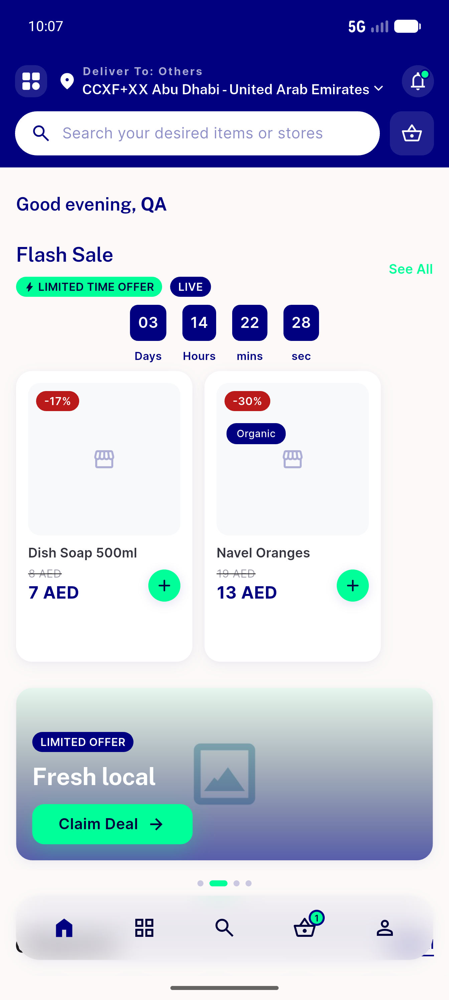
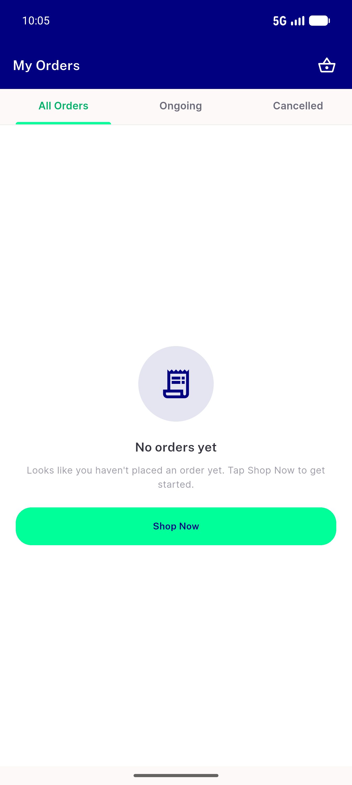

# QA Evidence — NEARS-1041

**PASS (14/15 ACs; AC13 BLOCKED - no taxi module) - batch5: 1041+1078+1061 on emulator-5554**

**5 screenshot(s).** Click any thumbnail for full resolution.

<table>
<tr>
<td align="center" width="33%"> ac14 rtl close x left</td>
<td align="center" width="33%"> ac2 carousel zone1 slide1</td>
<td align="center" width="33%"> ac2 zone2 carousel 4slides</td>
</tr>
<tr>
<td align="center" width="33%"> ac6 missing images branded placeholder</td>
<td align="center" width="33%"> ac6 order thumbnails</td>
</tr>
</table>

### Other artifacts
- [`ac1-banner-urls-before-after.log`](ac1-banner-urls-before-after.log)
- [`bug-banner-storage-url-missing-slash.log`](bug-banner-storage-url-missing-slash.log)
- [`progress.md`](progress.md)

---
*From `nears/docs/qa-evidence/NEARS-1041/` · public-repo scrub policy (no live secrets; verified clean).*
