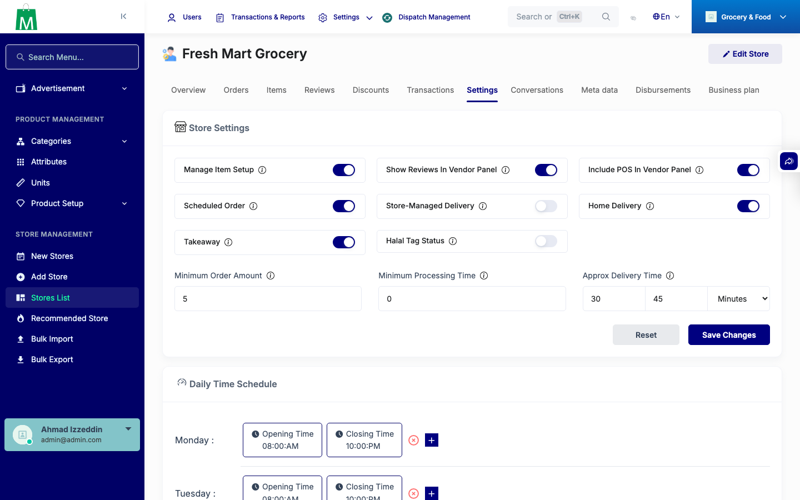
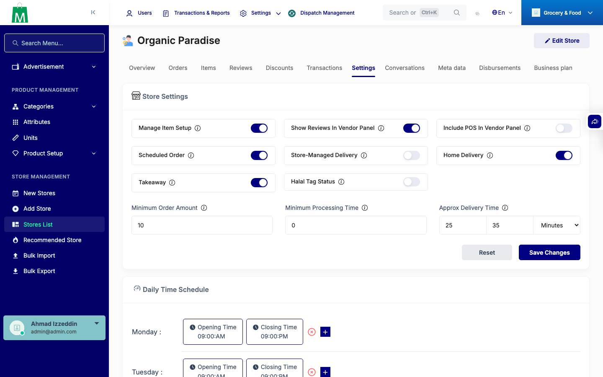
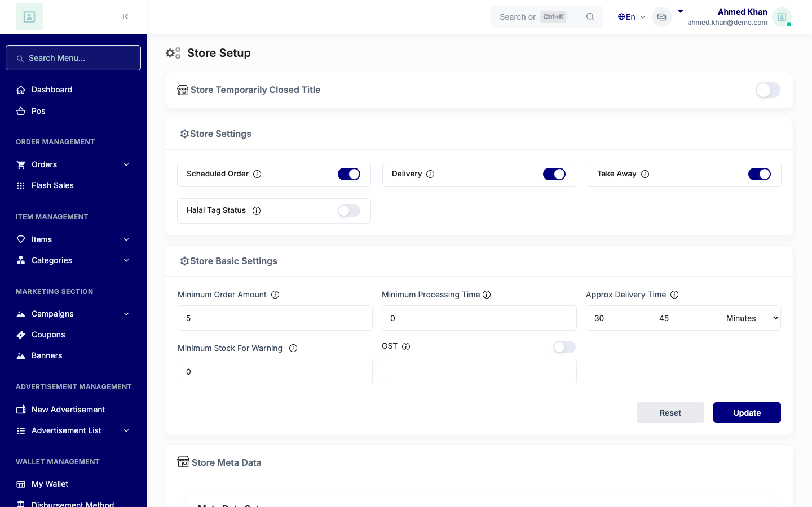
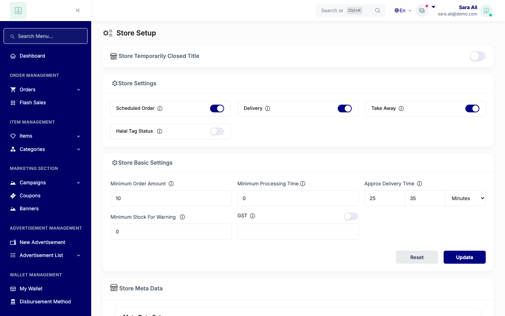

# QA Evidence — NEARS-1042

**PASS — store-settings delivery_time 500 fix verified on stores 2/3 (unsuffixed) + store 1 no-regression + vendor panel**

**5 screenshot(s).** Click any thumbnail for full resolution.

<table>
<tr>
<td align="center" width="33%"> ac1 store2 settings</td>
<td align="center" width="33%"> ac1 store3 settings</td>
<td align="center" width="33%"> ac2 store1 settings</td>
</tr>
<tr>
<td align="center" width="33%"> ac4 store2 vendor business settings</td>
<td align="center" width="33%"> ac4 store3 vendor business settings</td>
</tr>
</table>

### Other artifacts
- [`progress.md`](progress.md)

---
*From `nears/docs/qa-evidence/NEARS-1042/` · public-repo scrub policy (no live secrets; verified clean).*
