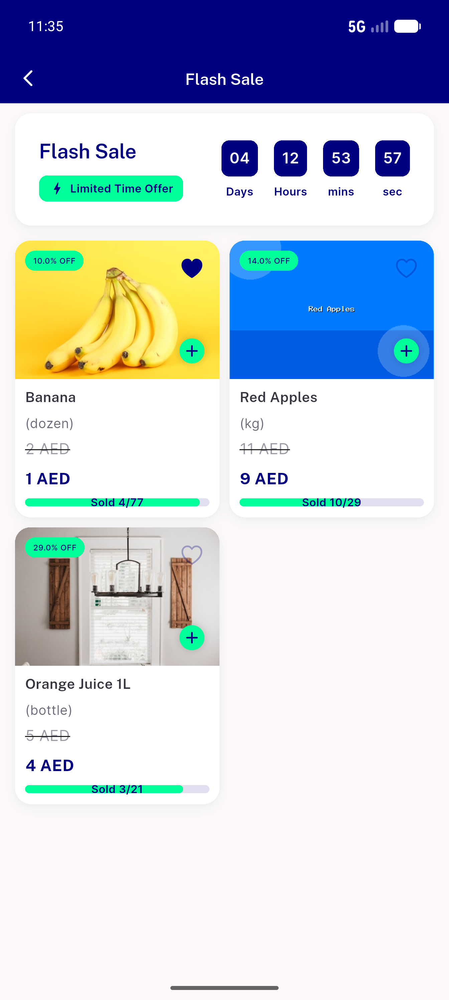
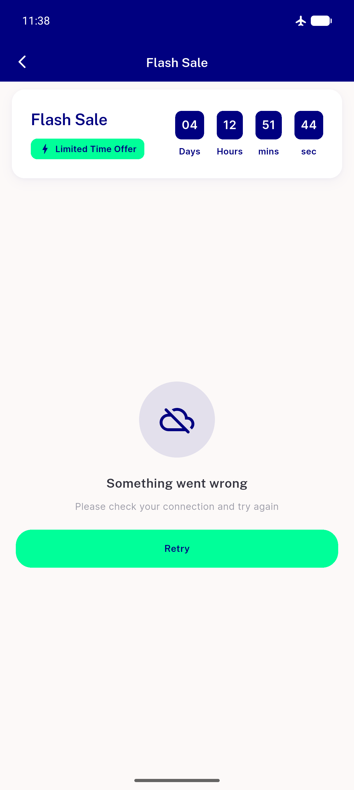
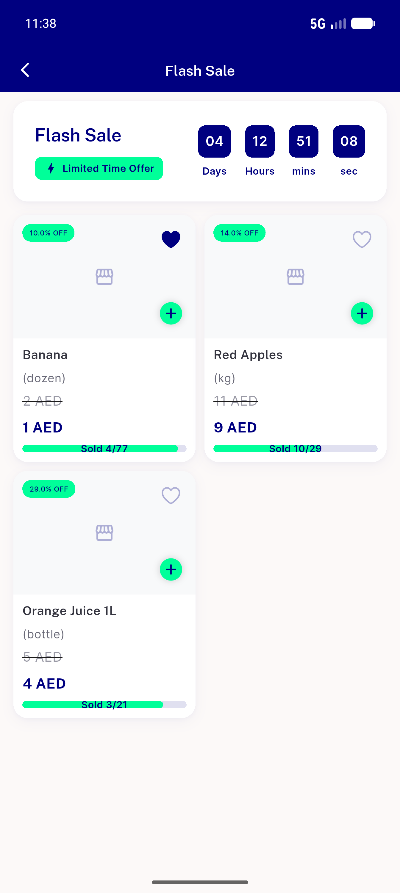

# QA Evidence — NEARS-1047

**PASS — flash-sale details permanent-shimmer fix verified live on emulator-5554 (grid renders, no setState-during-build, single items fetch, error-retry works)**

**4 screenshot(s).** Click any thumbnail for full resolution.

<table>
<tr>
<td align="center" width="33%"> ac3 details grid rendered</td>
<td align="center" width="33%"> ac4 module home rail intact</td>
<td align="center" width="33%"> ac5 error retry state</td>
</tr>
<tr>
<td align="center" width="33%"> ac5 retry recovered grid</td>
</tr>
</table>

### Other artifacts
- [`progress.md`](progress.md)

---
*From `nears/docs/qa-evidence/NEARS-1047/` · public-repo scrub policy (no live secrets; verified clean).*
