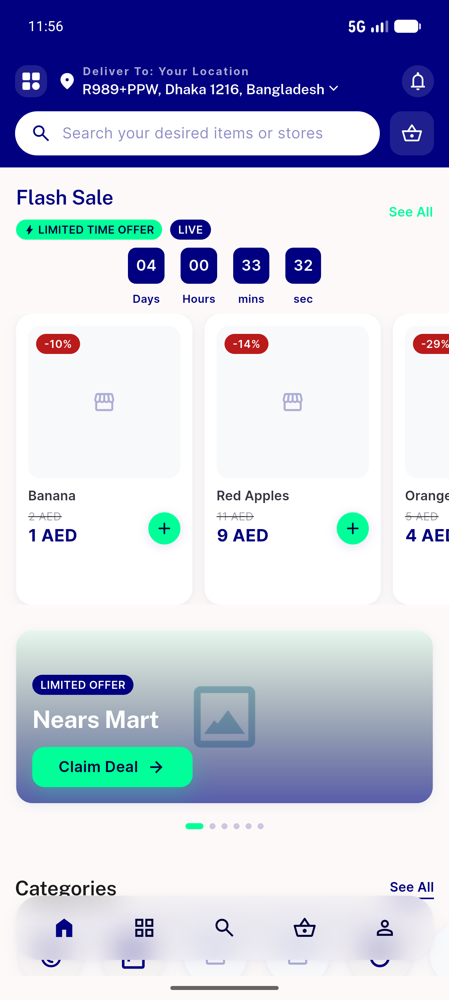
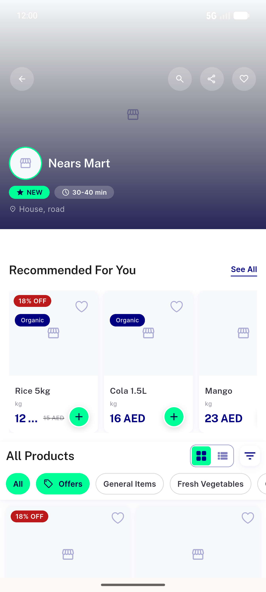
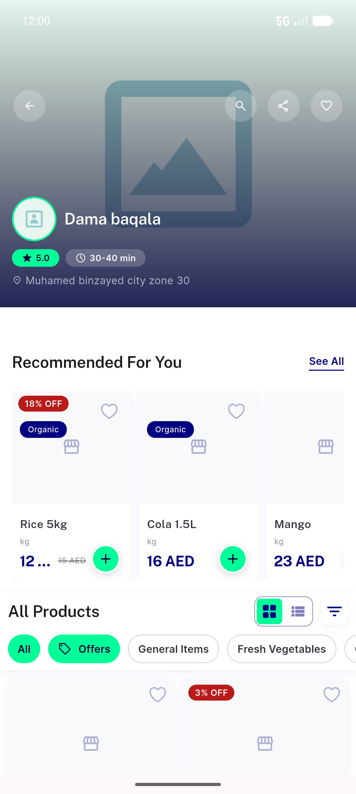
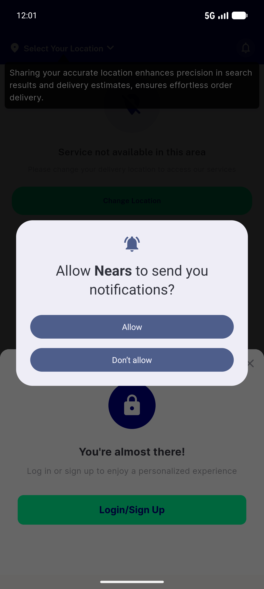
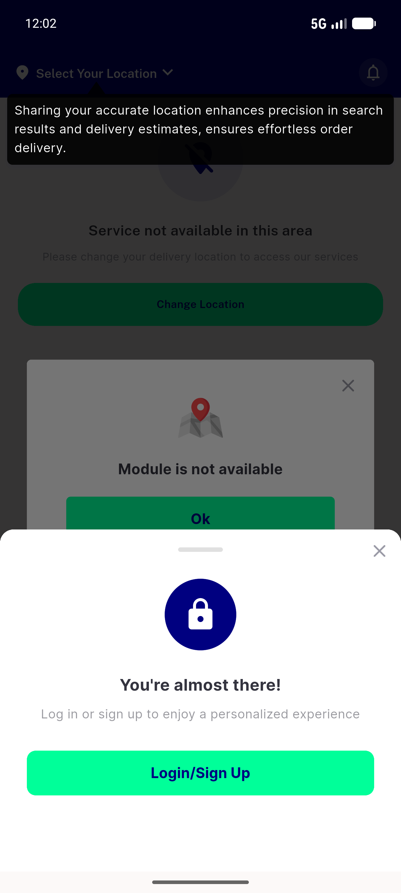

# QA Evidence — NEARS-1049

**NEARS-1049 PASS — cold-start deep-link double-nav fix, 6/6 ACs, light mode, emulator-5554**

**10 screenshot(s).** Click any thumbnail for full resolution.

<table>
<tr>
<td align="center" width="33%"> ac1 coldstart valid module1</td>
<td align="center" width="33%"> ac2 coldstart unserviceable module4 bounce</td>
<td align="center" width="33%"> ac3 coldstart module latency 2500ms</td>
</tr>
<tr>
<td align="center" width="33%"> ac4 warmstart valid module1</td>
<td align="center" width="33%"> ac5 inzone store demo</td>
<td align="center" width="33%"> ac5 outofzone store 3168 relocate</td>
</tr>
<tr>
<td align="center" width="33%"> ac6 noaddress coldstart</td>
<td align="center" width="33%"> ac6 noaddress home</td>
<td align="center" width="33%"> repro numeric module lands home</td>
</tr>
<tr>
<td align="center" width="33%"> repro run1 lands home</td>
</tr>
</table>

### Other artifacts
- [`ac3-proxy-delay-evidence.log`](ac3-proxy-delay-evidence.log)
- [`nav-sequence-double-nav.log`](nav-sequence-double-nav.log)

---
*From `nears/docs/qa-evidence/NEARS-1049/` · public-repo scrub policy (no live secrets; verified clean).*
