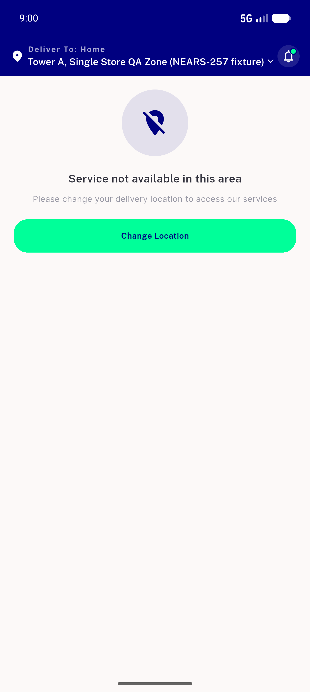

# QA Evidence — NEARS-1052

**PASS — five splash tiers clean, single-module/single-store happy paths unregressed; 1 pre-existing directStore hero-impression race filed**

**3 screenshot(s).** Click any thumbnail for full resolution.

<table>
<tr>
<td align="center" width="33%"> ac12 rtl sector grid</td>
<td align="center" width="33%"> ac8 multimodule grid</td>
<td align="center" width="33%"> ac9 outofzone empty state</td>
</tr>
</table>

### Other artifacts
- [`ac10-five-tiers.log`](ac10-five-tiers.log)
- [`bug-directstore-spurious-hero-impression.log`](bug-directstore-spurious-hero-impression.log)

---
*From `nears/docs/qa-evidence/NEARS-1052/` · public-repo scrub policy (no live secrets; verified clean).*
