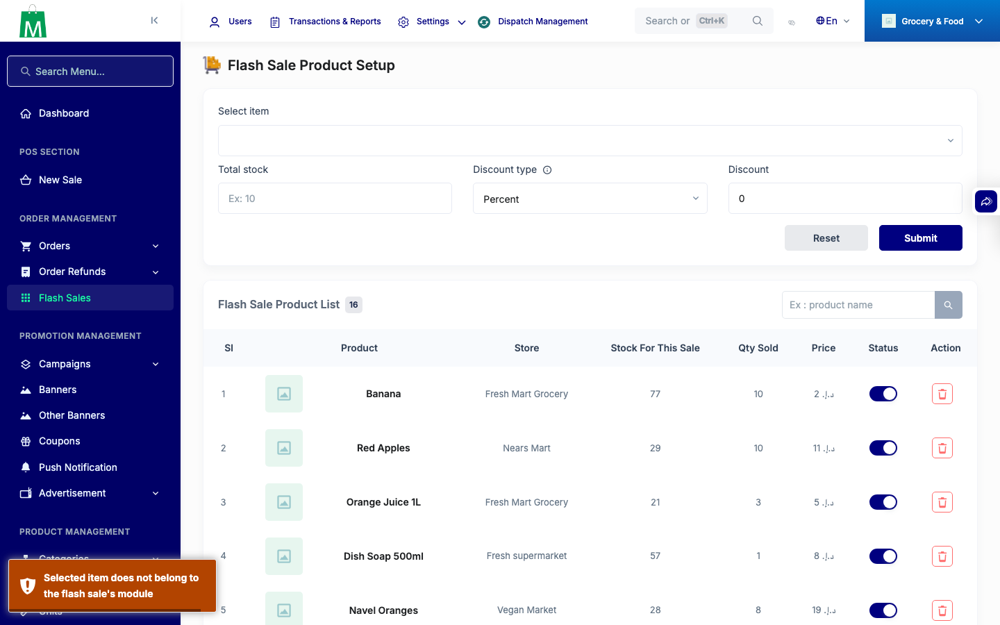
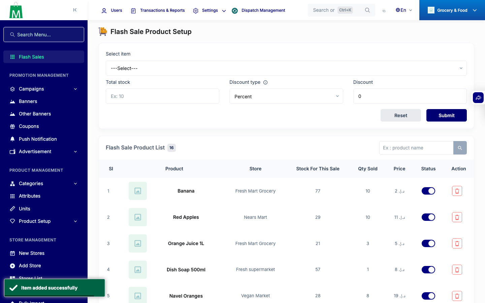

# QA Evidence — NEARS-1055

**PASS - flash-sale cross-module write guard: AC1 reject + AC2 same-module happy path verified live**

**2 screenshot(s).** Click any thumbnail for full resolution.

<table>
<tr>
<td align="center" width="33%"> ac1 cross module reject</td>
<td align="center" width="33%"> ac2 same module success</td>
</tr>
</table>

---
*From `nears/docs/qa-evidence/NEARS-1055/` · public-repo scrub policy (no live secrets; verified clean).*
