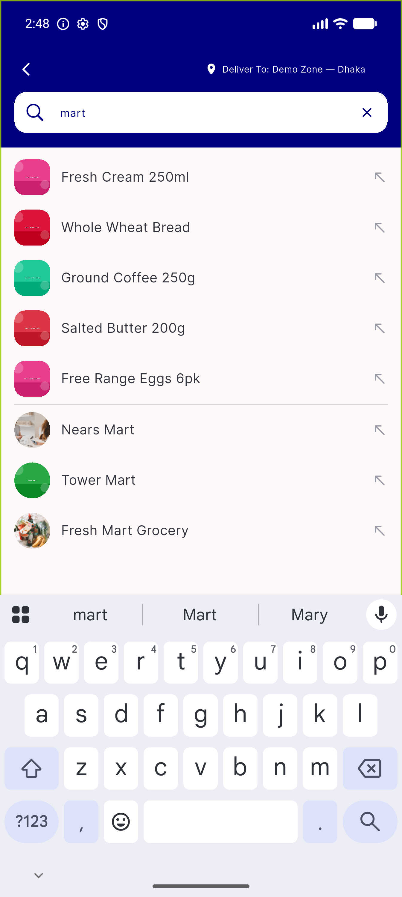
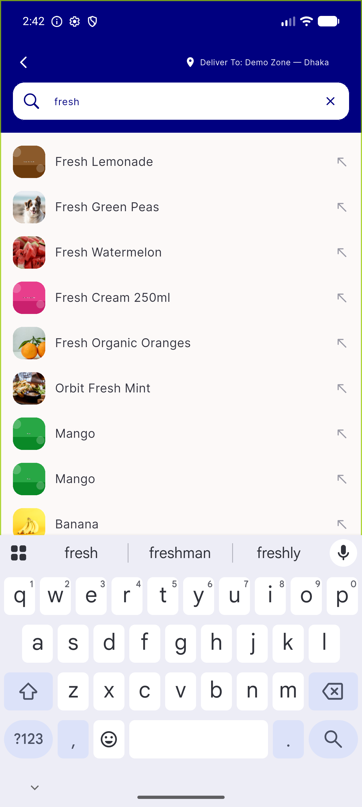
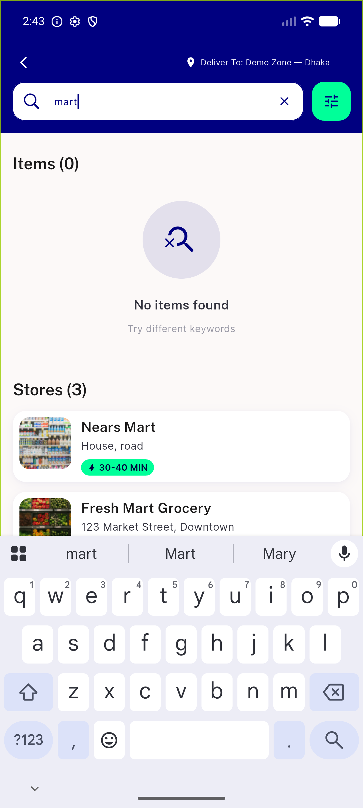
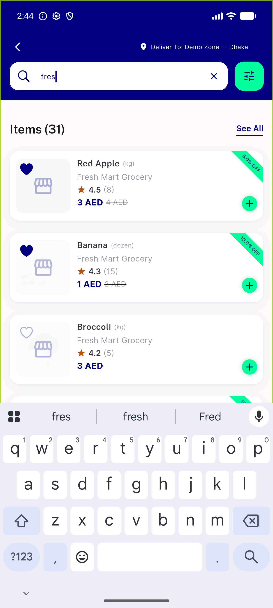
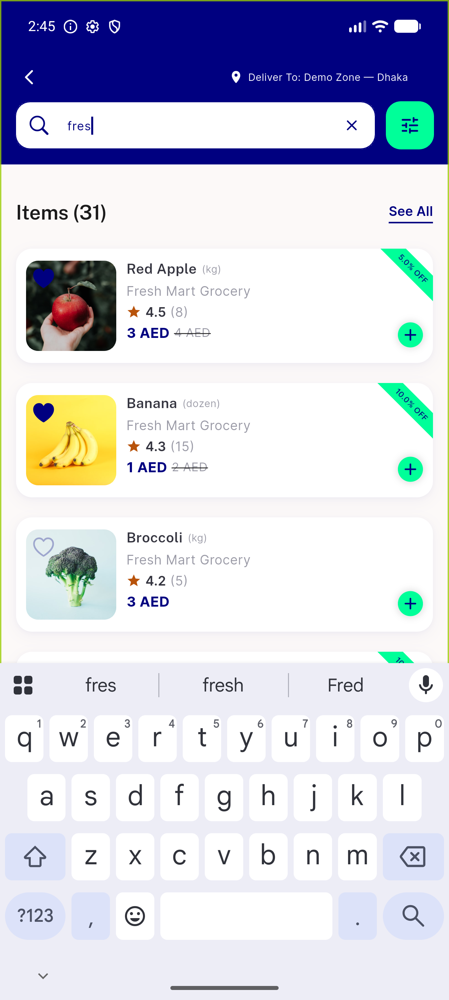

# QA Evidence — NEARS-1065

**PASS — payload slim: exact 4-key sets both module paths, dropdown renders real item thumbs + store logos on device, no collateral**

**5 screenshot(s).** Click any thumbnail for full resolution.

<table>
<tr>
<td align="center" width="33%"> ac1 global dropdown store logos</td>
<td align="center" width="33%"> ac1 global search dropdown</td>
<td align="center" width="33%"> ac1 module search dropdown</td>
</tr>
<tr>
<td align="center" width="33%"> ac1 module suggestion dropdown</td>
<td align="center" width="33%"> regression unified results settled</td>
</tr>
</table>

### Other artifacts
- [`ac2-key-sets-both-module-paths.log`](ac2-key-sets-both-module-paths.log)
- [`ac3-placeholder-null-logo.log`](ac3-placeholder-null-logo.log)
- [`ac5-no-collateral.log`](ac5-no-collateral.log)
- [`bug-appurl-missing-slash-malformed-image-url.log`](bug-appurl-missing-slash-malformed-image-url.log)
- [`bug-otel-export-retry-1s-per-request.log`](bug-otel-export-retry-1s-per-request.log)
- [`regression-same-rows.log`](regression-same-rows.log)

---
*From `nears/docs/qa-evidence/NEARS-1065/` · public-repo scrub policy (no live secrets; verified clean).*
