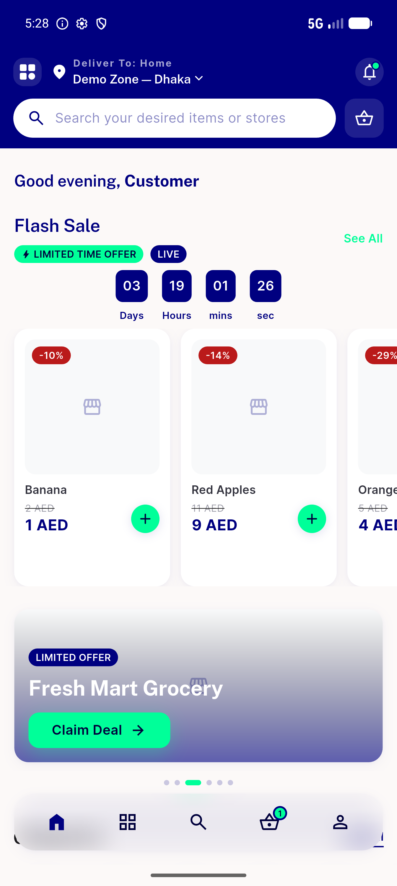
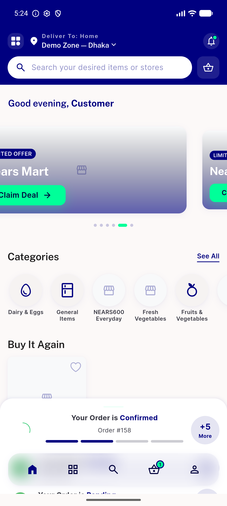

# QA Evidence — NEARS-1067

**PASS — id-scope + timer-cancel + expiry collapse all proven**

**2 screenshot(s).** Click any thumbnail for full resolution.

<table>
<tr>
<td align="center" width="33%"> ac3 grocery flash rail top slot</td>
<td align="center" width="33%"> ac4 expiry collapsed to banner top</td>
</tr>
</table>

### Other artifacts
- [`ac4-expiry-collapse-no-reload.log`](ac4-expiry-collapse-no-reload.log)
- [`perf-id-scope-guard-bites.log`](perf-id-scope-guard-bites.log)

---
*From `nears/docs/qa-evidence/NEARS-1067/` · public-repo scrub policy (no live secrets; verified clean).*
