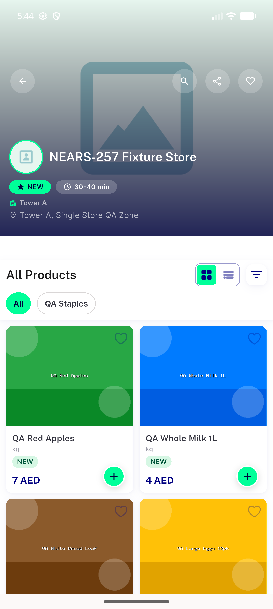
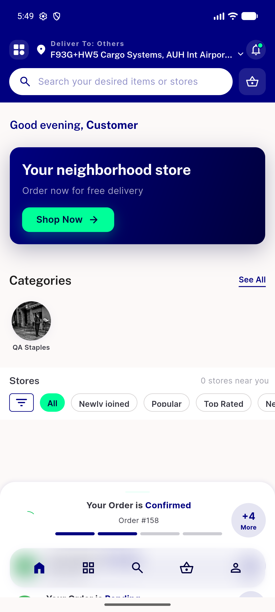

# QA Evidence — NEARS-1068

**PASS - store deep-link NPE fixed on emulator-5556 (5/5 ACs)**

**3 screenshot(s).** Click any thumbnail for full resolution.

<table>
<tr>
<td align="center" width="33%"> ac1 inzone store59 rendered</td>
<td align="center" width="33%"> ac2 outofzone store3168 relocated</td>
<td align="center" width="33%"> ac5 regression home tap store</td>
</tr>
</table>

### Other artifacts
- [`bug-outofzone-relocation-no-module-found.log`](bug-outofzone-relocation-no-module-found.log)
- [`progress.md`](progress.md)

---
*From `nears/docs/qa-evidence/NEARS-1068/` · public-repo scrub policy (no live secrets; verified clean).*
