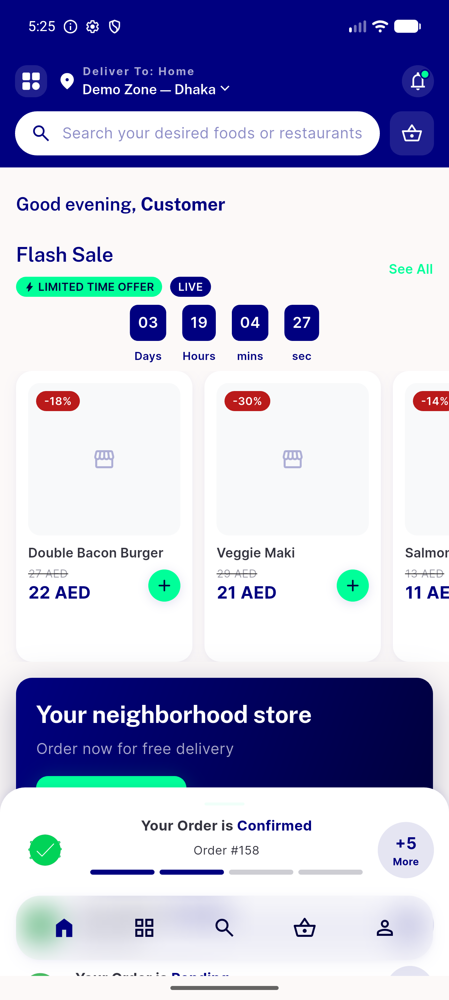
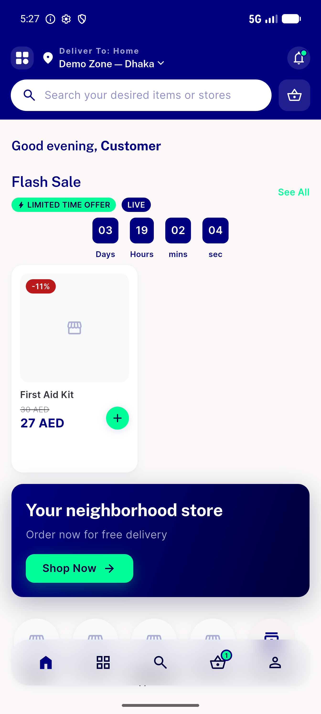
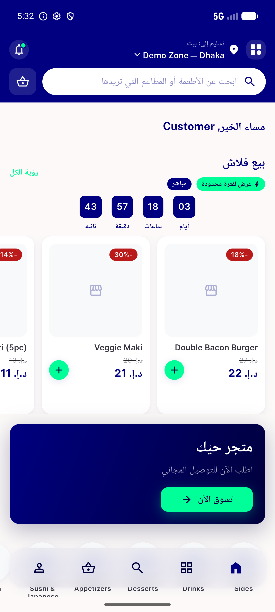
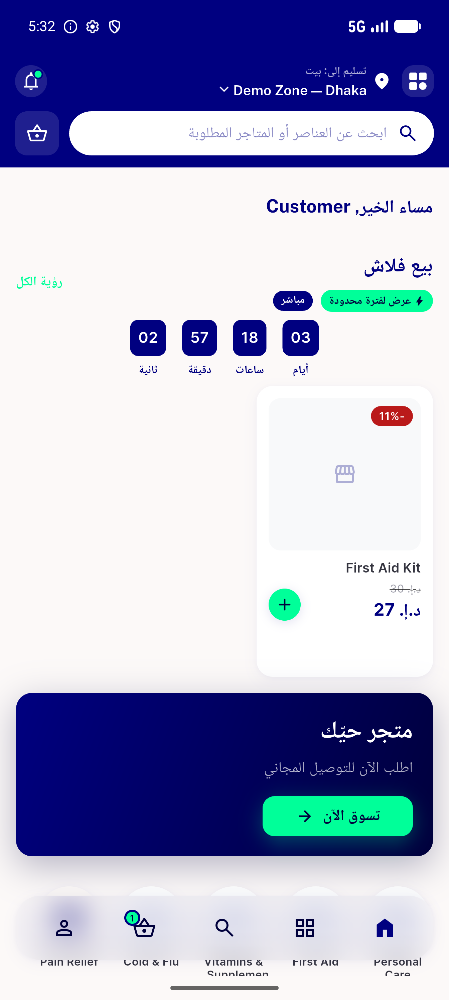

# QA Evidence — NEARS-1069

**PASS — food+pharmacy flash rails in top slot, exactly 1 GET per load/refresh**

**4 screenshot(s).** Click any thumbnail for full resolution.

<table>
<tr>
<td align="center" width="33%"> ac1 food flash rail top slot</td>
<td align="center" width="33%"> ac2 pharmacy flash rail top slot</td>
<td align="center" width="33%"> rtl arabic food flash rail</td>
</tr>
<tr>
<td align="center" width="33%"> rtl arabic pharmacy flash rail</td>
</tr>
</table>

### Other artifacts
- [`progress.md`](progress.md)

---
*From `nears/docs/qa-evidence/NEARS-1069/` · public-repo scrub policy (no live secrets; verified clean).*
