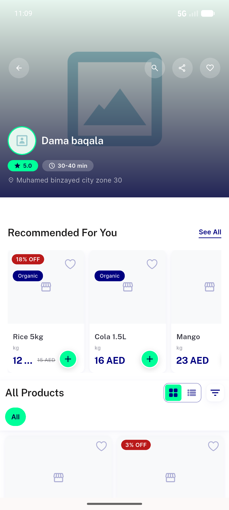
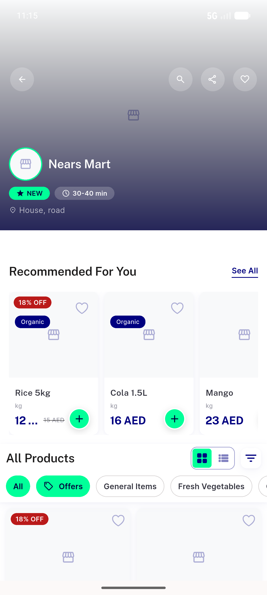
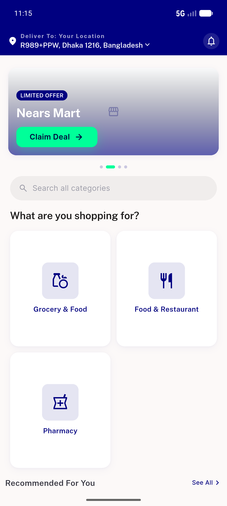
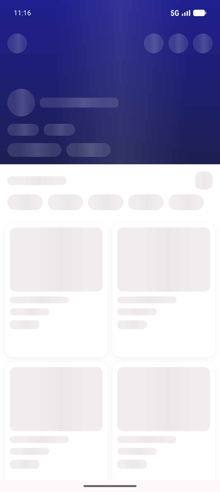
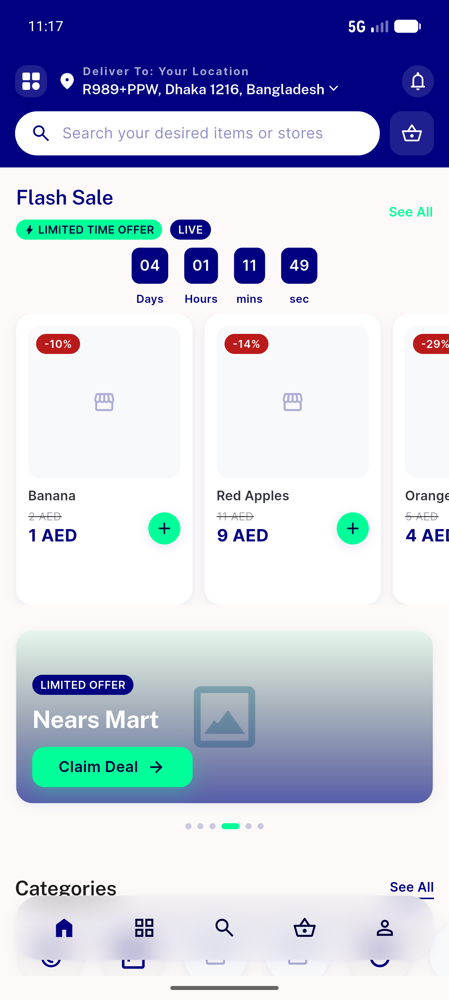

# QA Evidence — NEARS-1071

**1071 PASS - out-of-zone store deep-link relocates+opens; regressions hold**

**7 screenshot(s).** Click any thumbnail for full resolution.

<table>
<tr>
<td align="center" width="33%"> ac1 coldstart module1 lands store</td>
<td align="center" width="33%"> ac1 coldstart outofzone lands store</td>
<td align="center" width="33%"> ac2 inzone direct open</td>
</tr>
<tr>
<td align="center" width="33%"> ac3 missing module homebounce</td>
<td align="center" width="33%"> ac4 backend200empty stuck shimmer REGRESSION</td>
<td align="center" width="33%"> ac4 unresolvable id error fallback</td>
</tr>
<tr>
<td align="center" width="33%"> ac5 warm outofzone relocate</td>
</tr>
</table>

### Other artifacts
- [`bug-invalid-slug-200-empty-shimmer.log`](bug-invalid-slug-200-empty-shimmer.log)

---
*From `nears/docs/qa-evidence/NEARS-1071/` · public-repo scrub policy (no live secrets; verified clean).*
