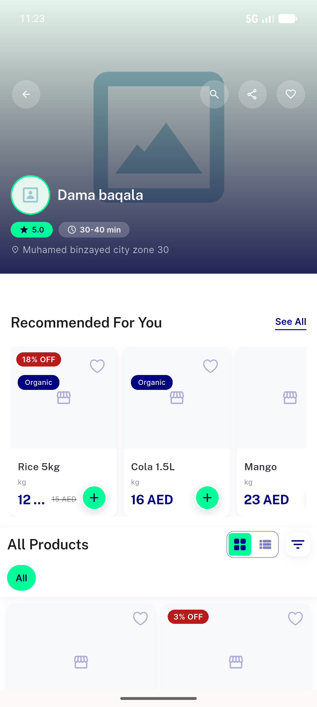
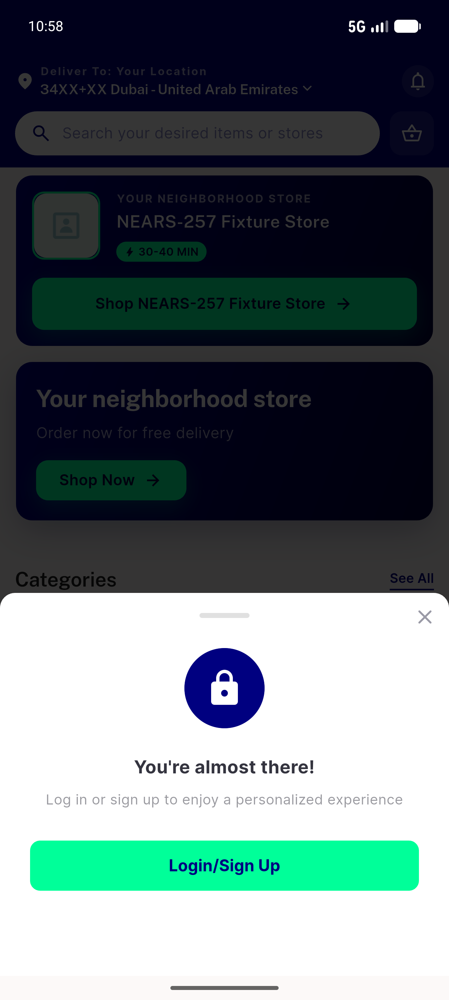

# QA Evidence — NEARS-1072

**1072 PASS - no [FAIL] store59 403 after relocation; regressions hold**

**2 screenshot(s).** Click any thumbnail for full resolution.

<table>
<tr>
<td align="center" width="33%"> ac1 relocate no fail store59</td>
<td align="center" width="33%"> ac2 singlestore hero zone3</td>
</tr>
</table>

---
*From `nears/docs/qa-evidence/NEARS-1072/` · public-repo scrub policy (no live secrets; verified clean).*
