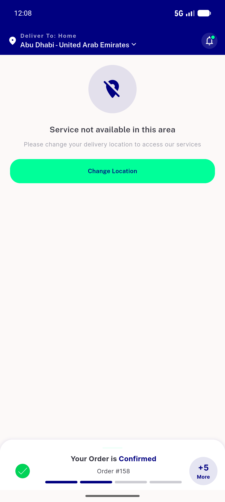
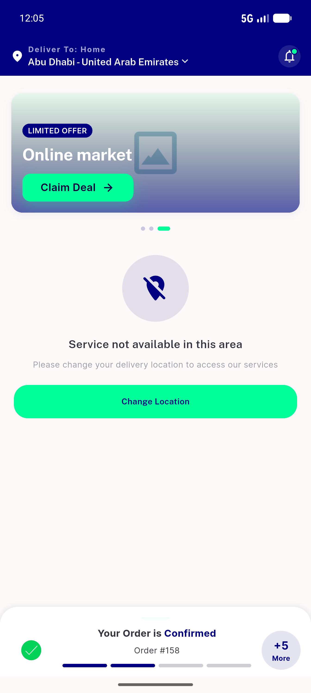
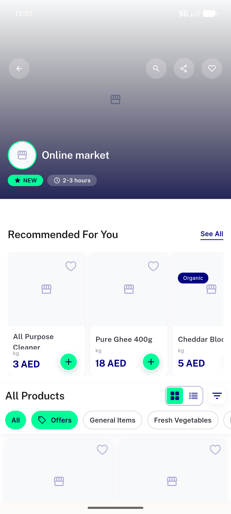
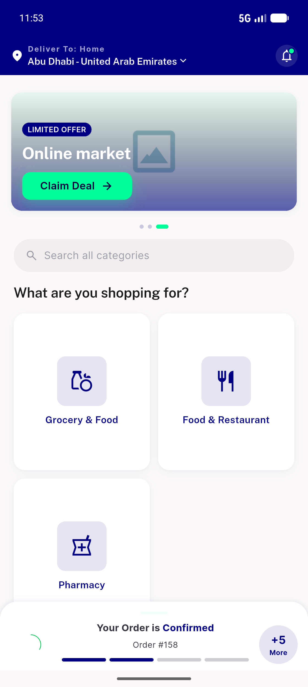
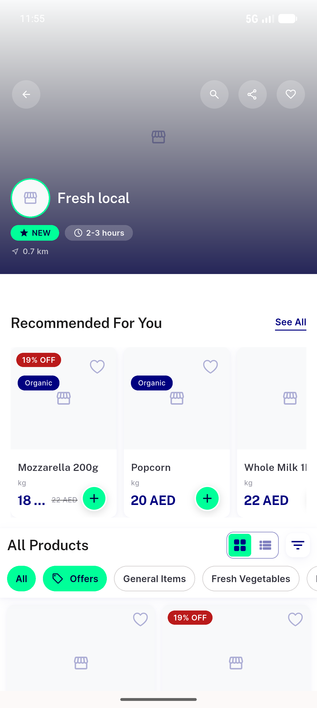

# QA Evidence — NEARS-1073

**PASS — banner-store force-unwrap fail-soft: featured banner tap opens store, no crash, IDs-only warn on zone miss (5 shots + 2 logs)**

**5 screenshot(s).** Click any thumbnail for full resolution.

<table>
<tr>
<td align="center" width="33%"> s1 01 null zonedata unserviceable</td>
<td align="center" width="33%"> s2 01 carousel zonemismatch</td>
<td align="center" width="33%"> s2 02 store14 opened no crash</td>
</tr>
<tr>
<td align="center" width="33%"> s3 01 featured carousel abudhabi</td>
<td align="center" width="33%"> s3 02 store opened module1</td>
</tr>
</table>

### Other artifacts
- [`progress.md`](progress.md)
- [`s1-null-zonedata-noncrash.log`](s1-null-zonedata-noncrash.log)
- [`s2-warn-log.log`](s2-warn-log.log)

---
*From `nears/docs/qa-evidence/NEARS-1073/` · public-repo scrub policy (no live secrets; verified clean).*
