# QA Evidence — NEARS-1074

**PASS — NEARS-1074 item→store module fix: 7 items re-homed to Fresh Mart Grocery (store 2, grocery); verified live on emulator-5554, zone 1**

**15 screenshot(s).** Click any thumbnail for full resolution.

<table>
<tr>
<td align="center" width="33%"><a href="ac2-01-search-watermelon-grocery-bucket.png">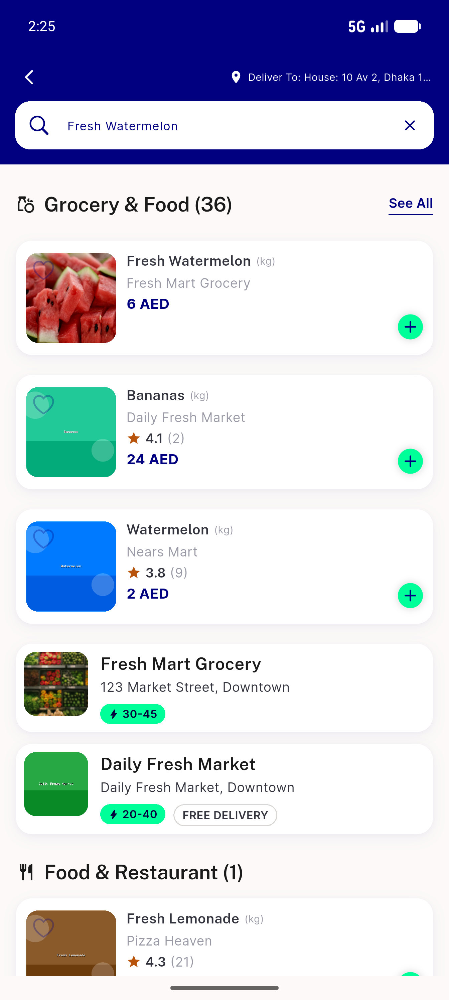</a> ac2 01 search watermelon grocery bucket</td>
<td align="center" width="33%"><a href="ac2-02-item47-detail-fresh-mart-grocery.png">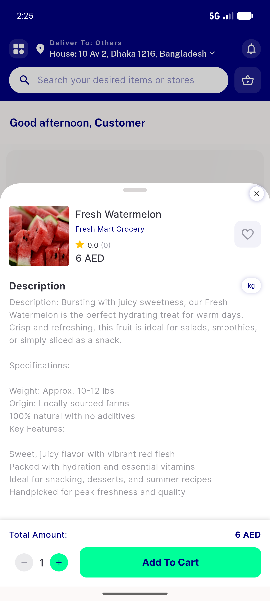</a> ac2 02 item47 detail fresh mart grocery</td>
<td align="center" width="33%"><a href="ac2-03-preexisting-other-store-basket-prompt.png">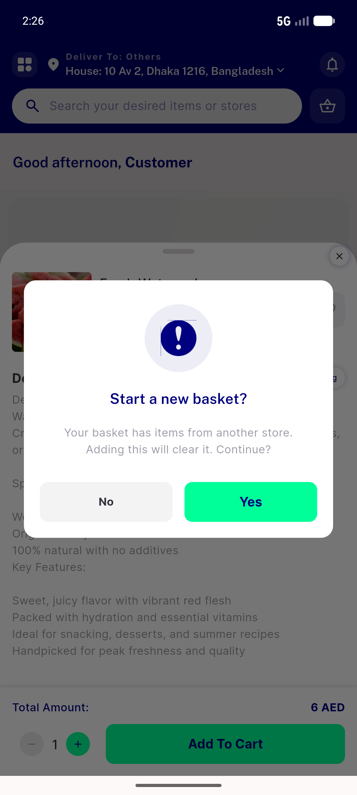</a> ac2 03 preexisting other store basket prompt</td>
</tr>
<tr>
<td align="center" width="33%"> ac2 04 search drumsticks fresh mart</td>
<td align="center" width="33%"><a href="ac2-05-item60-detail-fresh-mart-grocery.png">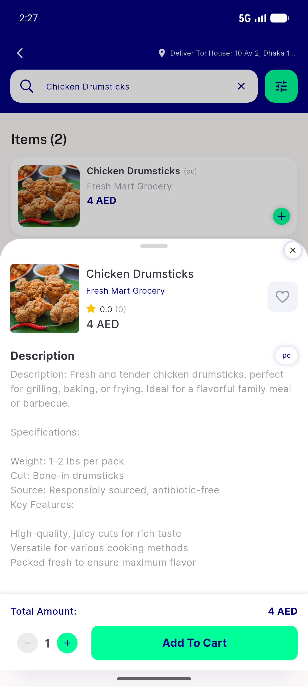</a> ac2 05 item60 detail fresh mart grocery</td>
<td align="center" width="33%"><a href="ac2-06-item60-added-no-clearcart-prompt.png">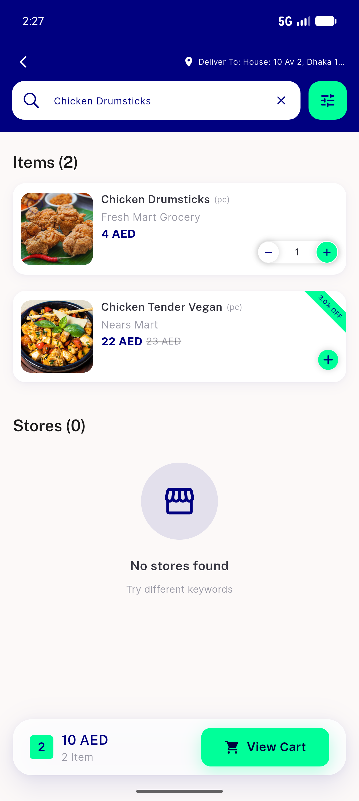</a> ac2 06 item60 added no clearcart prompt</td>
</tr>
<tr>
<td align="center" width="33%"><a href="ac2-07-mazola-grocery-fresh-mart.png">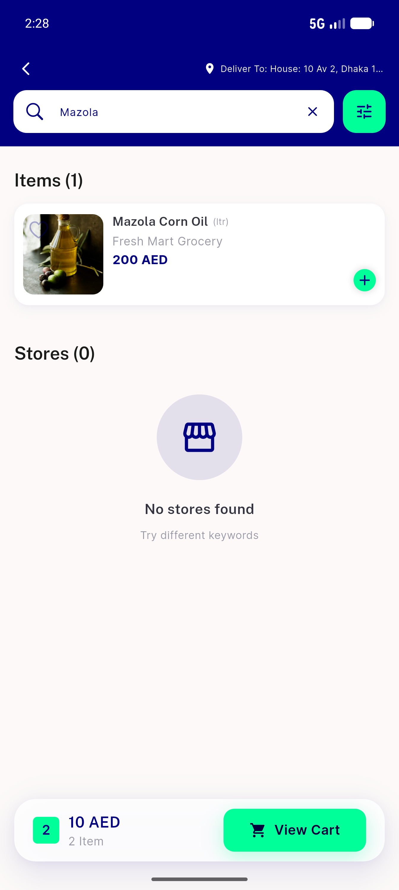</a> ac2 07 mazola grocery fresh mart</td>
<td align="center" width="33%"> ac2 08 negative watermelon absent in food</td>
<td align="center" width="33%"><a href="ac2-09-control-pizza-works-in-food.png">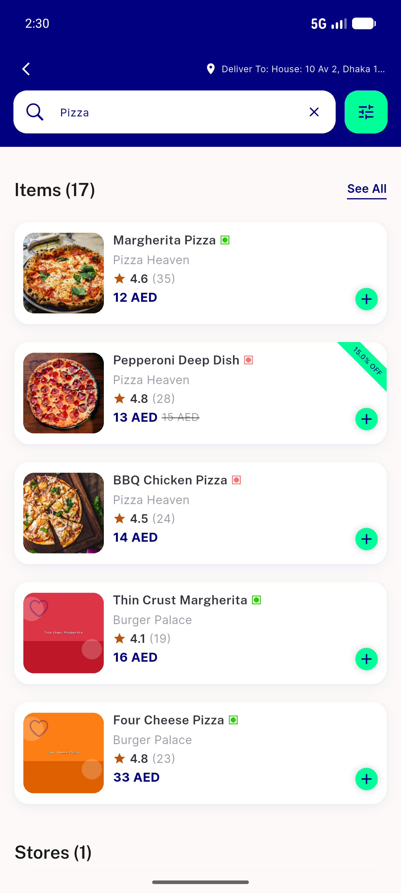</a> ac2 09 control pizza works in food</td>
</tr>
<tr>
<td align="center" width="33%"><a href="ac2-10-negative-drumsticks-absent-in-pharmacy.png">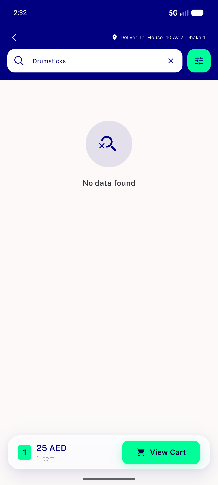</a> ac2 10 negative drumsticks absent in pharmacy</td>
<td align="center" width="33%"><a href="ac2-11-control-allergy-works-in-pharmacy.png">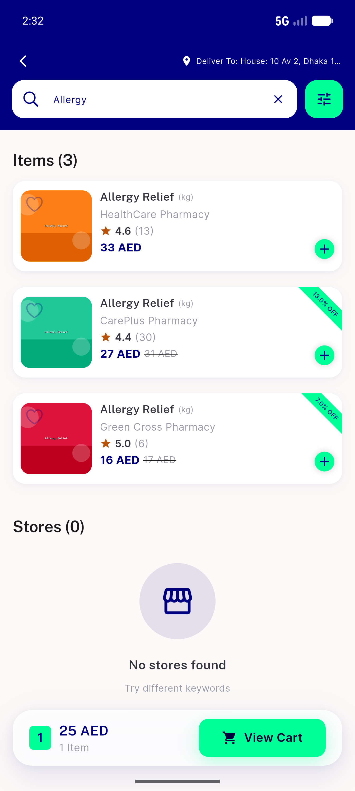</a> ac2 11 control allergy works in pharmacy</td>
<td align="center" width="33%"><a href="reg-01-store2-fresh-mart-page.png">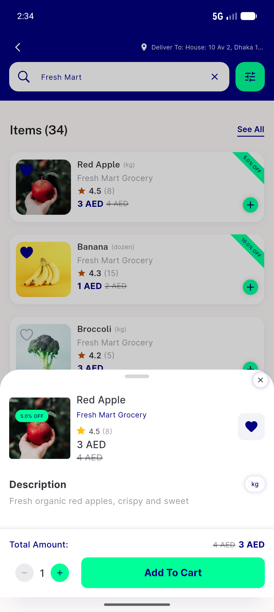</a> reg 01 store2 fresh mart page</td>
</tr>
<tr>
<td align="center" width="33%"><a href="reg-02-store2-storepage-loads.png">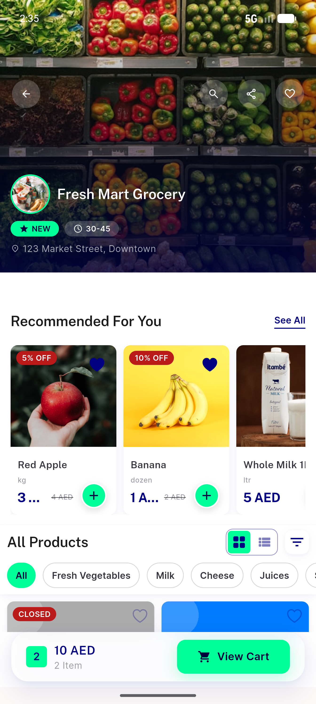</a> reg 02 store2 storepage loads</td>
<td align="center" width="33%"> reg 03 category browse fruits veg</td>
<td align="center" width="33%"> reg 04 category fresh fruits items</td>
</tr>
</table>

---
*From `nears/docs/qa-evidence/NEARS-1074/` · public-repo scrub policy (no live secrets; verified clean).*
