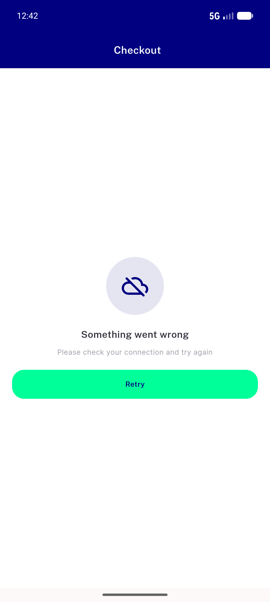
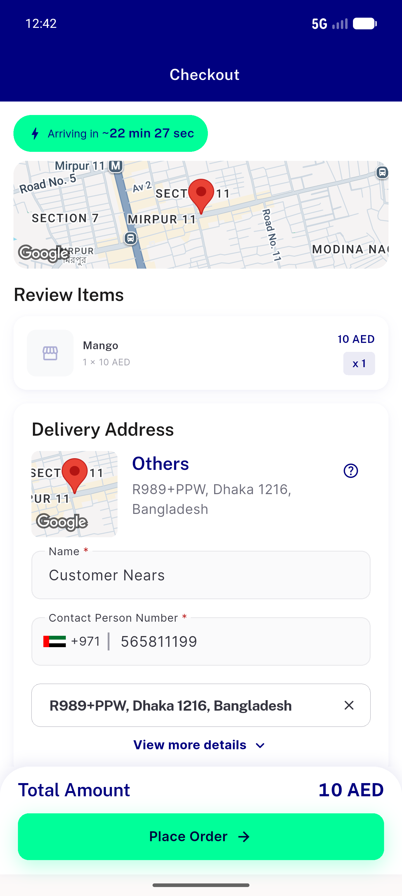
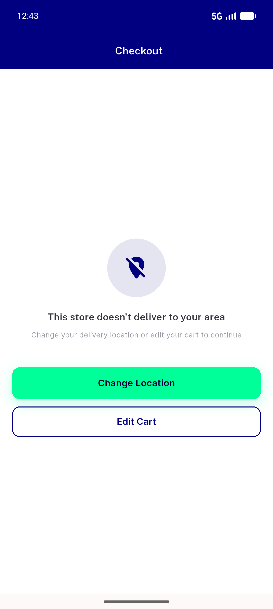
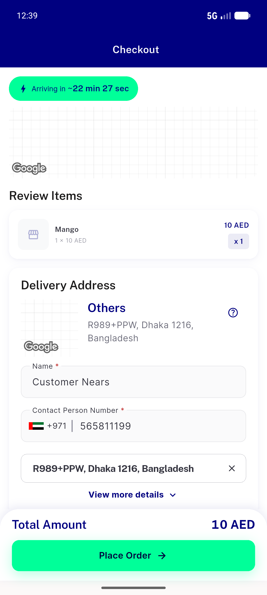

# QA Evidence — NEARS-1076

**NEARS-1076 PASS — checkout non-403 store-fetch failure shows NearsErrorRetry, not infinite shimmer (5 ACs live)**

**4 screenshot(s).** Click any thumbnail for full resolution.

<table>
<tr>
<td align="center" width="33%"> ac1 nearserrorretry on 500</td>
<td align="center" width="33%"> ac2 retry recovers cart intact</td>
<td align="center" width="33%"> ac3 out of zone panel not retry</td>
</tr>
<tr>
<td align="center" width="33%"> ac4 happy path normal checkout</td>
</tr>
</table>

### Other artifacts
- [`ac5-pii-safe-fail-log.log`](ac5-pii-safe-fail-log.log)

---
*From `nears/docs/qa-evidence/NEARS-1076/` · public-repo scrub policy (no live secrets; verified clean).*
