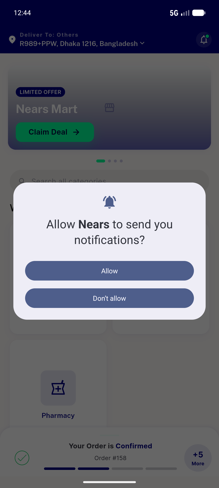
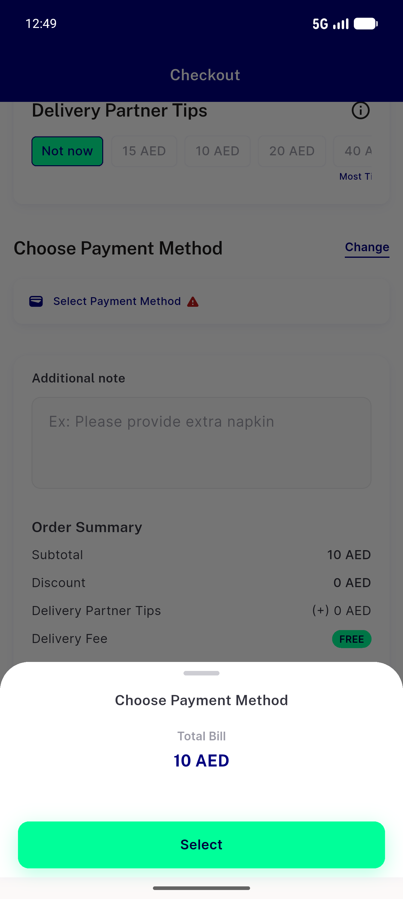
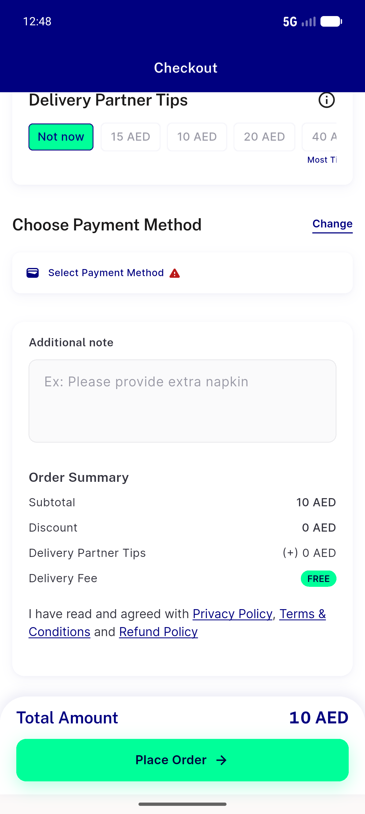
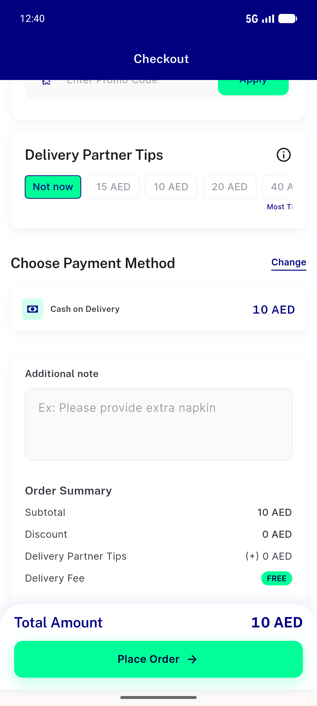
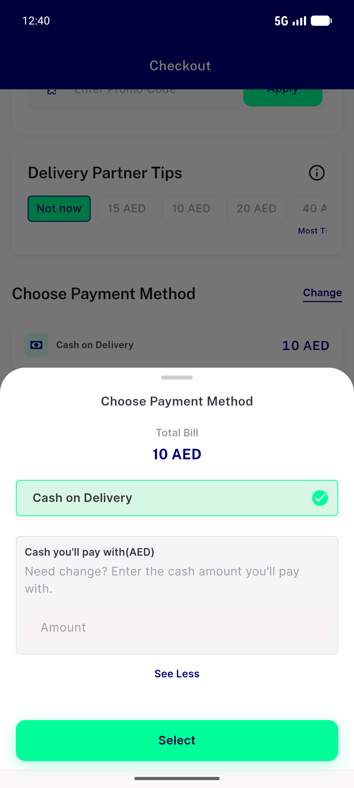

# QA Evidence — NEARS-1082

**NEARS-1082 PASS — null payment-config fields fail-soft to inactive, no checkout crash (AC1/AC2 live + AC3 live)**

**5 screenshot(s).** Click any thumbnail for full resolution.

<table>
<tr>
<td align="center" width="33%"> ac1 ac2 app boots clean with null config</td>
<td align="center" width="33%"> ac1 ac2 null config empty payment sheet no crash</td>
<td align="center" width="33%"> ac1 ac2 null config select payment warning no crash</td>
</tr>
<tr>
<td align="center" width="33%"> ac3 normal config cod active selectable</td>
<td align="center" width="33%"> ac3 normal config payment sheet cod</td>
</tr>
</table>

---
*From `nears/docs/qa-evidence/NEARS-1082/` · public-repo scrub policy (no live secrets; verified clean).*
