# QA Evidence — NEARS-1084

**PASS — Batch-3 (1084/1085/1088/1087): 16/16 ACs; +2 pre-existing byproduct artifacts**

**14 screenshot(s).** Click any thumbnail for full resolution.

<table>
<tr>
<td align="center" width="33%"><a href="ac1-store-error-retry-state.png">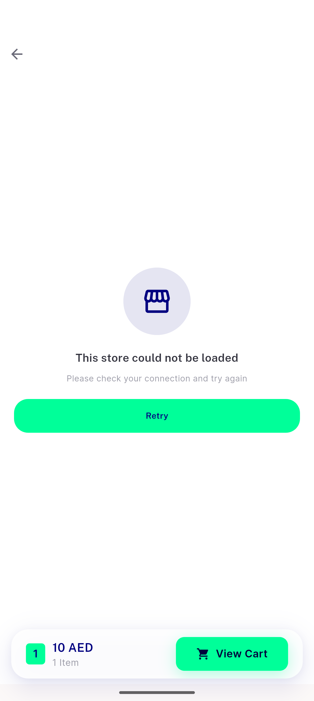</a> ac1 store error retry state</td>
<td align="center" width="33%"><a href="ac10-category-grid-retry-no-snackbar.png">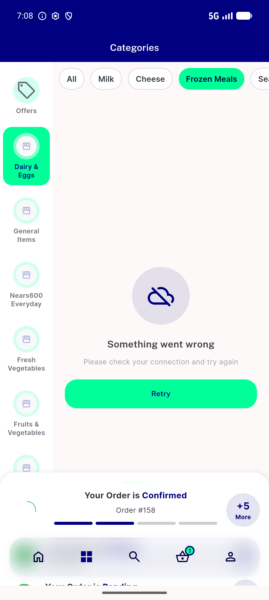</a> ac10 category grid retry no snackbar</td>
<td align="center" width="33%"><a href="ac16-rtl-store-grid-error.png">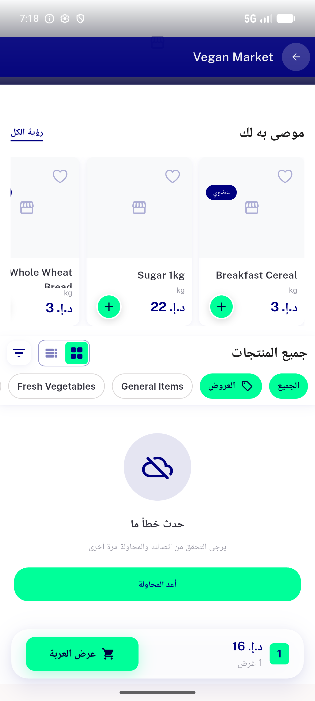</a> ac16 rtl store grid error</td>
</tr>
<tr>
<td align="center" width="33%"><a href="ac3-valid-store-recovers.png">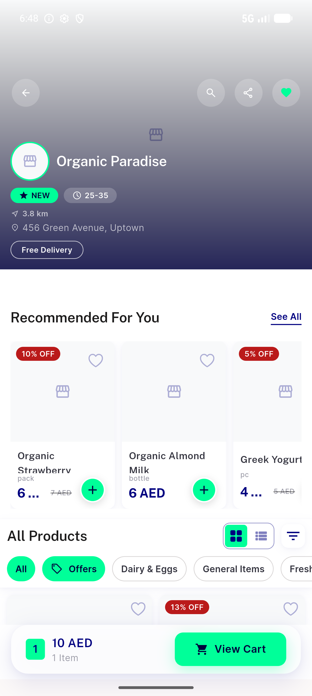</a> ac3 valid store recovers</td>
<td align="center" width="33%"><a href="ac5-flashsale-rail-selfhide-no-snackbar.png">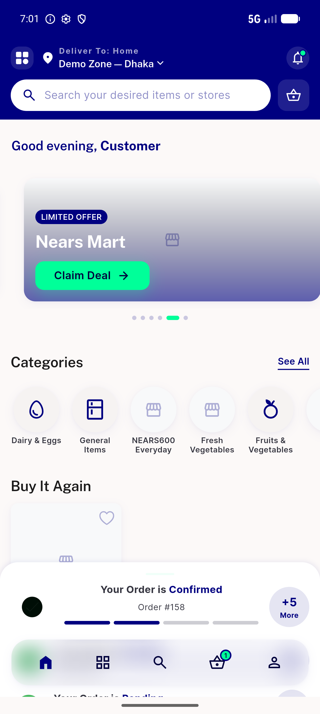</a> ac5 flashsale rail selfhide no snackbar</td>
<td align="center" width="33%"><a href="ac5-rails-fail-no-snackbar.png">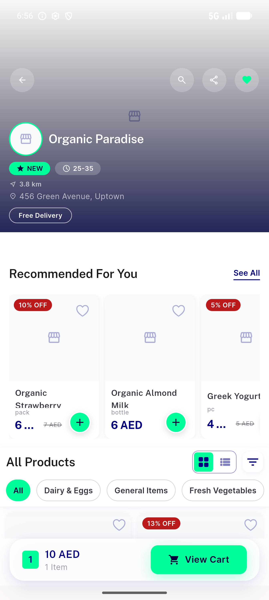</a> ac5 rails fail no snackbar</td>
</tr>
<tr>
<td align="center" width="33%"><a href="ac5-store-rails-selfhide.png">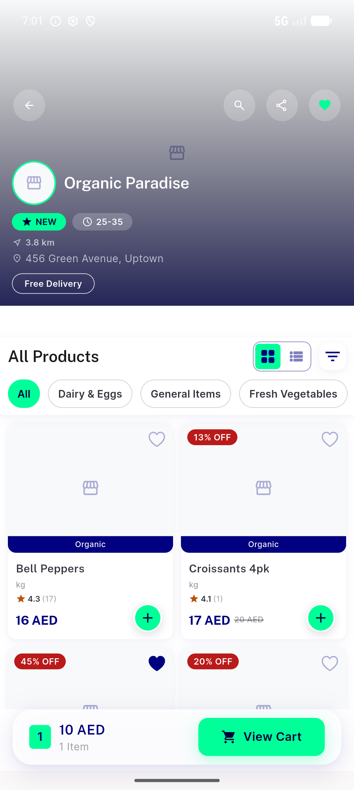</a> ac5 store rails selfhide</td>
<td align="center" width="33%"><a href="ac6a-category-grid-error-retry.png">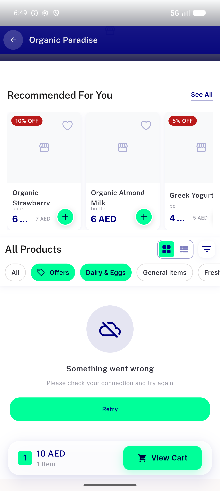</a> ac6a category grid error retry</td>
<td align="center" width="33%"><a href="ac6b-offers-chip-grid-error.png">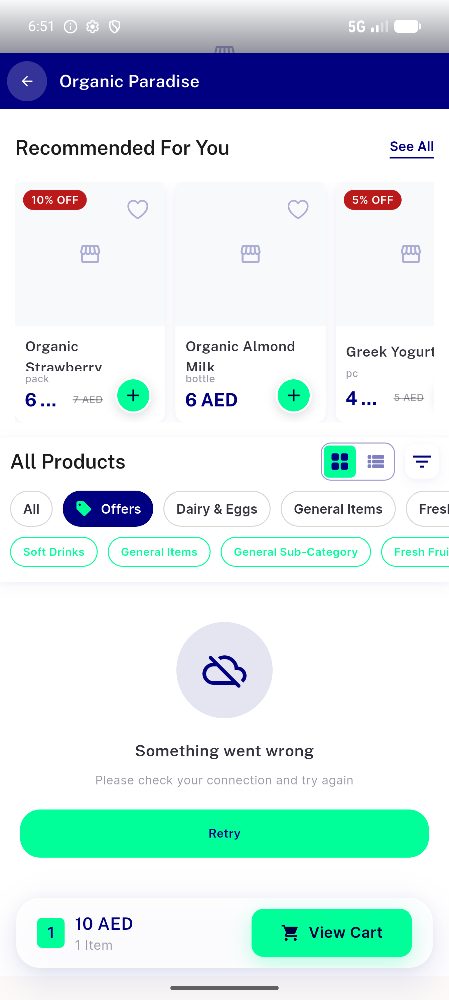</a> ac6b offers chip grid error</td>
</tr>
<tr>
<td align="center" width="33%"><a href="ac6c-offer-subchip-grid-error.png">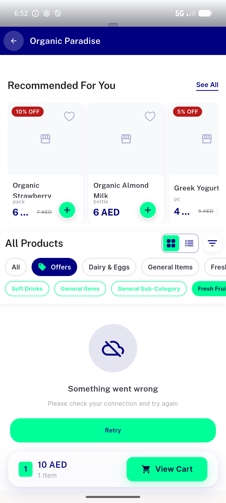</a> ac6c offer subchip grid error</td>
<td align="center" width="33%"><a href="ac7-loadmore-fail-grid-survives.png">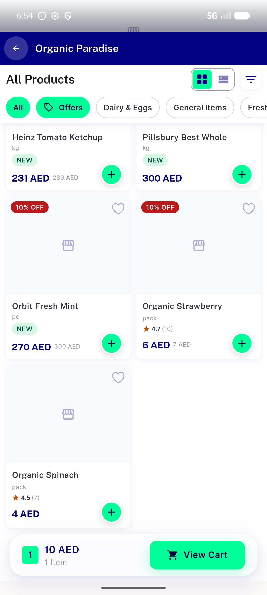</a> ac7 loadmore fail grid survives</td>
<td align="center" width="33%"><a href="ac8-checkout-outofzone-panel.png">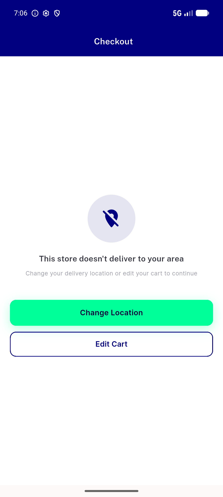</a> ac8 checkout outofzone panel</td>
</tr>
<tr>
<td align="center" width="33%"><a href="ac8-zone-dialog.png">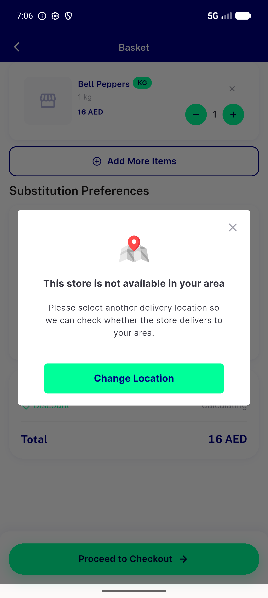</a> ac8 zone dialog</td>
<td align="center" width="33%"><a href="ac9-checkout-500-retry-panel.png">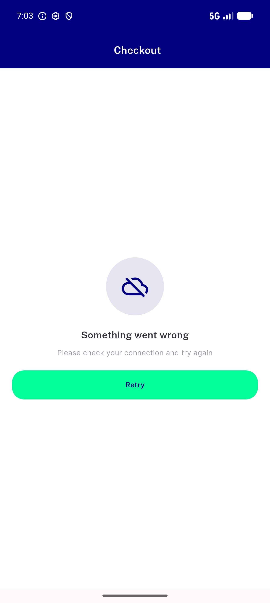</a> ac9 checkout 500 retry panel</td>
</tr>
</table>

### Other artifacts
- [`bug-category-error-merged-semantics-node.log`](bug-category-error-merged-semantics-node.log)
- [`bug-seed-banner-image-404.log`](bug-seed-banner-image-404.log)

---
*From `nears/docs/qa-evidence/NEARS-1084/` · public-repo scrub policy (no live secrets; verified clean).*
