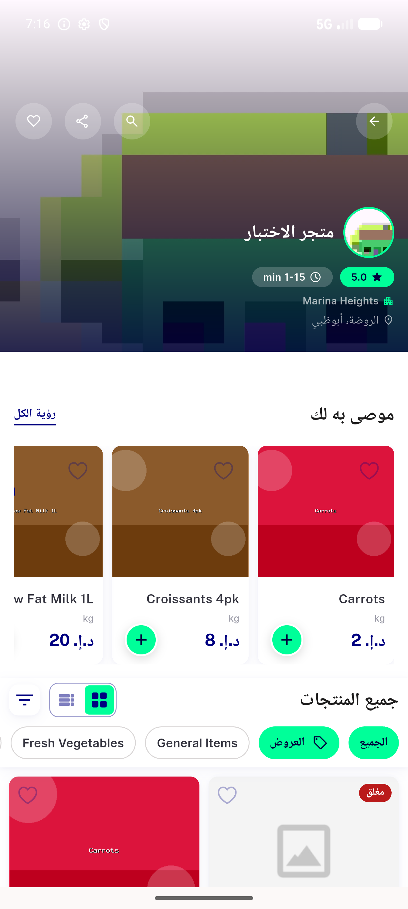
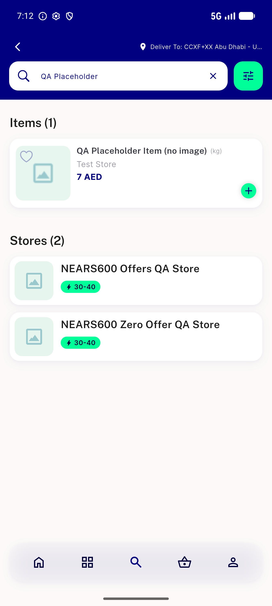
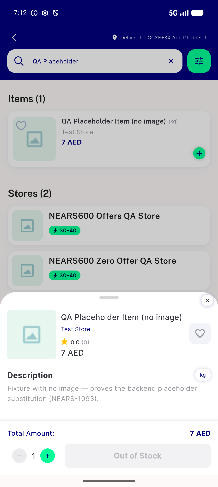
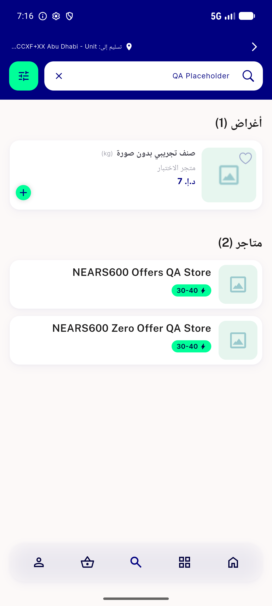

# QA Evidence — NEARS-1093

**NEARS-1093 QA: PASS — 7/7 ACs demonstrated (AR pipeline now falsifiable; NULL-image fixture non-orderable)**

**4 screenshot(s).** Click any thumbnail for full resolution.

<table>
<tr>
<td align="center" width="33%"> DELIVERABLE ar store35 placeholder with arabic names</td>
<td align="center" width="33%"> ac5 search placeholder card en</td>
<td align="center" width="33%"> ac6 fixture out of stock not orderable</td>
</tr>
<tr>
<td align="center" width="33%"> ar search fixture and store translated</td>
</tr>
</table>

### Other artifacts
- [`backend-placeholder-img2.jpg`](backend-placeholder-img2.jpg)

---
*From `nears/docs/qa-evidence/NEARS-1093/` · public-repo scrub policy (no live secrets; verified clean).*
