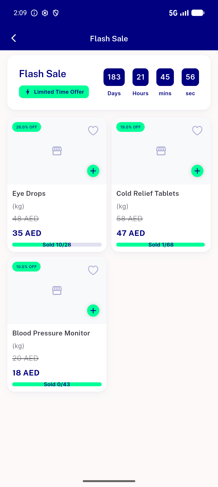

# QA Evidence — NEARS-1096

**PASS — flash-sale rail live on modules 1/2/3 (183d countdown), seeder re-run byte-identical no-op, guard fails closed, 866/866 phpunit**

**5 screenshot(s).** Click any thumbnail for full resolution.

<table>
<tr>
<td align="center" width="33%"> ac1 food m2 flash sale rail</td>
<td align="center" width="33%"> ac1 grocery m1 flash sale detail</td>
<td align="center" width="33%"> ac1 grocery m1 flash sale rail</td>
</tr>
<tr>
<td align="center" width="33%"> ac1 pharmacy m3 flash sale detail</td>
<td align="center" width="33%"> ac1 pharmacy m3 flash sale rail</td>
</tr>
</table>

### Other artifacts
- [`ac2-ac3-ac4-db-diffs.log`](ac2-ac3-ac4-db-diffs.log)
- [`ac2-seeder-rerun-noop.log`](ac2-seeder-rerun-noop.log)

---
*From `nears/docs/qa-evidence/NEARS-1096/` · public-repo scrub policy (no live secrets; verified clean).*
