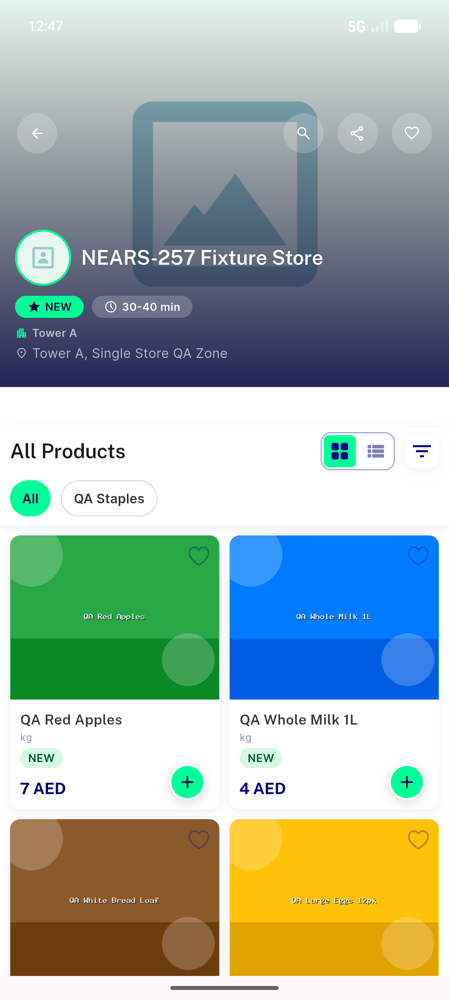
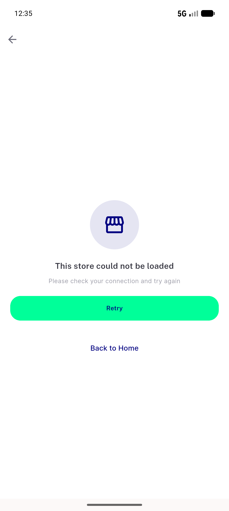
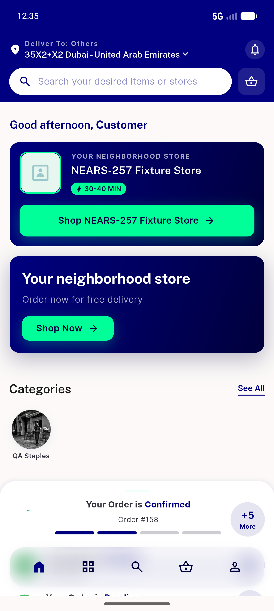
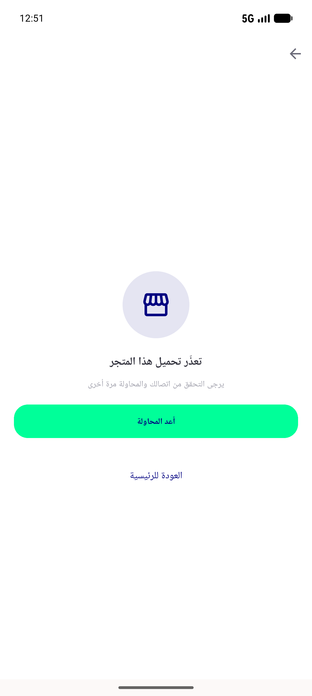
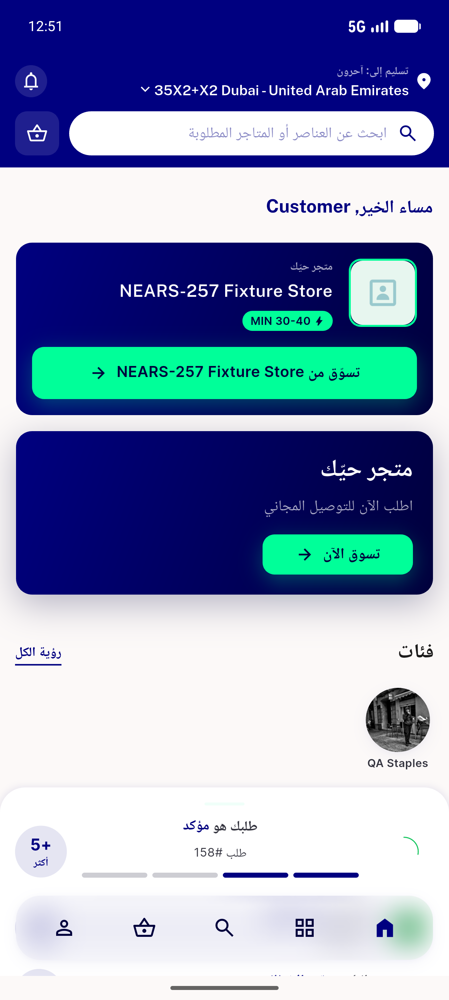
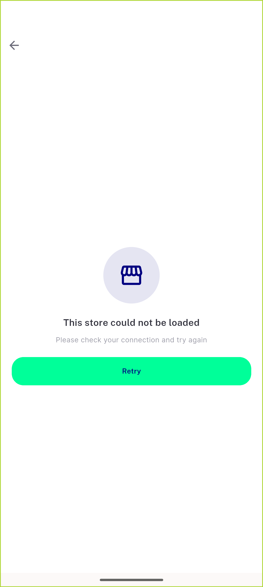
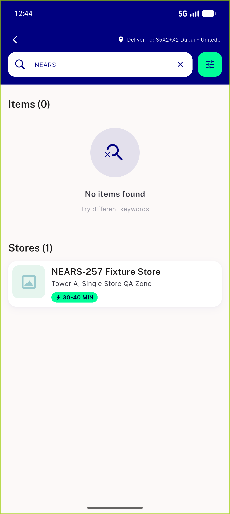
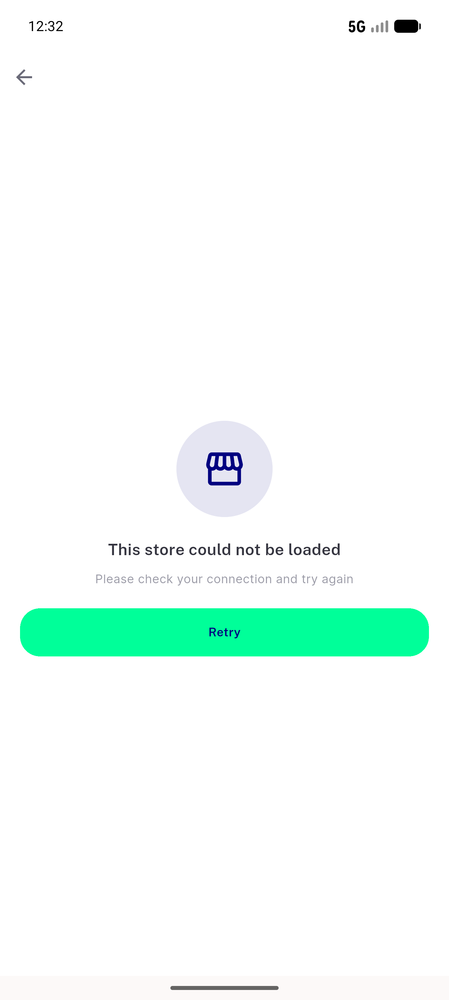

# QA Evidence — NEARS-1098

**PASS (fix-cycle 3) — AC5 dead-end fixed: cold deep-link back now reaches a live Home (34 nodes vs 0 pre-fix); AC1/AC4/AC5a-d all PASS; flutter test 2255/2255**

**27 screenshot(s).** Click any thumbnail for full resolution.

<table>
<tr>
<td align="center" width="33%"> ac1 error state not shimmer</td>
<td align="center" width="33%"> ac1 fixed error state</td>
<td align="center" width="33%"> ac1 pre basebuild infinite shimmer</td>
</tr>
<tr>
<td align="center" width="33%"> ac4 retry recovered store</td>
<td align="center" width="33%"> ac4 retry recovers store loaded</td>
<td align="center" width="33%"> ac5 deeplink cold open</td>
</tr>
<tr>
<td align="center" width="33%"> ac5a 01 failure with back to home link</td>
<td align="center" width="33%"> ac5a 02 after back live home</td>
<td align="center" width="33%"> ac5b 01 rtl failure arabic link</td>
</tr>
<tr>
<td align="center" width="33%"> ac5b 02 rtl back live home</td>
<td align="center" width="33%"> ac5c 01 pushed from list no home link</td>
<td align="center" width="33%"> ac5c 02 back popped to list</td>
</tr>
<tr>
<td align="center" width="33%"> ac5d 01 hwback from list to list</td>
<td align="center" width="33%"> ac5d 02 hwback deeplink to home</td>
<td align="center" width="33%"> bug ac5 prefix 01 failure no home link</td>
</tr>
<tr>
<td align="center" width="33%"> bug ac5 prefix 02 dead splash after back</td>
<td align="center" width="33%"> bug autoopened flag dead on hero path</td>
<td align="center" width="33%"> bug c2 deeplink back dead splash</td>
</tr>
<tr>
<td align="center" width="33%"> bug c2 rtl back false no internet</td>
<td align="center" width="33%"> bug deeplink back blank deadend</td>
<td align="center" width="33%"> bug deeplink back no internet deadend</td>
</tr>
<tr>
<td align="center" width="33%"> c2 ac4 retry recovered</td>
<td align="center" width="33%"> c2 ac5a stranded error screen</td>
<td align="center" width="33%"> c2 ac5c push entry failure</td>
</tr>
<tr>
<td align="center" width="33%"> c2 rtl arabic stranded error</td>
<td align="center" width="33%"> r2 zonewarning dialog intact</td>
<td align="center" width="33%"> r6 rtl arabic error state</td>
</tr>
</table>

### Other artifacts
- [`bug-autoopened-flag-dead-on-hero-path.log`](bug-autoopened-flag-dead-on-hero-path.log)
- [`bug-c2-deeplink-back-dead-splash.log`](bug-c2-deeplink-back-dead-splash.log)
- [`bug-deeplink-back-deadend.log`](bug-deeplink-back-deadend.log)
- [`progress.md`](progress.md)

---
*From `nears/docs/qa-evidence/NEARS-1098/` · public-repo scrub policy (no live secrets; verified clean).*
