# QA Evidence — NEARS-1098

**FAIL (fix-cycle 2) — AC5a/AC5b still dead-end; canPop() is TRUE on a cold deep-link (dead splash underneath)**

**14 screenshot(s).** Click any thumbnail for full resolution.

<table>
<tr>
<td align="center" width="33%"><a href="ac1-fixed-error-state.png">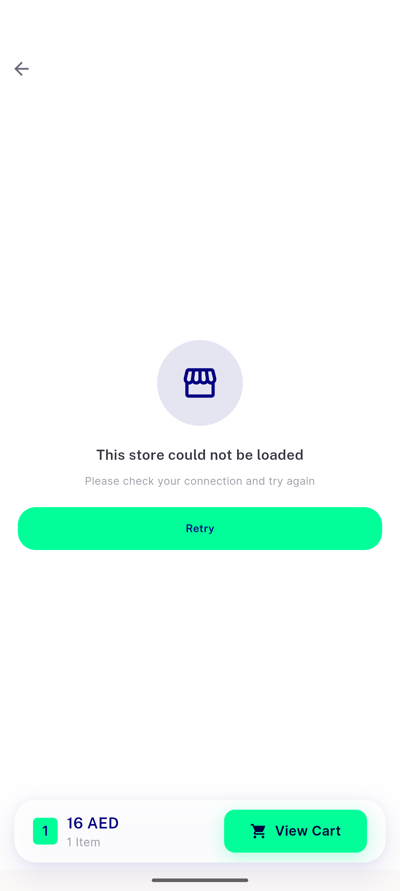</a> ac1 fixed error state</td>
<td align="center" width="33%"><a href="ac1-pre-basebuild-infinite-shimmer.png">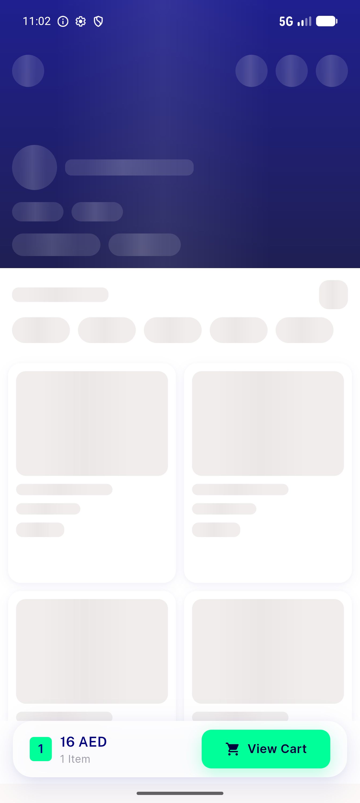</a> ac1 pre basebuild infinite shimmer</td>
<td align="center" width="33%"><a href="ac4-retry-recovered-store.png">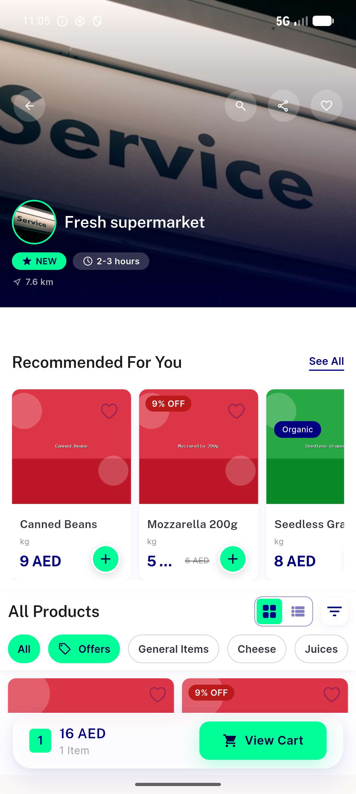</a> ac4 retry recovered store</td>
</tr>
<tr>
<td align="center" width="33%"><a href="ac5-deeplink-cold-open.png">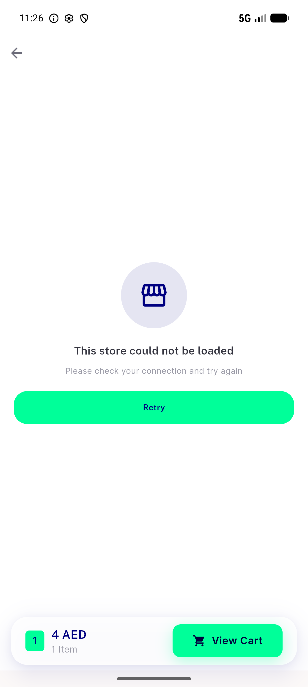</a> ac5 deeplink cold open</td>
<td align="center" width="33%"><a href="bug-c2-deeplink-back-dead-splash.png">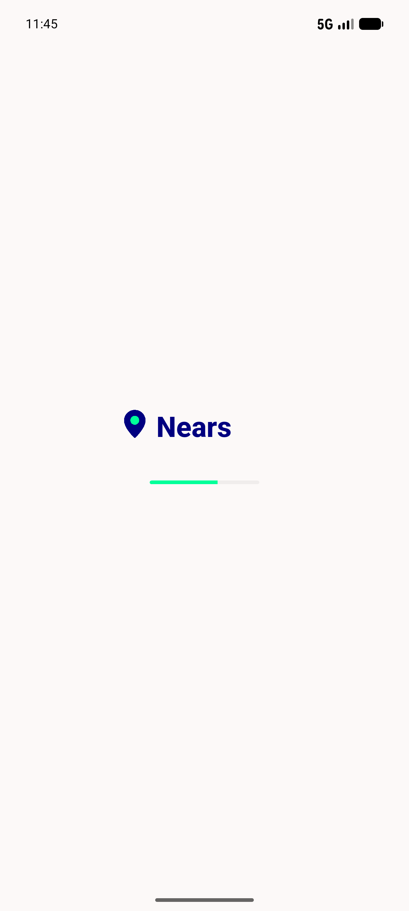</a> bug c2 deeplink back dead splash</td>
<td align="center" width="33%"><a href="bug-c2-rtl-back-false-no-internet.png">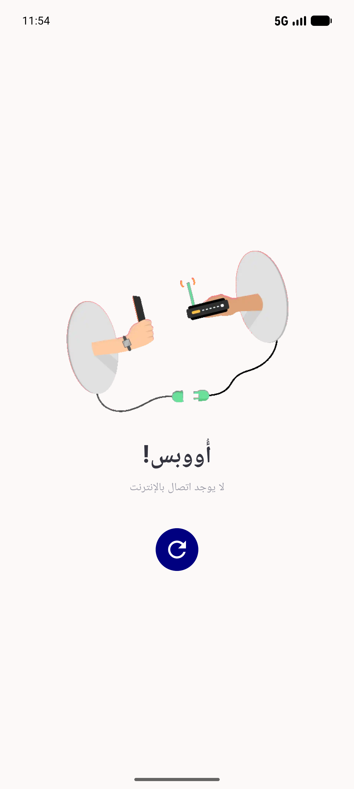</a> bug c2 rtl back false no internet</td>
</tr>
<tr>
<td align="center" width="33%"><a href="bug-deeplink-back-blank-deadend.png">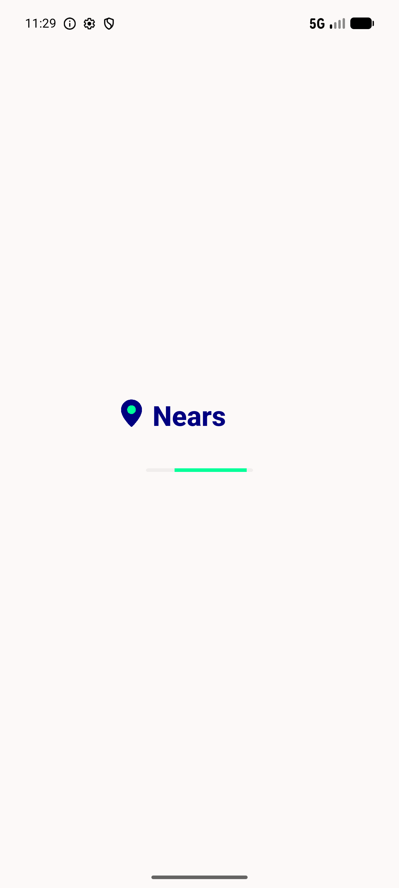</a> bug deeplink back blank deadend</td>
<td align="center" width="33%"><a href="bug-deeplink-back-no-internet-deadend.png">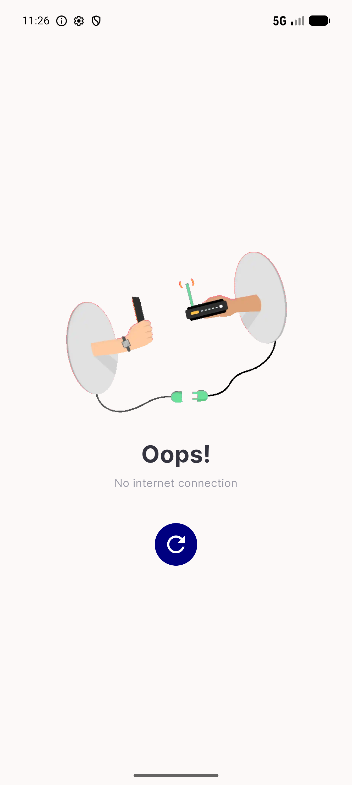</a> bug deeplink back no internet deadend</td>
<td align="center" width="33%"> c2 ac4 retry recovered</td>
</tr>
<tr>
<td align="center" width="33%"><a href="c2-ac5a-stranded-error-screen.png">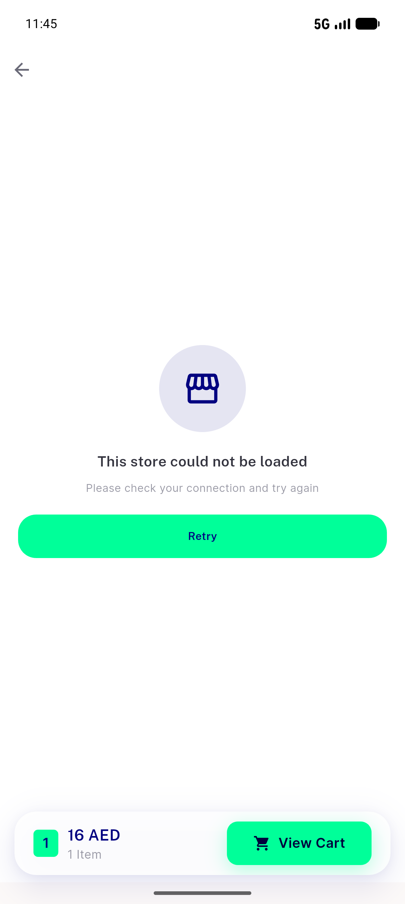</a> c2 ac5a stranded error screen</td>
<td align="center" width="33%"> c2 ac5c push entry failure</td>
<td align="center" width="33%"><a href="c2-rtl-arabic-stranded-error.png">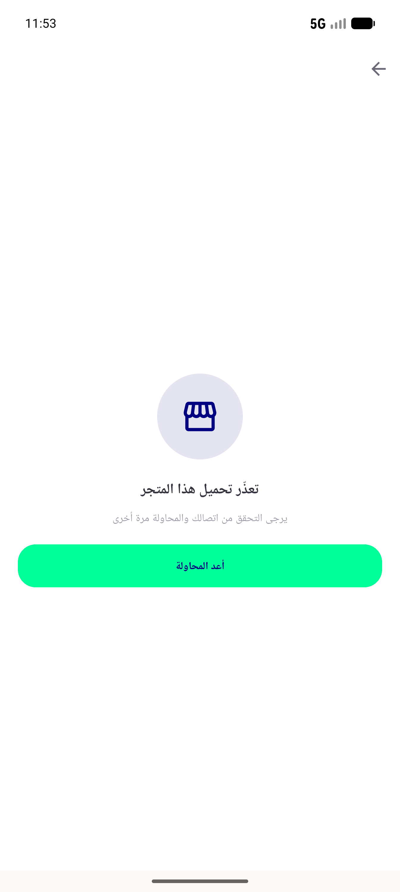</a> c2 rtl arabic stranded error</td>
</tr>
<tr>
<td align="center" width="33%"><a href="r2-zonewarning-dialog-intact.png">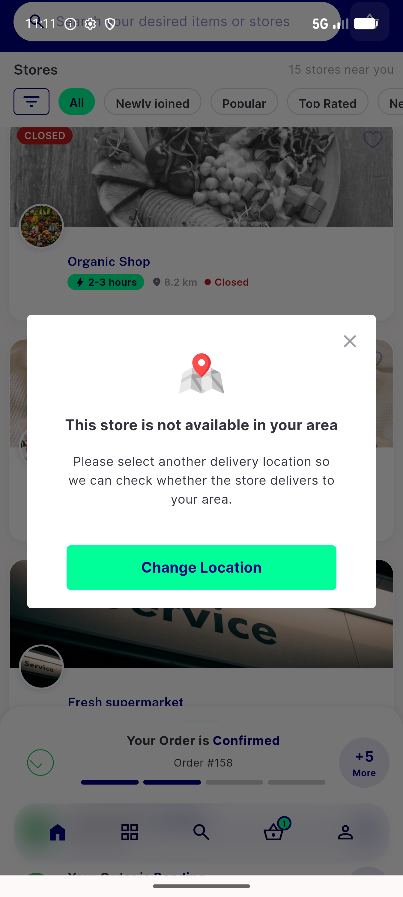</a> r2 zonewarning dialog intact</td>
<td align="center" width="33%"><a href="r6-rtl-arabic-error-state.png">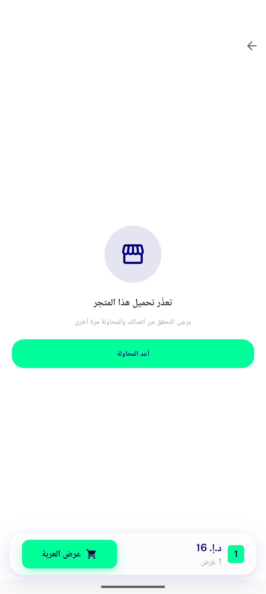</a> r6 rtl arabic error state</td>
</tr>
</table>

### Other artifacts
- [`bug-c2-deeplink-back-dead-splash.log`](bug-c2-deeplink-back-dead-splash.log)
- [`bug-deeplink-back-deadend.log`](bug-deeplink-back-deadend.log)

---
*From `nears/docs/qa-evidence/NEARS-1098/` · public-repo scrub policy (no live secrets; verified clean).*
