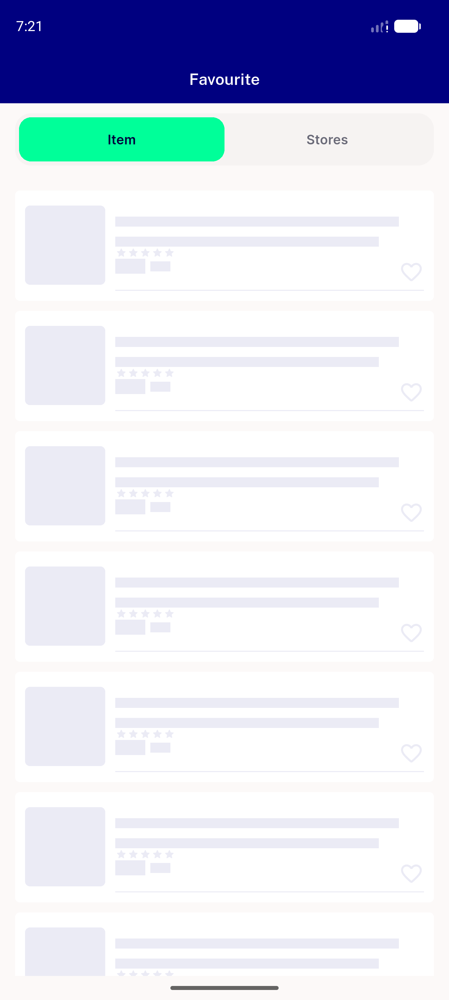
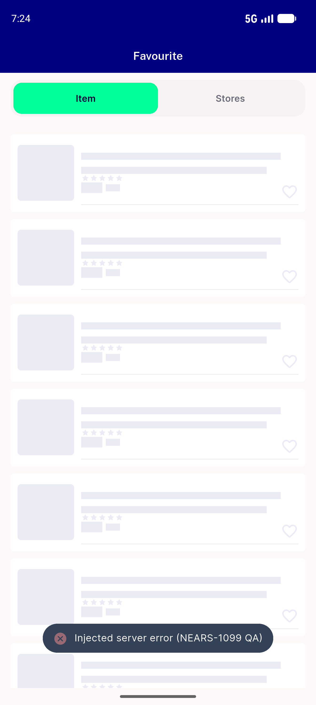
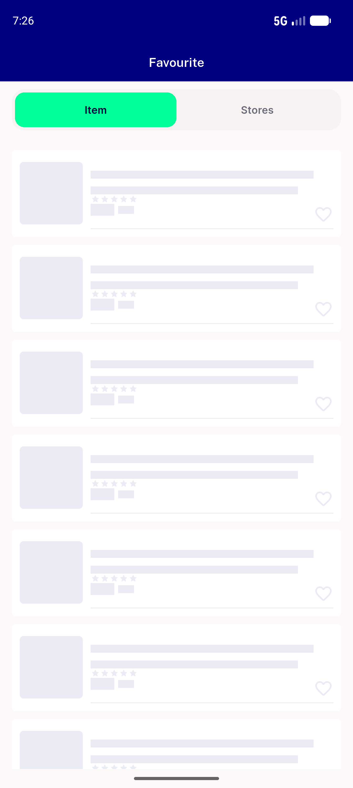
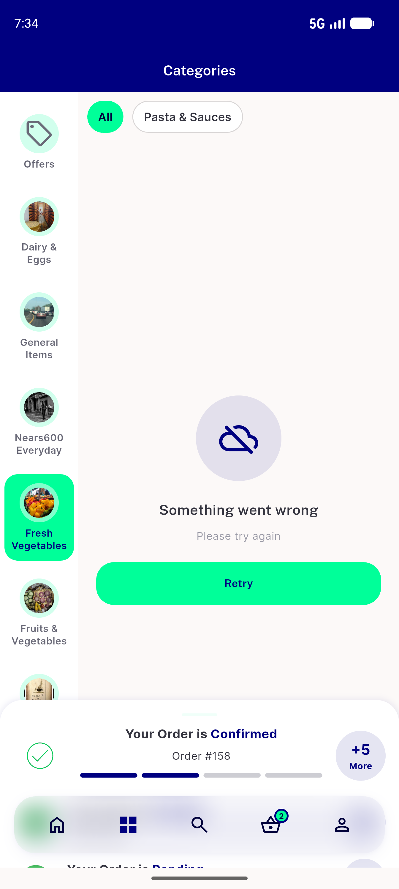
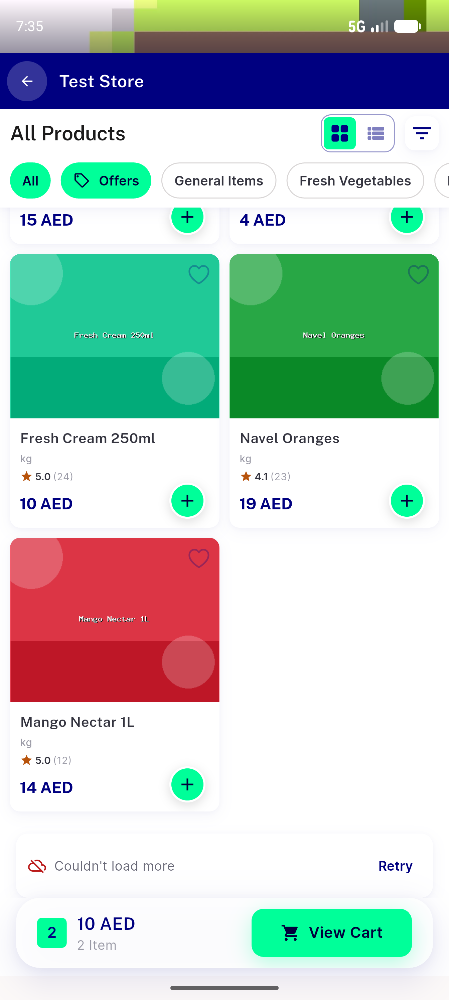
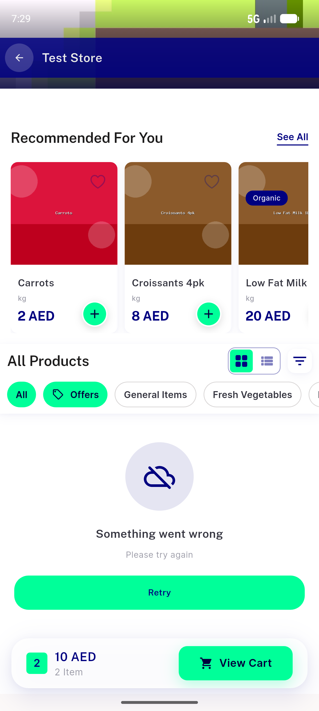

# QA Evidence — NEARS-1099

**PASS — mutation CONFIRMS the audit: flipping handleError:false on the wishlist site produces a silent shimmer with zero user-visible failure signal. Zero code correctly shipped.**

**8 screenshot(s).** Click any thumbnail for full resolution.

<table>
<tr>
<td align="center" width="33%"> step0 offline transport throw NO snackbar silent</td>
<td align="center" width="33%"> step0 offline transport throw shimmer</td>
<td align="center" width="33%"> step1 baseline 500 after snackbar gone shimmer</td>
</tr>
<tr>
<td align="center" width="33%"> step1 baseline 500 snackbar over shimmer</td>
<td align="center" width="33%"> step2 MUTATED 500 silent shimmer no snackbar</td>
<td align="center" width="33%"> step4 regression category 500</td>
</tr>
<tr>
<td align="center" width="33%"> step4 regression loadmore page2 500</td>
<td align="center" width="33%"> step4 regression store grid 500 scrolled</td>
</tr>
</table>

---
*From `nears/docs/qa-evidence/NEARS-1099/` · public-repo scrub policy (no live secrets; verified clean).*
