# QA Evidence — NEARS-1101

**PASS — NEARS-1101 error/empty-state a11y: Retry is now its own Button node (was one full-screen merged node); defect reproduced on pre-fix base 61acfb8a first**

**13 screenshot(s).** Click any thumbnail for full resolution.

<table>
<tr>
<td align="center" width="33%"><a href="ac3-talkback-focus-retry.png">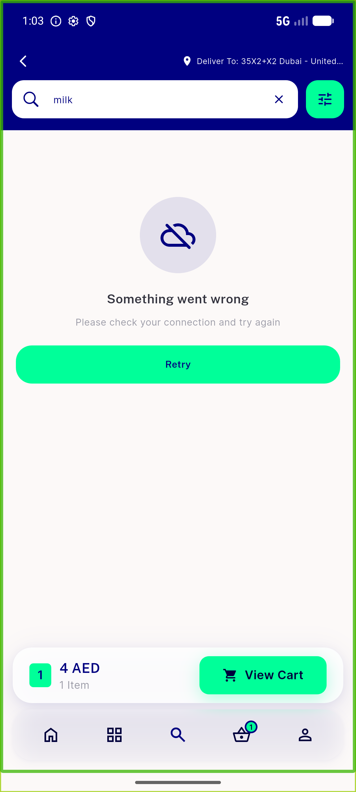</a> ac3 talkback focus retry</td>
<td align="center" width="33%"><a href="ac4-retry-recovered.png">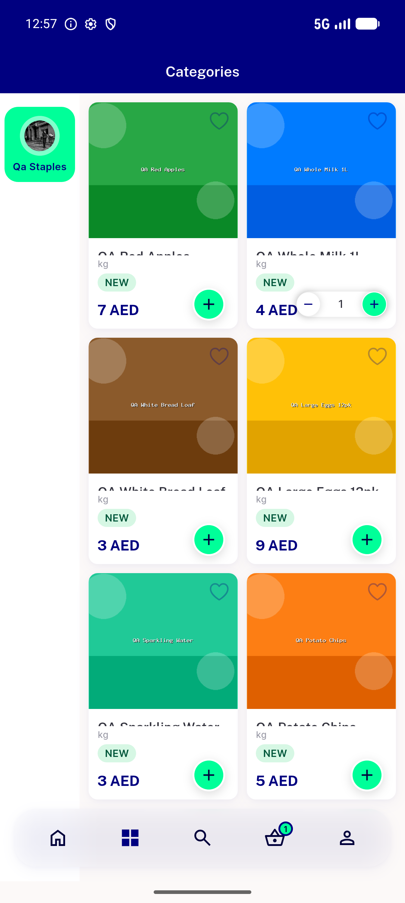</a> ac4 retry recovered</td>
<td align="center" width="33%"><a href="after-category-error.png">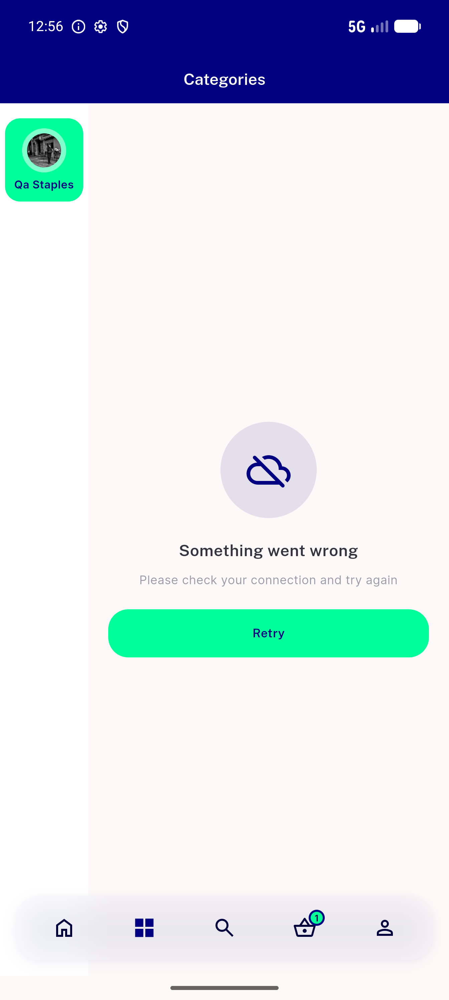</a> after category error</td>
</tr>
<tr>
<td align="center" width="33%"><a href="after-search-error.png">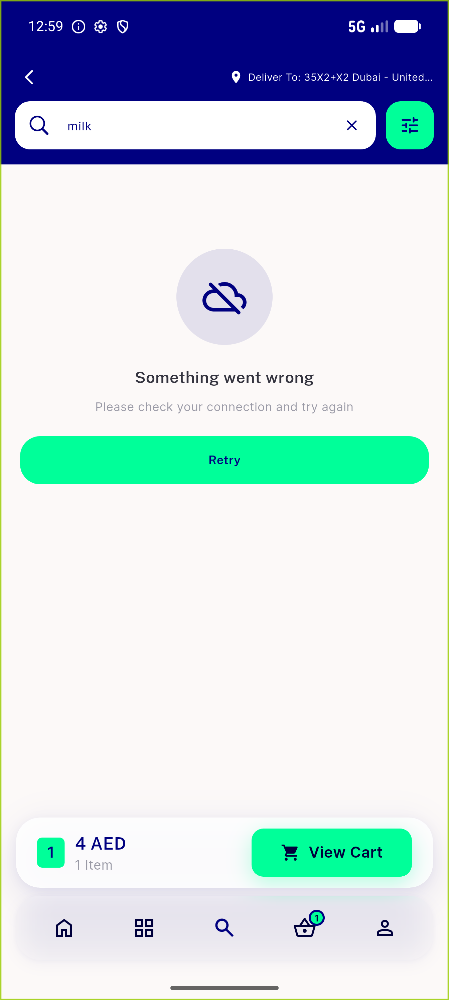</a> after search error</td>
<td align="center" width="33%"><a href="before-category-error.png">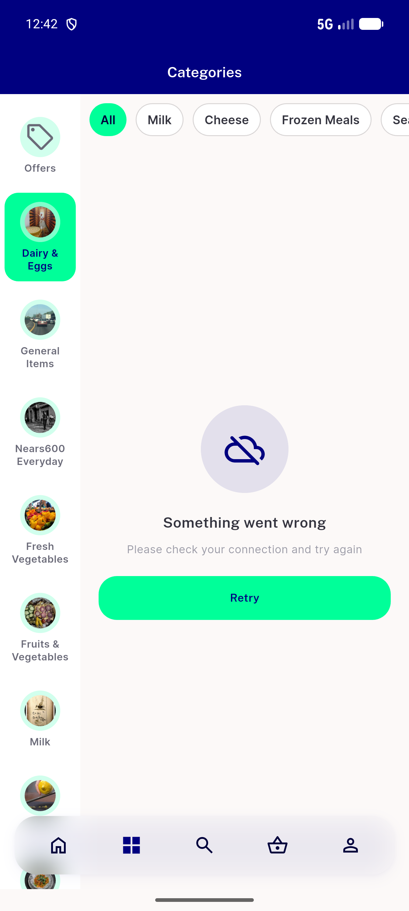</a> before category error</td>
<td align="center" width="33%"><a href="before-search-error.png">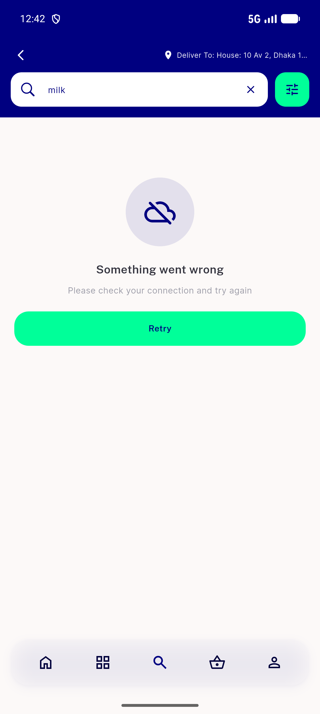</a> before search error</td>
</tr>
<tr>
<td align="center" width="33%"><a href="dark-retry-idle.png">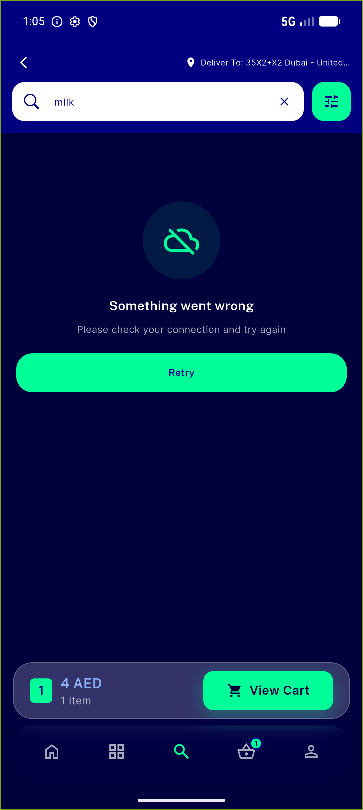</a> dark retry idle</td>
<td align="center" width="33%"><a href="dark-retry-pressed-ripple.png">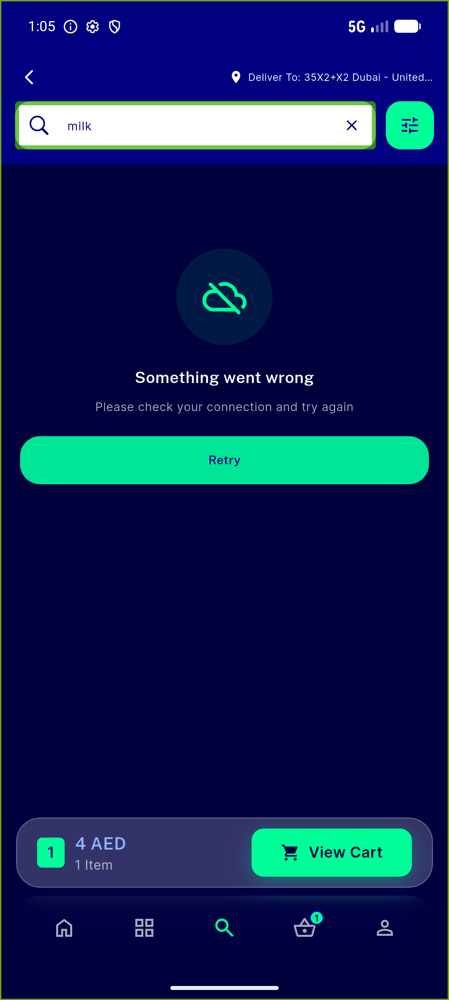</a> dark retry pressed ripple</td>
<td align="center" width="33%"><a href="regression-coupon-empty.png">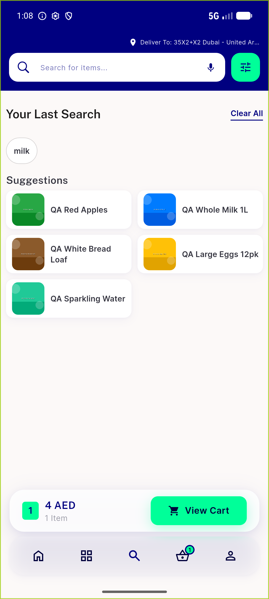</a> regression coupon empty</td>
</tr>
<tr>
<td align="center" width="33%"> regression favourite empty</td>
<td align="center" width="33%"><a href="regression-notification-empty.png">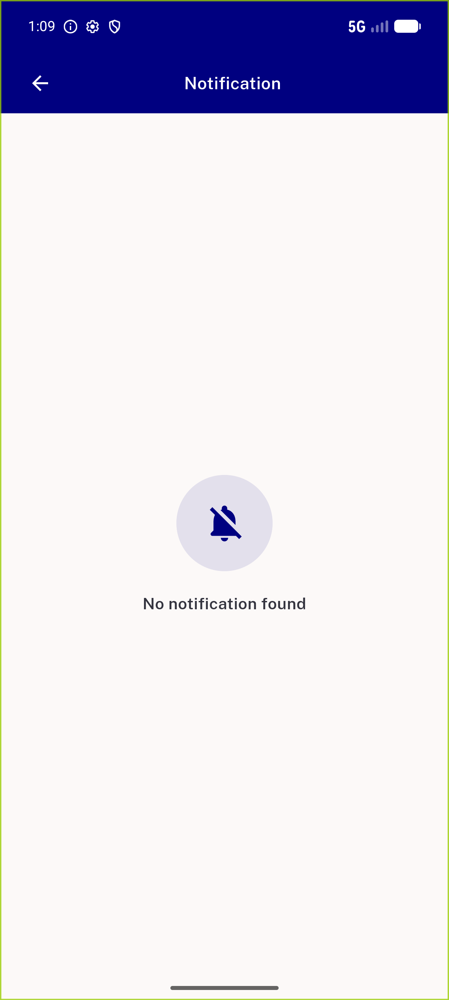</a> regression notification empty</td>
<td align="center" width="33%"><a href="regression-orders.png">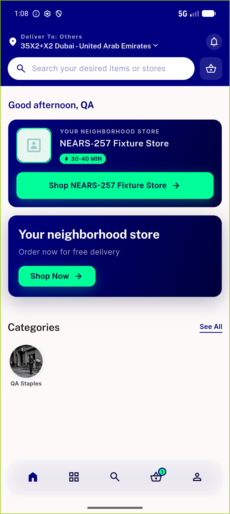</a> regression orders</td>
</tr>
<tr>
<td align="center" width="33%"><a href="regression-store-screen-error.png">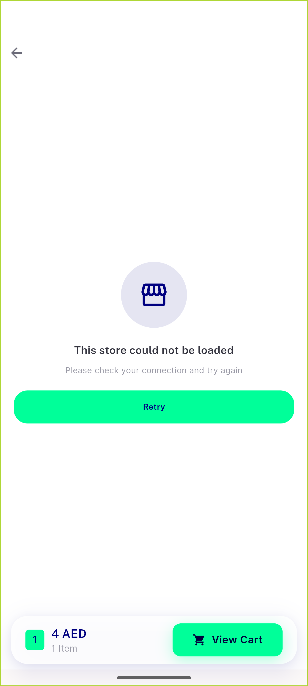</a> regression store screen error</td>
</tr>
</table>

### Other artifacts
- [`after-category-tab-dump.xml`](after-category-tab-dump.xml)
- [`after-search-tab-dump.xml`](after-search-tab-dump.xml)
- [`before-category-tab-dump.xml`](before-category-tab-dump.xml)
- [`before-search-tab-dump.xml`](before-search-tab-dump.xml)
- [`regression-store-screen-dump.xml`](regression-store-screen-dump.xml)

---
*From `nears/docs/qa-evidence/NEARS-1101/` · public-repo scrub policy (no live secrets; verified clean).*
