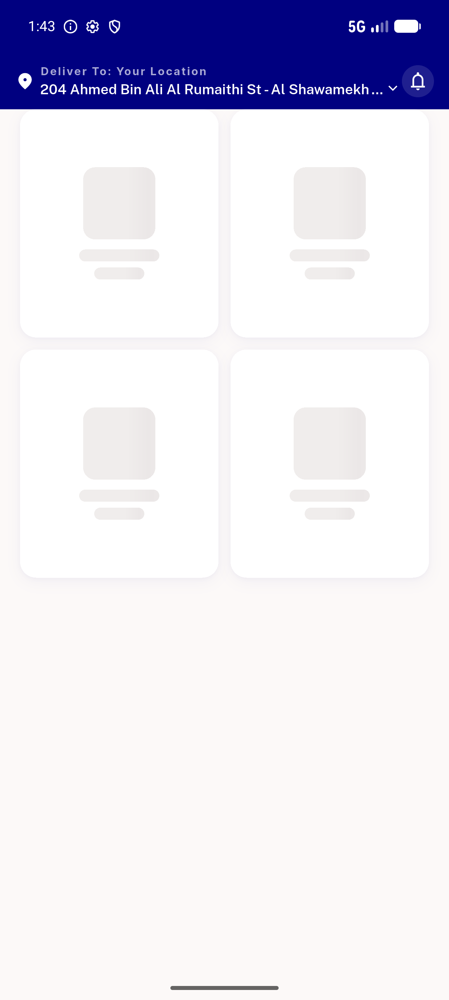

# QA Evidence — NEARS-1105

**PASS — 3/3 ACs met (AC1 zone→zone proven live pre/post; AC2+out-of-zone by falsifiable unit proof); regression clean; 2248/2248 tests**

**7 screenshot(s).** Click any thumbnail for full resolution.

<table>
<tr>
<td align="center" width="33%"> prefix 01 zone1 baseline</td>
<td align="center" width="33%"> prefix 01 zone2 grid baseline</td>
<td align="center" width="33%"> ux ar c1 sector grid rtl</td>
</tr>
<tr>
<td align="center" width="33%"> ux ar c2 zone change shimmer rtl</td>
<td align="center" width="33%"> ux ar c3 same zone refresh no flash rtl</td>
<td align="center" width="33%"> ux en a zone change shimmer slowconn</td>
</tr>
<tr>
<td align="center" width="33%"> ux en b same zone refresh no flash</td>
</tr>
</table>

### Other artifacts
- [`ac1-identity-repro-prefix-vs-postfix.log`](ac1-identity-repro-prefix-vs-postfix.log)
- [`bug-prefix-stale-grid-baseline.log`](bug-prefix-stale-grid-baseline.log)
- [`mutation-check-tests-vs-prefix.log`](mutation-check-tests-vs-prefix.log)

---
*From `nears/docs/qa-evidence/NEARS-1105/` · public-repo scrub policy (no live secrets; verified clean).*
