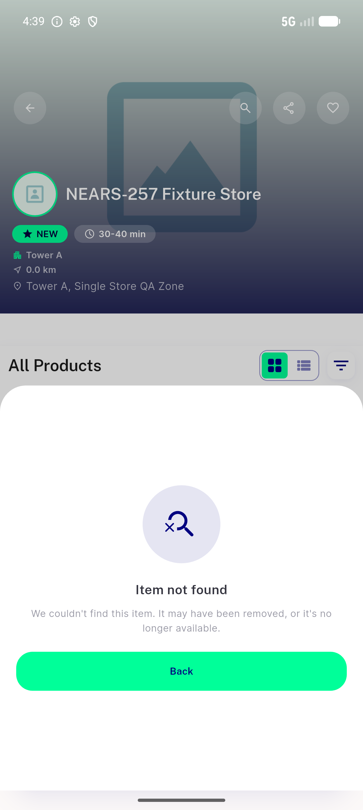
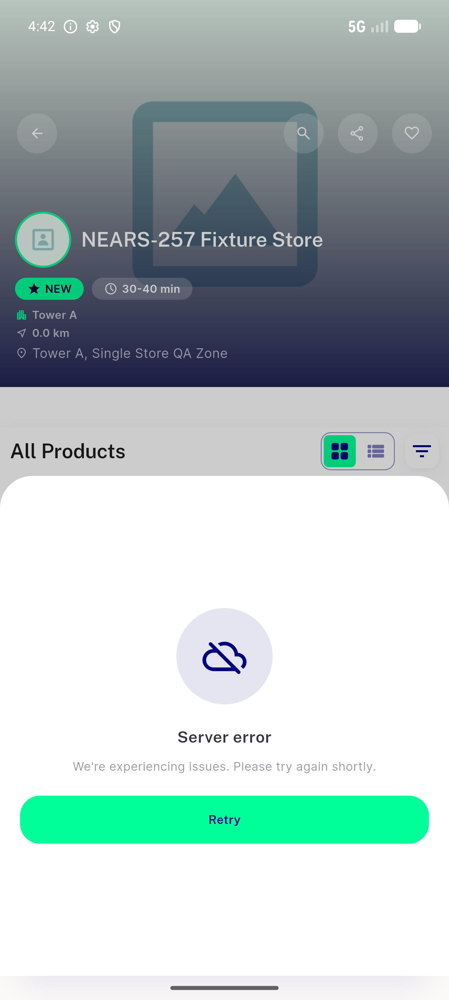
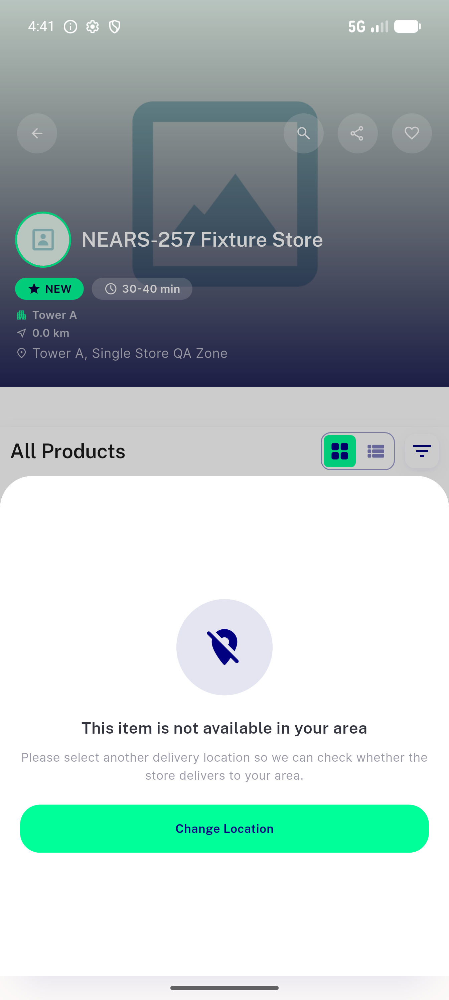
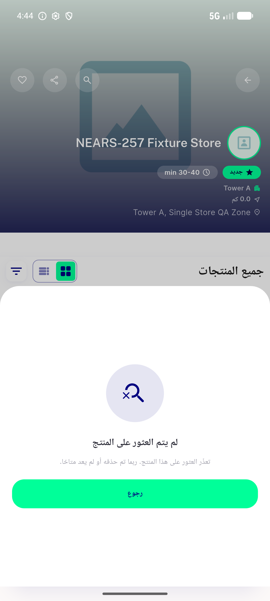
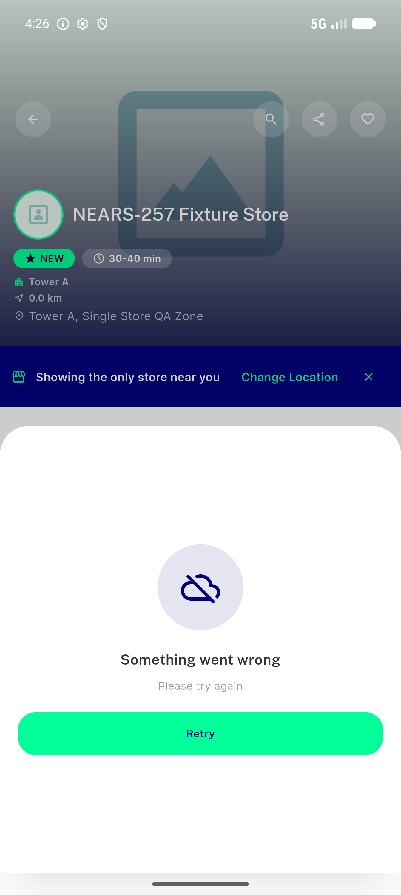
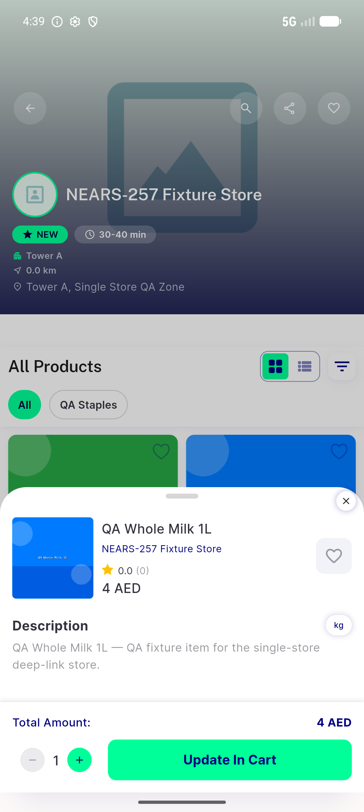

# QA Evidence — NEARS-1106

**PASS — 404 renders terminal not-found state; 5xx still Retry (distinct); 403 still change-location; AR/RTL verified on-device**

**6 screenshot(s).** Click any thumbnail for full resolution.

<table>
<tr>
<td align="center" width="33%"> ac1 404 not found state</td>
<td align="center" width="33%"> ac2 5xx retry state</td>
<td align="center" width="33%"> ac3 403 out of zone state</td>
</tr>
<tr>
<td align="center" width="33%"> ac4 arabic rtl not found</td>
<td align="center" width="33%"> prefix 404 shows RETRY bug</td>
<td align="center" width="33%"> wedge check valid item after 404</td>
</tr>
</table>

---
*From `nears/docs/qa-evidence/NEARS-1106/` · public-repo scrub policy (no live secrets; verified clean).*
