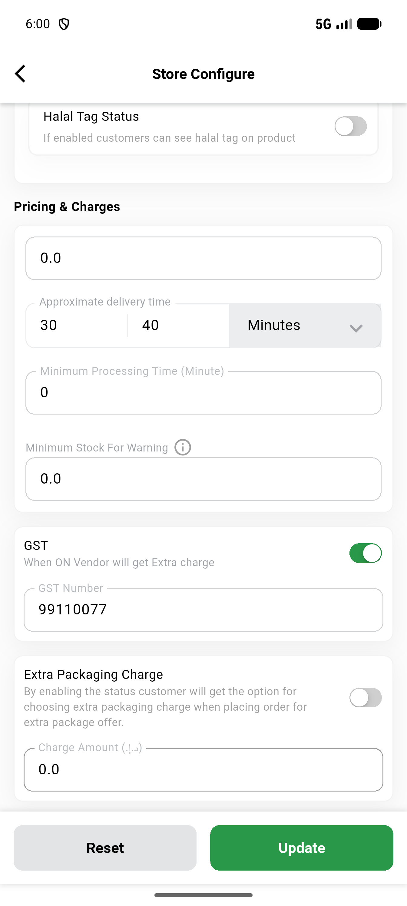
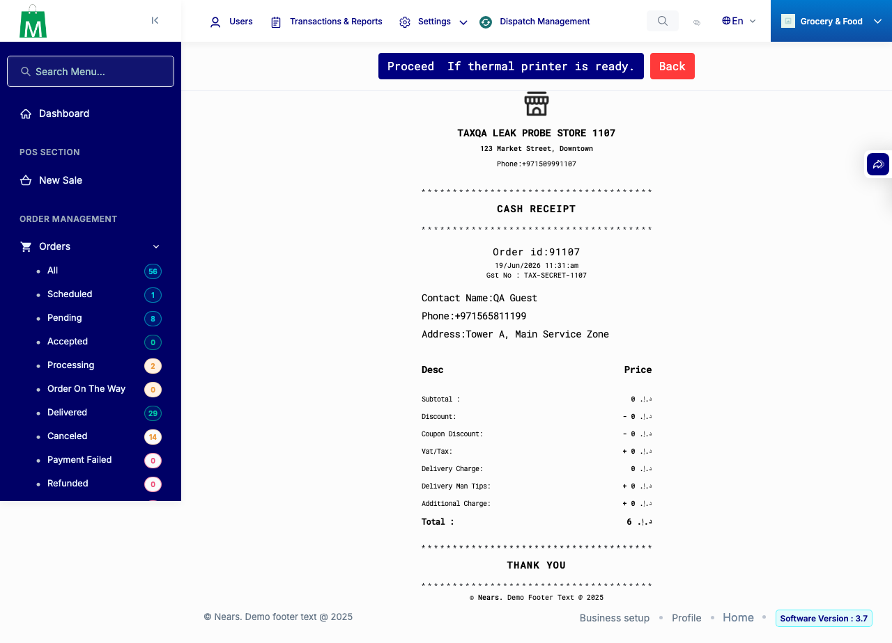
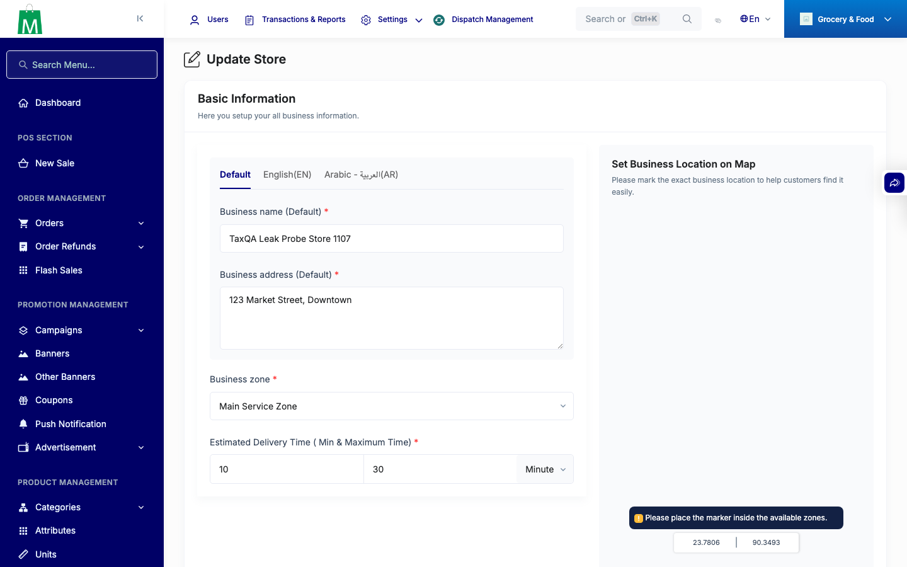
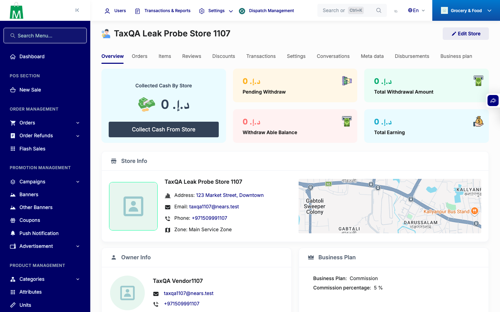
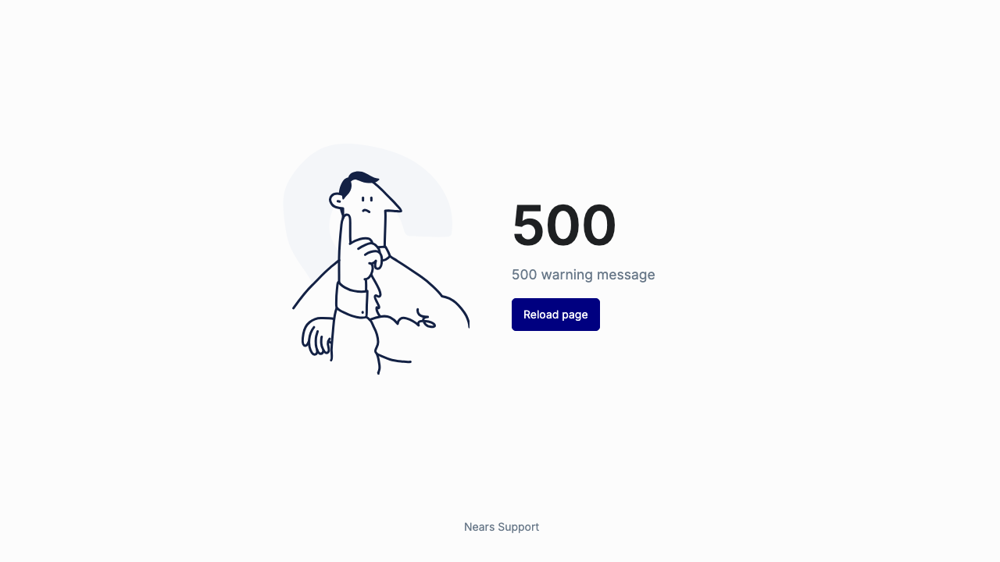

# QA Evidence — NEARS-1107

**PASS — anonymous store tax leak closed (pre-fix leak captured + gone post-fix); owner GST path intact on-device**

**6 screenshot(s).** Click any thumbnail for full resolution.

<table>
<tr>
<td align="center" width="33%"> ac2 vendorapp gst persisted</td>
<td align="center" width="33%"> ac3 admin order invoice gst</td>
<td align="center" width="33%"> ac3 admin store edit</td>
</tr>
<tr>
<td align="center" width="33%"> ac3 admin store view</td>
<td align="center" width="33%"> ac4 vendor panel store setup</td>
<td align="center" width="33%"> bug vendor store setup 500 delivery time</td>
</tr>
</table>

### Other artifacts
- [`ac1-prefix-vs-fixed-raw.txt`](ac1-prefix-vs-fixed-raw.txt)
- [`bug-vendor-store-setup-500-delivery-time.log`](bug-vendor-store-setup-500-delivery-time.log)
- [`bug-vendorapp-gst-field-digits-only.log`](bug-vendorapp-gst-field-digits-only.log)

---
*From `nears/docs/qa-evidence/NEARS-1107/` · public-repo scrub policy (no live secrets; verified clean).*
