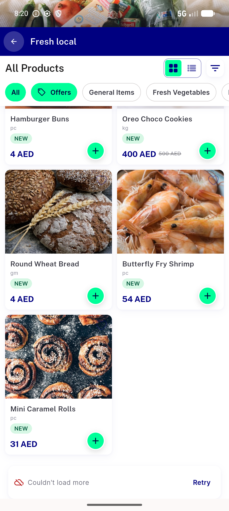
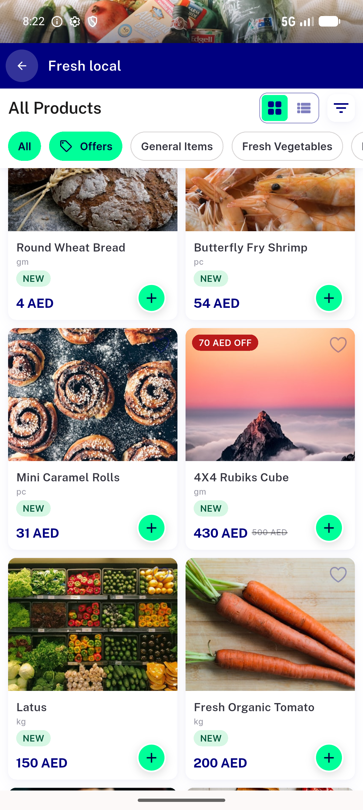
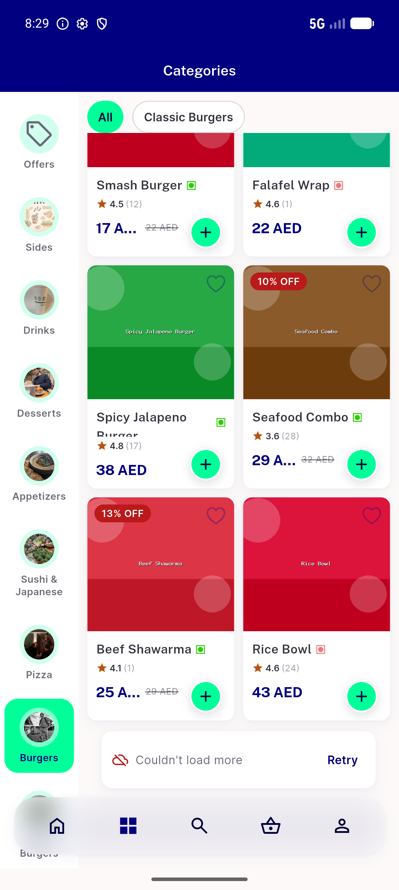
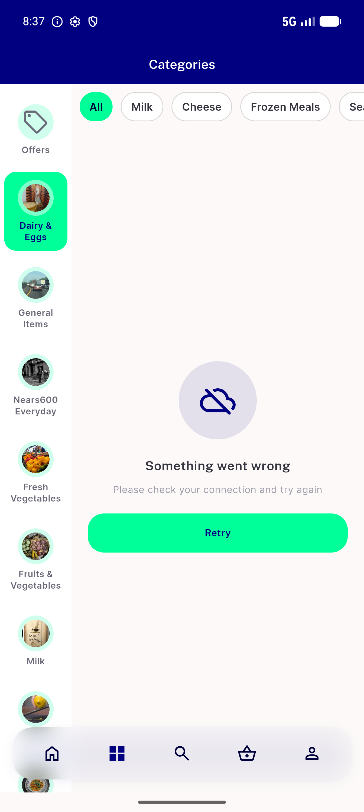
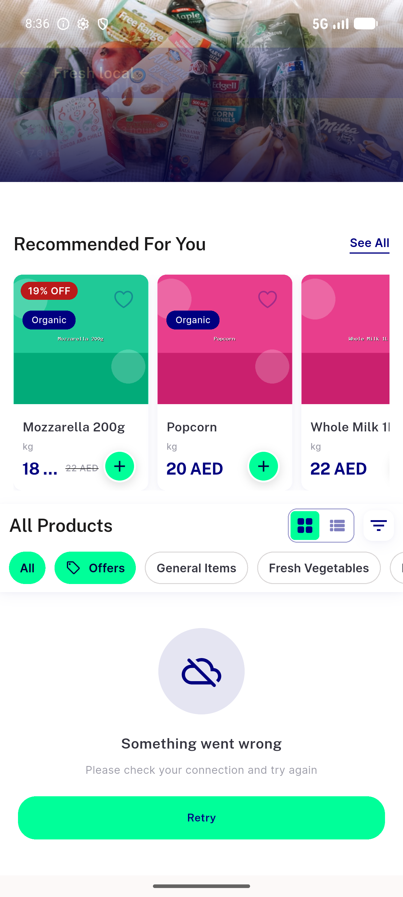
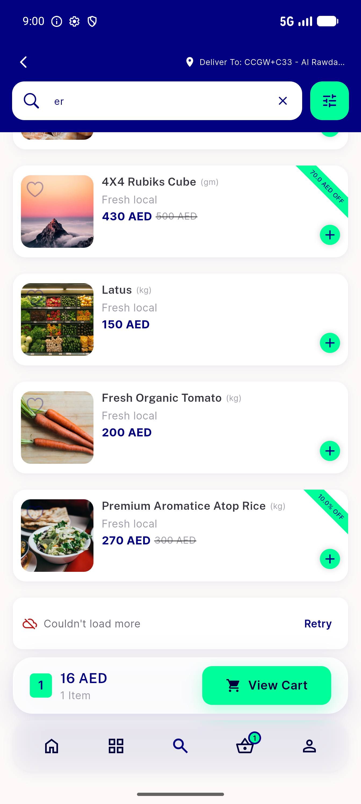
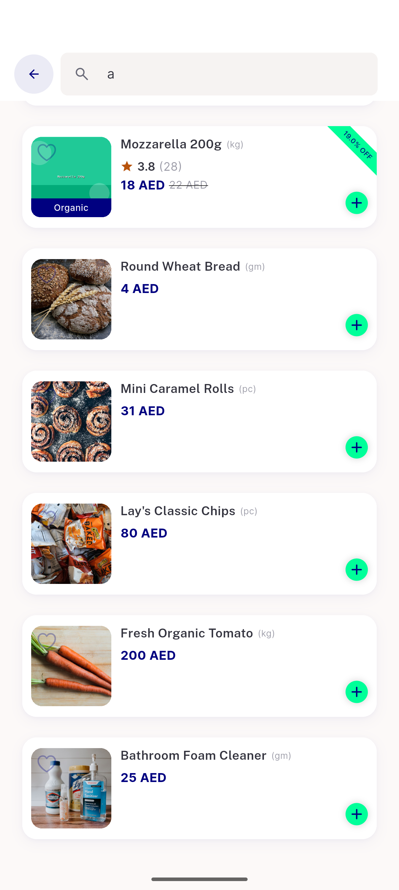
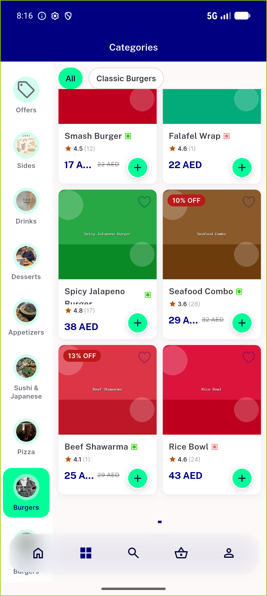
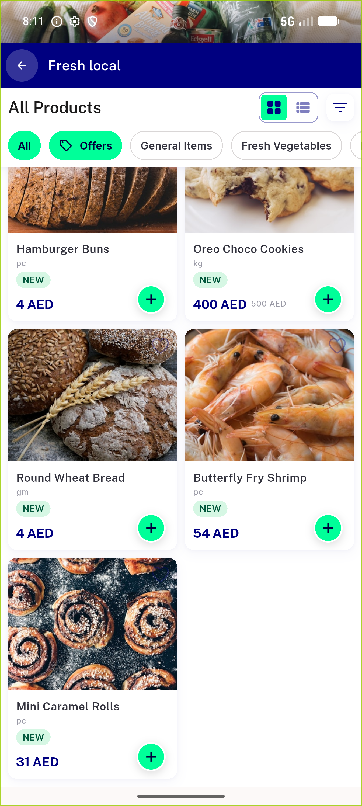
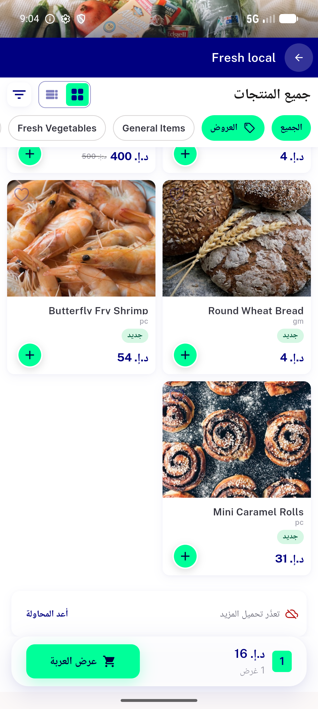

# QA Evidence — NEARS-1109

**PASS (cycle 5) — 16/21 ACs demonstrated live; AC9/AC10 + 4 AC11 surfaces NOT_RUN (surface unreachable on mobile / seeded data too small). No task bugs.**

**10 screenshot(s).** Click any thumbnail for full resolution.

<table>
<tr>
<td align="center" width="33%"> ac1 store inline error row</td>
<td align="center" width="33%"> ac2 page2 appended in order</td>
<td align="center" width="33%"> ac4 category inline row</td>
</tr>
<tr>
<td align="center" width="33%"> ac6 category offset1 fullscreen</td>
<td align="center" width="33%"> ac6 offset1 fullscreen error</td>
<td align="center" width="33%"> ac8 search footer unchanged</td>
</tr>
<tr>
<td align="center" width="33%"> bug store item search still silent</td>
<td align="center" width="33%"> prefix category spinner hang</td>
<td align="center" width="33%"> prefix store grid page skip</td>
</tr>
<tr>
<td align="center" width="33%"> rtl store inline row arabic</td>
</tr>
</table>

### Other artifacts
- [`ac2-store-grid-no-page-skip.log`](ac2-store-grid-no-page-skip.log)
- [`ac4-category-grid.log`](ac4-category-grid.log)
- [`ac6-offset1.log`](ac6-offset1.log)
- [`bug-store-item-search-still-silent.log`](bug-store-item-search-still-silent.log)
- [`prefix-category-spinner-hang.log`](prefix-category-spinner-hang.log)
- [`prefix-store-grid-page-skip.log`](prefix-store-grid-page-skip.log)

---
*From `nears/docs/qa-evidence/NEARS-1109/` · public-repo scrub policy (no live secrets; verified clean).*
