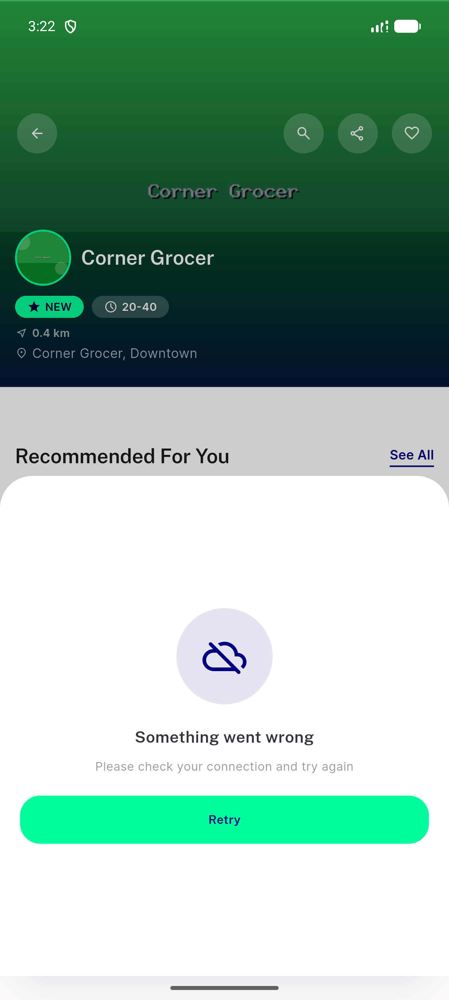
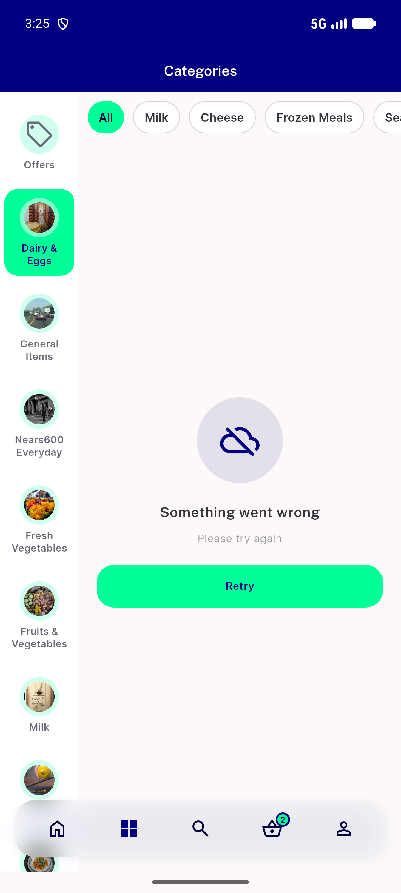
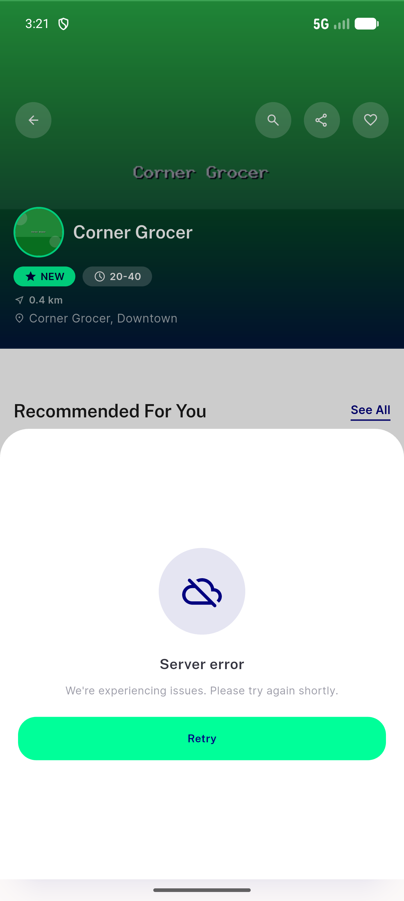
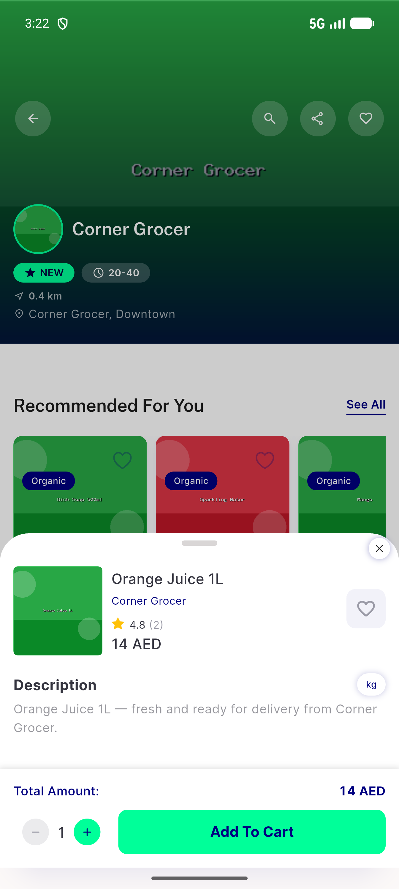
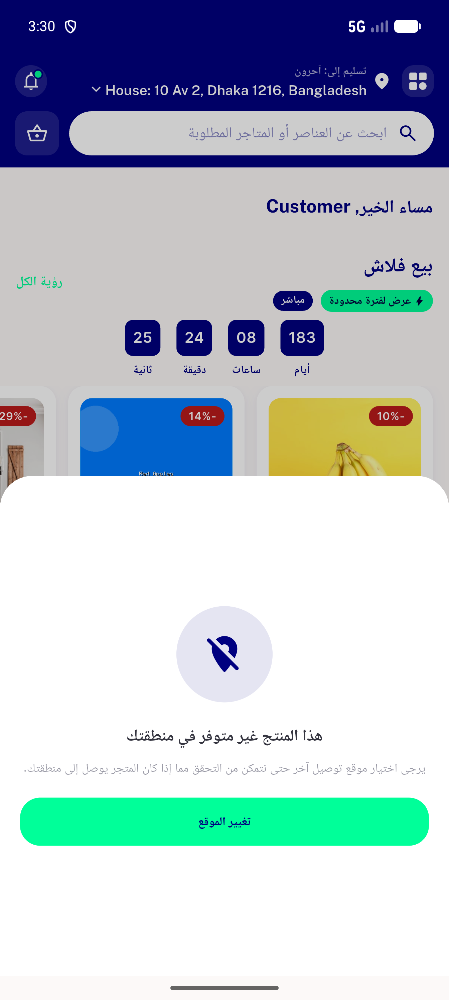
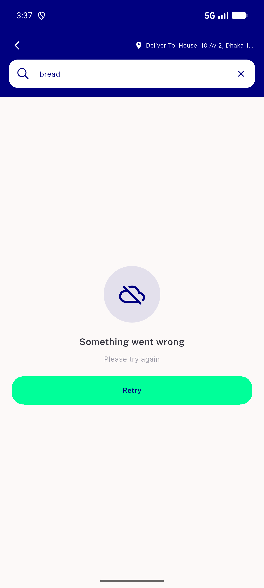
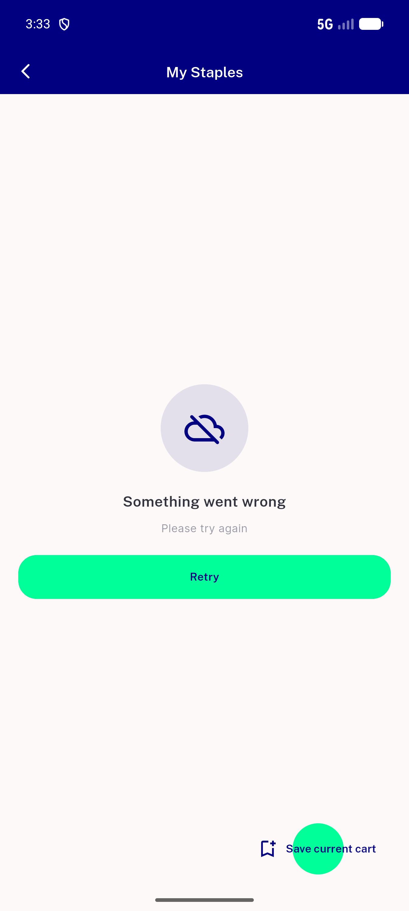
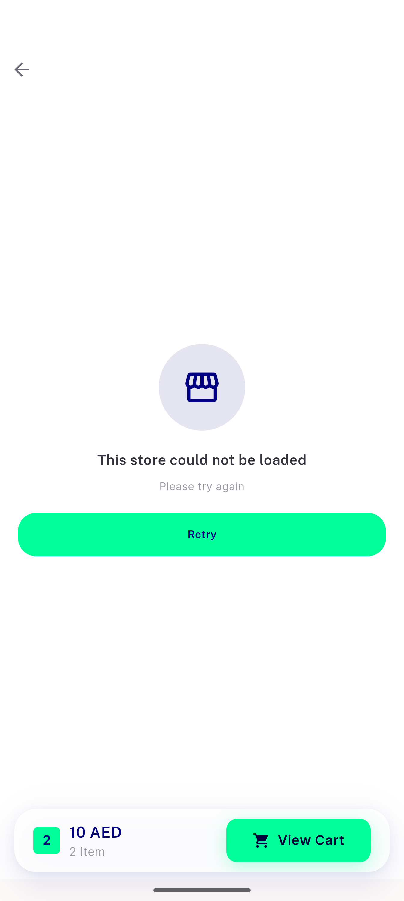

# QA Evidence — NEARS-1110

**PASS — 5/5 ACs demonstrated live on emulator-5558 (UserApp, light mode); genuine 500 via fault-injecting proxy; 17/17 unit tests green**

**10 screenshot(s).** Click any thumbnail for full resolution.

<table>
<tr>
<td align="center" width="33%"> ac1 connectivity en</td>
<td align="center" width="33%"> ac2 neutral category grid en</td>
<td align="center" width="33%"> ac3 server error en</td>
</tr>
<tr>
<td align="center" width="33%"> ac4 neutral category grid ar</td>
<td align="center" width="33%"> ac4 server error ar</td>
<td align="center" width="33%"> ac5 retry recovered en</td>
</tr>
<tr>
<td align="center" width="33%"> regression out of zone 403</td>
<td align="center" width="33%"> regression search neutral en</td>
<td align="center" width="33%"> regression staples neutral en</td>
</tr>
<tr>
<td align="center" width="33%"> regression store neutral en</td>
</tr>
</table>

### Other artifacts
- [`bug-ar-modal-barrier-untranslated.log`](bug-ar-modal-barrier-untranslated.log)
- [`bug-staples-lossy-fail-log.log`](bug-staples-lossy-fail-log.log)

---
*From `nears/docs/qa-evidence/NEARS-1110/` · public-repo scrub policy (no live secrets; verified clean).*
