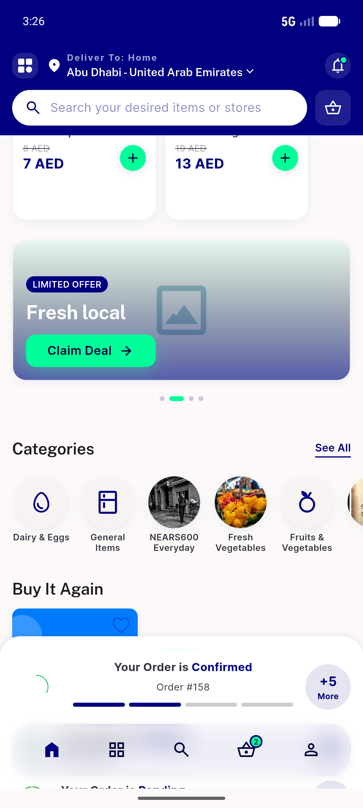
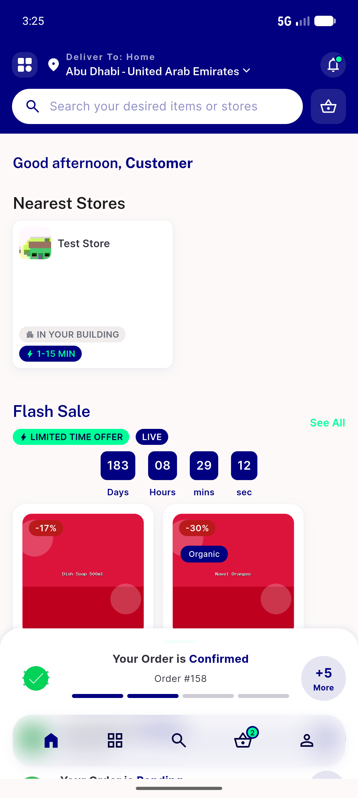
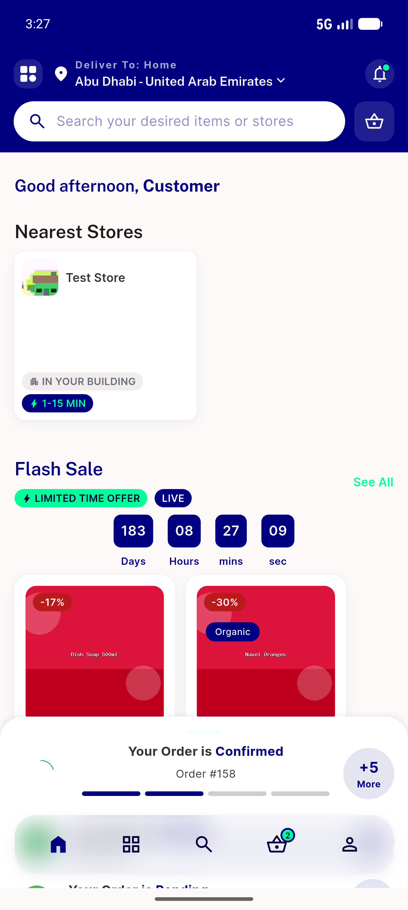
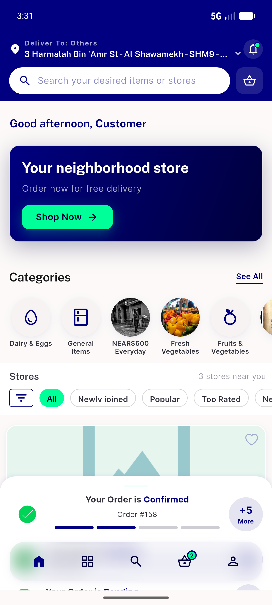

# QA Evidence — NEARS-1111

**PASS — NEARS-1111 taxi-guard tests: 6 new tests pin both guards; mutation-verified (each mutant kills exactly its own guard's 2 tests); full suite +2266; live non-taxi home regression clean on emulator-5554**

**5 screenshot(s).** Click any thumbnail for full resolution.

<table>
<tr>
<td align="center" width="33%"> ac5 coldopen grocery home lower rails</td>
<td align="center" width="33%"> ac5 coldopen grocery home mid rails</td>
<td align="center" width="33%"> ac5 coldopen grocery home top</td>
</tr>
<tr>
<td align="center" width="33%"> ac6 pull to refresh rails repopulated</td>
<td align="center" width="33%"> ac7 single module zone coldopen</td>
</tr>
</table>

---
*From `nears/docs/qa-evidence/NEARS-1111/` · public-repo scrub policy (no live secrets; verified clean).*
